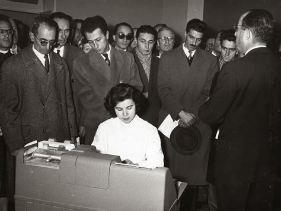
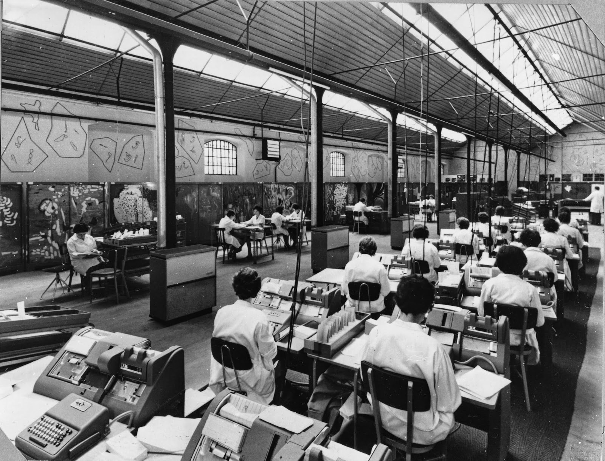
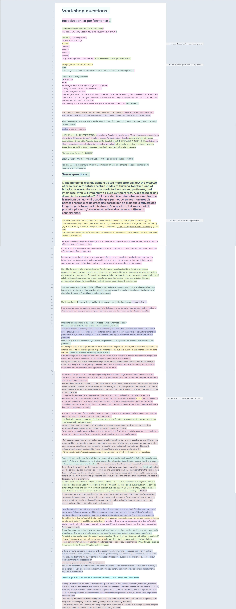
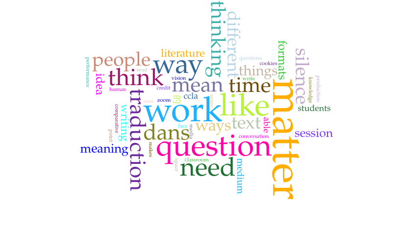

[N]{.dropcap}ous proposons ici une réflexion sur la matérialité de l’écriture et son
rôle dans la constitution du sens en nous appuyant notamment sur les
observations issues d’un atelier d’écriture collaborative organisé dans
le cadre du congrès annuel de l’Association Canadienne de Littérature
Comparée/Canadian Comparative Literature Association (ACLC/CCLA). We
propose here a reflection on the materiality of writing and its role in
the constitution of meaning, based in particular on observations from a
collaborative writing workshop organised as part of the annual
conference of the Canadian Comparative Literature
Association/Association Canadienne de Littérature Comparée (CCLA/ACLC).

En réponse à un billet de blogue où Marcello essayait d’expliquer
l’importance des formats et des outils d’écriture, un collègue
twittait : « Nan mais lis le texte… Caricature de geekerie. Le genre qui
passe son temps à bidouiller LaTex au lieu de bosser. »[^1].

Il est intéressant d’analyser le point de vue qui est au fondement d’une
telle réaction, car il représente une pensée fortement enracinée dans
notre culture.

On pourrait dire qu’une telle idée se situe dans la continuité d’une
certaine interprétation de la fameuse critique platonicienne de
l’écriture, développée dans le _Phèdre_. La position de Platon à ce
sujet a été le centre de plusieurs débats – que l’on pense au texte de
Derrida qui montre toute la complexité et les enjeux des ambiguïtés
cachées dans le texte du philosophe grec. Si on lit Platon au premier
degré, on identifie une opposition entre l’idéalité de la pensée et
l’impureté de son inscription matérielle : d’une part il y a ce qui
compte vraiment, les contenus, les idées, dont l’expression la plus pure
est le _logos_ ; de l’autre, l’inscription matérielle de ces idées qui
représente une forme de déchéance. La pureté supérieure de la pensée se
transforme en un produit dérivé, bâtard, imparfait car incarné :
l’écriture.

L’opposition entre pensée et écriture est une des déclinaisons
– peut-être la plus représentative – de l’opposition entre forme et
matière où cette dernière est toujours une manifestation limitée et
imparfaite de la première. Elle émerge par ailleurs de manière forte
dans les rapports entre genres masculin et féminin et on la retrouve
aussi chez Aristote : une forme masculine et une matière féminine. C’est
le sperme – principe formel de vie – qui se « nourrit » de la matière
féminine pour s’incarner – dans la théorie de la génération
aristotélicienne, notamment[^2].

Une anecdote porphyrienne exemplifie clairement cette idéologie : dans
la _Vie de Plotin_, Porphyre raconte que Plotin écrivait ses _Énnéades_
pendant qu’il faisait autre chose ; il parlait, il s’occupait d’autres
affaires et en même temps, il inscrivait sur un support la pensée
complexe qu’il avait déjà développée.

> Γράψας γὰρ ἐκεῖνος δὶς τὸ γραφὲν μεταλαβεῖν οὐδέ ποτ’ ἂν ἠνέσχετο,
> ἀλλ’ οὐδὲ ἅπαξ γοῦν ἀναγνῶναι καὶ διελθεῖν διὰ τὸ τὴν ὅρασιν μὴ
> ὑπηρετεῖσθαι αὐτῷ πρὸς τὴν ἀνάγνωσιν. Ἔγραφε δὲ οὔτε εἰς κάλλος
> ἀποτυπούμενος τὰ γράμματα οὔτε εὐσήμως τὰς συλλαβὰς διαιρῶν οὔτε τῆς
> ὀρθογραφίας φροντίζων, ἀλλὰ μόνον τοῦ νοῦ ἐχόμενος καί, ὃ πάντες
> ἐθαυμάζομεν, ἐκεῖνο ποιῶν ἄχρι τελευτῆς διετέλεσε. Συντελέσας γὰρ παρ’
> ἑαυτῷ ἀπ’ ἀρχῆς ἄχρι τέλους τὸ σκέμμα, ἔπειτα εἰς γραφὴν παραδιδοὺς ἃ
> ἐσκέπτετο, συνεῖρεν οὕτω γράφων ἃ ἐν τῇ ψυχῇ διέθηκεν, ὡς ἀπὸ βιβλίου
> δοκεῖν μεταβάλλειν τὰ γραφόμενα· ἐπεὶ καὶ διαλεγόμενος πρός τινα καὶ
> συνείρων τὰς ὁμιλίας πρὸς τῷ σκέμματι ἦν, ὡς ἅμα τε ἀποπληροῦν τὸ
> ἀναγκαῖον τῆς ὁμιλίας καὶ τῶν ἐν σκέψει προκειμένων ἀδιάκοπον τηρεῖν
> τὴν διάνοιαν· ἀποστάντος γοῦν τοῦ προσδιαλεγομένου οὐδ’ ἐπαναλαβὼν τὰ
> γεγραμμένα, διὰ τὸ μὴ ἐπαρκεῖν αὐτῷ πρὸς ἀνάληψιν, ὡς εἰρήκαμεν, τὴν
> ὅρασιν, τὰ ἑξῆς ἂν ἐπισυνῆψεν, ὡς μηδένα διαστήσας χρόνον μεταξὺ ὅτε
> τὴν ὁμιλίαν ἐποιεῖτο.

> C’est qu’une fois qu’il avait écrit, il ne pouvait pas retoucher ni
> même relire ce qu’il avait fait, parce que la faiblesse de sa vue lui
> rendait toute lecture fort pénible. Le caractère de son écriture
> n’était pas beau. Il ne séparait pas les mots et faisait très peu
> d’attention à l’orthographe : il n’était occupé que des idées. Il fut
> continuellement jusqu’à sa mort dans cette habitude, ce qui était pour
> nous tous un sujet d’étonnement. Lorsqu’il avait fini de composer
> quelque chose dans sa tète, et qu’ensuite il écrivait ce qu’il avait
> médité, il semblait qu’il copiât un livre. En conversant et en
> discutant, il ne se laissait pas distraire de l’objet de ses pensées,
> en sorte qu’il pouvait à la fois satisfaire aux besoins de l’entretien
> et poursuivre la méditation du sujet qui l’occupait. Lorsque son
> interlocuteur s’en allait, il ne relisait pas ce qu’il avait écrit
> avant la conversation (c’était pour ménager sa vue, comme nous l’avons
> déjà dit) ; il reprenait la suite de sa composition comme si la
> conversation n’eût mis aucun intervalle à son application. [^3]

Le geste d’inscrire sa pensée sur un support est trivial, il n’a en soi
aucune importance et donc aucune dignité particulière. C’est un travail
manuel, qui pourrait finalement être délégué à un individu sans aucune
compétence, qui se limite à retranscrire, mécaniquement ce qui a été
déjà élaboré. Pour citer d’autres conversations qui ont eu lieu autour
du fameux billet de blog de Marcello, plusieurs collègues – toujours des
hommes – soulignaient que le travail de mise en forme et de balisage des
contenus devrait être laissé à « *une* secrétaire ». L’homme supérieur
pense et crée le contenu. La femme, mécaniquement, inscrit ce contenu
dans un support en réalisant ainsi un travail trivial, neutre et
inintéressant. Les femmes qui sont selon Aristote du côté de la matière,
se retrouvent logiquement dans l’opposition entre pensée et écriture, du
côté de l’écriture.

Lorque l’écriture devient informatique, on retrouve encore la même
opposition et la même hiérarchisation. Et en effet, la même idéologie a
fortement conditionné les débuts de l’informatique. Comme le montre
Isabelle Collet :

> \[..\] tant que l’informatique était perçue comme un métier technique
> du tertiaire, les femmes ont pu y entrer relativement nombreuses. Mais
> avec la généralisation du micro-ordinateur, le modèle du hacker se
> diffuse auprès du public. Ce modèle, culturellement familier aux
> garçons, possiblement désirable, activant les fantasmes de pouvoir
> dans lesquels les garçons sont éduqués, est devenu hostile aux filles.
> Elles désertent alors les études d’informatique. Collet

Encore une fois, les tâches « techniques » – l’inscription matérielle –
sont laissées aux femmes et, une fois qu’on commence à reconnaitre une
valeur « intellectuelle », symbolique – et donc immatérielle –, les
hommes prennent leur place. Melissa Terras a aussi parlé de ce phénomène
en analysant le rôle des femmes dans le fameux laboratoire du Père
Busa[^4].

<figure>

<figcaption aria-hidden="true">Les hommes regardent
(Θέαομαι)…</figcaption>
</figure>

<figure>

<figcaption aria-hidden="true">Les femmes inscrivent</figcaption>
</figure>

L’idéologie dualiste qui voit une séparation nette entre forme et
matière a donc une histoire longue et elle a été l’objet de plusieurs
analyses et critiques – dont celle de Derrida est une des plus connue.
Cependant elle n’a jamais vraiment été dépassée. Elle est toujours là,
et peut-être aussi dans les travaux de ceux qui ont le plus essayé de la
critiquer. Derrida lui-même finit par remplacer le concept de logos par
une idée assez immatérielle d’écriture et de texte – que l’on pense à
ses considérations sur le fait qu’un texte « n’est pas un livre ».

L’intérêt renouvelé pour la matérialité semble promettre des pistes
différentes. Le mouvement qui a été défini comme « nouveau
matérialisme » peut être compris dans ce sens : des auteures comme Karen
Barad, par exemple, associent leur approche féministe avec une nouvelle
compréhension de la fonction ontologique de la matière
(Barad). « Matter matters » devient ainsi un bon slogan
pour comprendre les enjeux du réalisme agentiel de cette philosophe.

À partir de ces considérations, il semble de plus en plus urgent de
penser la matérialité. En particulier, dans le domaine de la
littérature, il est fondamental de se pencher sur l’écriture en tant que
matérialité. Au lieu qu’opposer pensée et incarnation matérielle de
cette pensée, il est indispensable de partir de l’idée qu’il n’y a pas
de pensée immatérielle, ou mieux que la pensée n’est que cette
matérialité.

Pour les études littéraires il devient ainsi nécessaire de penser
littérature et média ensemble. Il n’y a pas d’une part la littérature et
de l’autre les supports ou les médias où elle s’inscrit ; la littérature
est toujours inscrite, la littérature n’est qu’une inscription. La
pensée littéraire et surtout la théorie littéraire émergent dans leurs
inscriptions matrielles.

Ce qui pense est l’inscription : que cela soit un ensemble de formats,
de protocoles, de règles syntaxiques, d’outils et d’algorithmes,
l’inscription _est_ la pensée.

Parler de littérature signifie donc parler de cette inscription, faire
de la littérature signifie performer cette inscription. Au lieu de
parler de « littérature _et_ média » il faudrait assumer l’affirmation
selon laquelle « la littérature est média » où le mot « média » renvoie
à la matérialité des multiples inscriptions scripturales.

Cette inscription est aussi le lieu possible d’émergence d’une
individuation : ce que notre texte souhaite, c’est que cette émergence
individuante n’ait pas comme résultat un _individu_ mais plutôt un
collectif. Et c’est notamment cette question de l’inscription concrète
du collectif que nous avons souhaité performer, mettre en pratique dans
le cadre d’un exercice d’écriture collaborative qui rassemblait des
chercheur·e·s intéressé·e·s par les rapports entre littérature et média.

## Présentation de l’atelier

[D]{.dropcap}ans le cadre du congrès annuel de l’Association Canadienne de
Littérature Comparée/Canadian Comparative Literature Association
(ACLC/CCLA), un atelier d’écriture collaborative a été organisé,
aboutissement d’une réflexion animée notamment par les chercheur·e·s du
groupe de recherche _Comparative Materialities: Media, Literature,
Theory / Matérialités comparatives : médias, littérature et théorie_. Ce
groupe réunissait plusieurs chercheur·e·s anglophones et francophones
dont Brent Ryan Bellamy, Lai-Tze Fan, Antoine Fauchié, Jeanne
Mathieu-Lessard, Margot Mellet, Markus Reisenleitner, Joshua Synenko,
Monique Tschofen, et Marcello Vitali-Rosati. Tout au long de l’année, le
groupe a cherché à produire une réflexion collective pour présenter,
comprendre et étudier les différentes matérialités de l’écriture et pour
répondre à la question de recherche suivante :

> Comment « faire » de la littérature comparée en s’intéressant à la
> matérialité des textes ainsi qu’à la communication elle-même, en
> considérant le support, les moyens, les plateformes et les
> interfaces ?

Après une série de présentations autour d’outils, de méthodes et de
pratiques d’écriture numérique ouverte – présentations qui se sont
déroulées à distance entre 2020 et 2021 –, nous avons organisé un
atelier d’écriture collaborative numérique pour approfondir notre
réflexion sur l’écriture comme espace commun et la mettre à l’essai.
Cette proposition d’atelier s’inscrit en continuité de la réflexion
principale et proposait d’investir les outils et les réflexions sur
l’écriture numérique de manière concrète. Lors d’une session de 3
heures, incluant des temps de discussions, il s’agissait pour les
chercheur·e·s présent·e·s de répondre en synchrone à plusieurs questions
documentées dans un _pad_ partagé – un _pad_ étant une interface
d’écriture en ligne permettant d’écrire à plusieurs de façon simultanée.
Ce que nous avons désigné comme une performance d’écriture collaborative
numérique avait pour but de suivre le processus de constitution et
d’inscription matérielle d’un savoir commun, de garder trace des
différentes dynamiques d’écriture qui le composent, d’observer
l’émergence du collectif dans un média d’écriture.

La première question à laquelle nous avons été confronté·e·s en tant
qu’organisateur·rice·s de l’atelier était la suivante : quelle structure
de l’évènement prévoir afin de guider l’écriture collaborative sans la
déterminer et donc la dénaturer ? Comment prévoir des espaces d’écriture
suffisamment ouverts pour échapper à notre organisation ?

En amont de l’atelier, la documentation autour du principe de l’écriture
collaborative et autour de l’outil choisi pour l’atelier a été partagée
avec les participant·e·s[^5]. Cette documentation présentait notamment
les 3 espaces d’écritures qui portaient l’exercice :

1.  le *pad* : un espace d’écriture collaborative, en l’occurrence
    l’outil Framapad[^6] mis à disposition par Framasoft ;
2.  la vidéo : la rencontre en vidéoconférence avec la plateforme
    Jitsi ;
3.  le *chat* : un canal de discussion instantanée avec la même
    plateforme Jitsi.

L’outil Framapad a été choisi pour l’atelier parce qu’il permet de
visualiser les différentes couches d’écriture au fil des versions.
Plusieurs aspects de ce service ont aussi compté dans la réception et la
prise en main par les chercheur·e·s de différentes littéracies : la
coloration du texte, la non agnostie en terme de balisage (les
chercheur·e·s pouvaient écrire en texte riche, sans besoin de s’adapter
à un langage de balisage léger comme Markdown), etc. Ils et elles
pouvaient également écrire dans la langue de leur choix et intervenir
selon la pratique qui leur convenait le mieux : ajout de contenus
externes, réponse ou réaction à d’autres écritures, correction,
détournement d’écriture etc.

Nous souhaitons ici présenter les questionnements et réflexions qui ont
émergés lors de l’atelier.

## Investir les espaces d’écriture

[À]{.dropcap} la suite de l’atelier, nous pouvons remarquer que les différents
espaces d’écriture ont été investis de diverses façons. Le _pad_,
l’outil d’écriture collectif et simultané, se présentait comme un espace
à part, indépendant de la visioconférence et de l’espace de discussion
instantanée (tous les deux disponibles via la plateforme Jitsi). Il
représente tout d’abord une inscription plus visible : nous retrouvons
l’esprit de la page même s’il s’agit d’une page sans limite réelle, qui
s’allonge et se déroule au fur et à mesure que nous écrivons dessus.
Ensuite c’est un outil uniquement destiné à l’écriture, dans lequel nous
pouvons retrouver des pratiques propres aux traitements de texte ou aux
éditeurs de texte sémantique. Aller _dans le pad_, c’est réaliser une
démarche d’inscription, il s’agit d’un geste spécifique, plus formalisé
que le flux vidéo ou les échanges via un canal de discussion. C’est déjà
entrer dans un espace collaboratif et participer à le définir
concrètement. Si la visioconférence est principalement pour les
discussions et la prise de parole, le _pad_ se présente davantage comme
monolithique et formel, proposant une inscription plus pérenne, le
_chat_ invitant à des échanges plus spontanés et éphémères en ce sens.
Le _pad_ correspond clairement à des pratiques déjà instituées au sein
des communautés universitaires — dont le besoin a augmenté après la
pandémie de COVID-19.

Pour préciser cette distinction entre différents espaces d’écriture, le
pad – peut-être à la différence du _chat_ et de la visioconférence qui
s’apparentent davantage à des lieux de communication – semble permettre
d’_écrire_ au sens de formaliser la pensée et non de la discuter. Cette
différence implique aussi la possibilité de _garder une trace visible_
de la réflexion qui confirme la réalité matérielle de l’écriture dans le
média. Cette typologie des espaces ouvre une réflexion sur la linéarité
de nos écritures. En effet dans le pad il est possible de jouer avec une
contrainte temporelle dans la structure du document – soit déplacer un
bloc en haut de page ou ajouter une phrase n’importe où –, contrairement
au canal de discussion instantanée dans lequel les messages se
superposent sans possibilité de modifier l’agencement des blocs de texte
et donc des idées. Cette possible modularité de l’espace d’écriture
commun, sa potentielle réinscriptibilité a posé question pour les
participant·e·s pour qui l’écriture est intimement liée à la question de
la propriété intellectuelle. Savoir que n’importe qui (possédant le lien
du pad) peut venir _ajouter_ du texte dans notre réflexion, ou même
_modifier_ ou _supprimer_ nos propos, peut être quelque peu
déstabiblisant. Cette inquiétude s’ancre dans la prise de conscience que
nos écritures individuelles n’existent pas hors de leur inscription
concrète, et que cette inscription, dans le cadre de l’atelier, relève
du collectif et est alors négocié continuellement par lui. Il s’avère au
final – dû peut-être à nos conditionnements académiques – que peu de
blocs ou de lignes ont finalement été effacées ou réinscrites. Là
transparaît certainement notre culture de l’écrit trop immobile ou
assagie dans l’expérimentation. C’est notamment ce fait de ne pas oser
réinscrire ou _bouleverser_ une écriture existante dont nous ne serions
pas l’origine (ou le « propriétaire ») qui a été à la cause d’une
dynamique d’ajouts continus et d’un ensemble final de données
extrêmement fourni. En revanche des phrases ont été régulièrement
ajoutées, parfois au centre de blocs de texte, pour réagir ou demander
des compléments, au sein du déroulement d’une pensée.

Il est apparu également surprenant pour les participant·e·s que cet
espace fonctionne sur un principe de péremption : bien que la question
de la pérennité des échanges apparaisse moins se poser pour les produits
de visioconférence et de chat – pourtant d’autant plus concernés par
l’éphémérité –, le _pad_ était investi d’une appréhension peut-être
d’usage vis-à-vis de sa propre disparition. Chaque phrase, chaque mot,
chaque lettre peut être suprimée, et nous courrons alors le risque de
perdre la trace d’une pensée en train de se constituer ou d’une pensée
établie, le processus d’un collectif en train de se réaliser dans des
pratiques d’écriture en cours. À cette précarité de l’écriture s’ajoute
celle de l’espace des écritures en tant que tel puisque le pad a lui
aussi une date de péremption. En effet, il est supprimé si demeuré
inactif – soit non édité – pendant plus de 365 jours. Il est cependant
possible pour tous les participant·e·s d’exporter le document en
plusieurs formats, de copier-coller le contenu sur un autre espace, ou
d’éditer son contenu avant la date de fin de conservation pour relancer
le décompte. Cette contrainte du délai avant suppression va en fait à
l’encontre de l’idée que l’espace de l’écriture et l’espace de l’archive
sont réunis en une même infrastructure. Le pad utilisé pour l’atelier ne
pourra pas être un espace d’archivage des écritures collaboratives.

Le _pad_ utilisé pour cet atelier dispose d’un système de versionnement
qui conserve chaque état du texte. Chaque frappe est enregistrée non pas
comme seule inscription, mais comme une inscription dans le temps avec
l’identification de qui la déclenchée. Ainsi ce sont 12 531 états du
texte qui sont sauvegardés, et qui s’accumulent à chaque ajout,
modification ou suppression. Cette fonctionnalité proposée avec cet
outil d’écriture représente deux apports : un enregistrement de chaque
inscription, ce qui signifie qu’une portion supprimée peut être
retrouvée en naviguant dans l’historique ; une visualisation nouvelle du
texte, qui devient un flux lorsqu’on le considère dans sa dimension
temporelle et non plus comme seul résultat final. Cet historique
constituait une dimension importante du déroulement de l’atelier : il
est possible de parcourir ces différents états du texte, de visualiser
les modifications et interventions diverses. Ces états représentent une
masse de données qu’il est difficile d’appréhender, des outils sont
nécessaires pour prendre la mesure de ce flux qui n’est plus seulement
un texte finalisé mais une matière à penser travaillée, repensée à
maintes reprises. L’interface joue un rôle déterminant pour appréhender
une nouvelle matérialisation du texte[^7]. La diversité de ces
appropriations des espaces de l’atelier a certainement participé à la
diversité des formes d’écriture qui fondent, chacunes à différent
niveaux, un dispositif de collaboration.

## Écritures qui collaborent

[P]{.dropcap}our conserver un espace d’échappement de l’écriture collaborative, nous
n’avons pas fourni de directives de rédaction strictes aux
participant·e·s, ils avaient donc la possibilité de proposer et de
définir leur participation au pad collaboratif. Nous avons appréhendé
l’idée d’échappement comme un espace de libre cours de l’écriture, afin
que la dimension collaborative de l’exercice puisse se décider selon
chaque individu et selon la synergie du groupe des participant·e·s. Cela
signifie que chaque action était par défaut _affranchie_, c’est-à-dire
que ces actions ne sont pas dictées par des règles préétablies autres
que les expériences passées des collaborateurs et leur apprentissage en
temps réel.

Plusieurs types d’interactions peuvent donc être distinguées et, sans en
faire une typologie officielle, nous nous sommes posés la question
suivante : qu’est ce qui relève de l’écriture collaborative et qu’est ce
qui n’en est pas, qui y échappe, mais qui prend part à la dynamique
d’écriture collaborative ? À ce stade nous pouvons lister ces formes de
participation qui sont constitutives d’une écriture collaborative sans
être identifiées comme telles puisque ne relevant pas de l’inscription
ou de la discussion scientifique à proprement parler : les divers
métadiscours sur l’atelier en lui-même tels que des discussions dans la
messagerie instantanée ou les références explicites au fonctionnement du
pad ; les moments d’échanges informels et de sociabilisation autour de
l’appréhension de ce nouvel espace lors des débuts de l’atelier ; les
demandes d’assistance pour apprendre à utiliser les fonctionnalités
offertes par les outils et interfaces, etc. La question qui se pose est
celle de la reconnaissance de ce discours dans la constitution de
l’écriture collaborative. Pour reprendre l’expression
« environnement-support » (Merzeau), il nous apparaît que ces
interventions, si elles ne relèvent pas directement de la constitution
d’un savoir ou de la formulation d’une réponse à une question
scientifique, portent et contribuent à établir un espace et un
dispositif du collaboratif. Ces écritures font parties de l’espace où la
pensée se constitue, où le collectif se négocie. Dans la _production de
l’écriture collaborative_ se jouent de multiples méta-discours,
commentaires ou annotations directes d’un contenu plus officiel, qui ont
une place importante dans le résultat final et qu’il semble, au vu de
leur intrication concrète, de leur _maillage_ dans le _pad_, impossible
de départager réellement.

Cette _intrication_, ce réseau d’écritures à deux dimensions (le texte
et l’identification des acteurs·trices inscrivant), se retrouve
également dans l’historique qui est laissé à disposition pendant ou
après l’atelier. Framapad propose de parcourir les différents états du
texte via une _ligne du temps_ (ou _timeline_), affichant les
modifications successives. Si ces dernières sont identifiées – ainsi que
les personnes qui contribuent – avec une coloration syntaxique, il n’est
en revanche pas possible de ne voir que les modifications d’un·e
contributeur·trice. Nous devons faire avec ce réseautage de textes,
mêlés et néanmoins identifiables.

Cette question de ce qui coopère au collaboratif se complexifie par la
dimension de durée de l’écriture : l’outil choisi propose en effet de
garder trace des différentes versions du pad. L’atelier a donc généré
une multitude de versions (12 531 pour être précis) enregistrées
lorsqu’un élément du texte était modifié (correction, suppression,
ajout). Dans l’ensemble des versions, et par le principe de
versionnement automatisé, les corrections de fautes d’orthographe
acquièrent le même niveau d’importance que l’ajout d’un paragraphe, dans
la mesure où elles vont toutes deux résulter en la création de nouveaux
états du texte. Chaque intervention bénéficie ainsi d’un même degré
d’importance pour le processus collaboratif. Toutes participent à la
matière du collectif. Il en résulte une masse de données, ce qui
implique une extraction devenue bien plus complexe.

## La question de la représentation

[L]{.dropcap}’espace du _pad_ compte actuellement 194 paragraphes, 479 phrases et 7
348 mots (ce qui correspond à environ 30 pages imprimables, soit la
taille d’un article conséquent). À cet ensemble de données déjà
important devraient être ajoutées également les écritures produites dans
les différents _chats_ (discussion instantanée de la visioconférence sur
Jitsi et _chat_ disponible dans le _pad_ Framapad), ainsi que les
commentaires en annotation du _pad_, qui contribuent au collaboratif.
L’abondance des écritures, le maillage entre les différents niveaux,
leurs mouvements dans le collaboratif notamment posent le problème des
_outputs_ envisageables : comment retranscrire ce processus d’écriture
en train de se faire sans le réécrire d’une seule main et en conservant
toute sa dimension collaborative ? Quelles représentations de la
performance d’écriture collaborative établir pour permettre une lecture,
pour lui donner une lisibilité tout en gardant la pluricité des traces
issues des pratiques d’écriture individuelles ?

Lors du colloque annuel de 2019 de l’association (Congrès des sciences
humaines du Canada, Université de la Colombie-Britannique (UBC),
Vancouver), une table ronde bilingue conjointe avait réuni plusieurs
membres de la communauté comparatiste et de la communauté des humanités
numériques pour mener une réflexion sur la place du comparatisme au sein
de nos institutions. Pour retranscrire et clore cet évènement, la forme
du manifeste a été choisie : « Knowledge is a commons - Pour des savoirs
en commun » représente cette expérience de réflexion collective.
Concrètement deux objets bilingues ont été créés et publiés, soit une
version imprimée ainsi qu’une [version
numérique](http://sens-public.org/articles/1522/) parue à la revue [Sens
public](http://sens-public.org/).

Dans le cas de notre atelier, l’option d’un travail de réécriture du pad
sous la forme d’un article à plusieurs mains semble peu envisageable
dans la mesure où notre démarche s’est focalisée davantage sur le
processus d’écriture collaborative du savoir en tant que tel. La
question que nous nous posons ici est moins celle de la mise ou remise
en forme des données obtenues que de la représentation et de l’archivage
de ces données, du jeu possible à partir de ce média. Nous souhaitons
plutôt proposer quelques pistes pour explorer les possibilités pour
structurer un corpus d’écritures collaboratives.

### 1. Carte des écritures en collaboration

Parce que Framapad fonctionne sur un principe de coloration syntaxique :
chaque participant·e pouvait choisir une couleur d’écriture. Cette
fonctionnalité fait de l’espace du pad un espace qui peut être abordé
comme un objet visuel et plastique. Chaque variation de couleur indique
une dynamique de collaboration (réponse, réaction, correction). Le
produit de la performance peut ainsi être représenté comme une carte des
écritures en collaboration :

<figure>

<figcaption aria-hidden="true">Extrait du pad</figcaption>
</figure>

Ici est surtout visible l’alternance des écritures dans la dynamique du
collaboratif.

### 2. Lexique du collaboratif

Une autre piste pour représenter les données de l’écriture collaborative
serait l’analyse lexicale pour mettre en évidence les thèmes les plus
présents dans l’ensemble du document.

<figure>

<figcaption aria-hidden="true">Visualisation par Voyant
Tools</figcaption>
</figure>

<iframe style="width: 100%; height: 800px;" src="https://voyant-tools.org/?stopList=keywords-d7cf3a838d0b848b0ee35c05e169c253&amp;panels=cirrus%2Ctermsberry%2Ctrends%2Csummary%2Cbubblelines&amp;corpus=2a4466ba2067df3c6adc8fb1339805b6">
</iframe>

Nous avons ici fait un test avec l’outil [Voyant
Tools](https://voyant-tools.org/), outil pour la visualisation et
l’analyse de textes numériques. Pour procéder à l’étude lexicale du
produit collaboratif, il était nécessaire dans un premier temps
d’exclure de l’analyse tous les mots de liaison. Le collaboratif est
alors représenté par un échantillon de mots-clefs, résumé et unifié en
ce sens autour des thèmes phares de la réflexion de l’atelier.

Cette analyse lexicale aurait très bien pu être réalisée avec des
langages de programmation comme python, nous avons ici choisit Voyant
pour son offre de différentes visualisations et ses différents
graphiques[^8].

### 3. Mouvement des écritures

Framapad a également été choisi pour la dimension ludique de son
résultat : une timeline permet de naviguer entre les versions du
document, permettant ainsi de remonter dans le temps du processus
collaboratif. Cette visualisation et manipulation d’un produit textuel
devenu _watchable_ ou regardable permet de considérer le collaboratif
non plus comme un résultat mais comme un mouvement, comme une
perfomance. C’est un dispositif inscrit dans la durée. Parce que la
timeline de Framapad a elle aussi une date de péremption, nous avons
procédé à une captation vidéo qui présente l’avantage de reproduire la
fonction de navigation dans le temps de la performance. La différence
majeure dans cette captation est le rapport à l’espace du pad : la
timeline de Framapad permet, en parallèle de la navigation entre les
états du document, une navigation au sein de la page. C’est-à-dire que
je peux faire pause au cours de la timeline pour observer les autres
espaces de la page qui ont subi des modifications. Cette élasticité des
mouvements d’écriture n’est pas possible dans la représentation vidéo.

<video src="../static/media/01-fauchie-mellet-vitali-rosati-media/01-fauchie-mellet-vitali-rosati_image5.mp4" controls>
    Your browser does not support the video tag.
</video>
<figcaption>Début de la dynamique d'écriture collaborative</figcaption>

<video src="../static/media/01-fauchie-mellet-vitali-rosati-media/01-fauchie-mellet-vitali-rosati_image6.mp4" controls>
    Your browser does not support the video tag.
</video>
<figcaption>Exemple de hocquetement 1</figcaption>

<video src="../static/media/01-fauchie-mellet-vitali-rosati-media/01-fauchie-mellet-vitali-rosati_image7.mp4" controls>
    Your browser does not support the video tag.
</video>
<figcaption>Exemple de hocquetement 2</figcaption>

Ce que capte la vidéo de la timeline, c’est notamment les hoquètements
entre deux dynamiques : la dynamique linéaire du temps de la timeline et
l’enchaînement des versions et la dynamique non linéraire des écritures
en train de collaborer à des espaces différents, parfois éloignés, au
sein du pad.

De ces différentes expérimentations, il ressort la presque nécessité de
sortir du texte brut pour aller envisager des structures plus
interactives qui impliquent une visibilité du texte.

## Conclusion

[L]{.dropcap}a réflexion sur la matérialité de l’écriture et sa relation au sens
rejoint les observations issues de l’atelier : les investissements des
espaces d’écritures, les inquitétudes vis-à-vis des fonctionnalités qui
les définissent, la problématique de la représentation d’un corpus
d’écritures collaboratives nous amènent à considérer que la pensée et le
collectif sont média. C’est-à dire que le sens émerge d’un contexte
matériel particulier. Il n’y a pas d’idée préalable à une inscription
– cette pensée même ne précède pas son écriture –, ce sont en réalité
des conjonctures médiatrices[^9] qui font émerger le sens.

Dans le cadre de l’atelier, ce que nous a démontré l’expérience, c’est
que non seulement la réflexion n’existe pas hors d’une réalité
matérielle de l’écriture, mais que le collectif lui-même n’existe pas
hors de cette réalité. On ne trouvera ni les _Énnéades_ ni Plotin ni le
groupe de recherche _Comparative Materialities: Media, Literature,
Theory / Matérialités comparatives : médias, littérature et théorie_
hors de l’inscription concrète. Le collectif comme la pensée qu’il
développe ont été ici négociés par les caractéristiques du dispositif
d’écriture collaborative.

:::{class="REF"}

## Bibliographie

Barad, Karen Michelle. _Meeting the Universe Halfway: Quantum Physics
and the Entanglement of Matter and Meaning_. Duke University Press, 2007.

Collet, Isabelle. “La disparition des filles dans les études
d’informatique : les conséquences d’un changement de représentation.”
_Carrefours de l’education_, vol. n° 17, no. 1, 2004, pp. 42–56.

Derrida, Jacques. “La pharmacie de Platon.” _Tel Quel_, no. 32,33, 1968.

Merzeau, Louise. “Éditorialisation Collaborative d’un Événement:
L’exemple Des Entretiens Du Nouveau Monde Industriel 2012.”
_Communication et Organisation_, no. 43, June 2013, pp. 105–22,
<https://doi.org/10.4000/communicationorganisation.4158>.

Plotinus, Marie Nicolas Bouillet. _Les Ennéades de Plotin_. 1857,
<http://archive.org/details/lesennadesdeplo01bouigoog>.

Vitali-Rosati, Marcello. _Les Chercheurs En SHS Savent-Ils Écrire ?_
2018,
<http://theconversation.com/les-chercheurs-en-shs-savent-ils-ecrire-93024>.

-–. _Les Chercheurs En SHS Savent-Ils Écrire? Quelques Réponses Aux
Commentaires Des Lecteurs_. Mar. 2018,
<http://blog.sens-public.org/marcellovitalirosati/les-chercheurs-en-shs-savent-ils-ecrire-quelques-reponses-aux-commentaires-des-lecteurs/>.

Vitali-Rosati, Marcello, and Jean-Marc Larrue. _Media Do Not Exist_.
Institute of Network Cultures, 2019,
<https://papyrus.bib.umontreal.ca/xmlui/handle/1866/22937>.

## Notes

[^1]:
    Le billet en question a été publié sur _The Conversation_
    (Vitali-Rosati, “Les Chercheurs En SHS Savent-Ils Écrire ?”). Une
    réponse aux commentaires a été publiée dans un deuxième billet de
    blogue (Vitali-Rosati, “Les Chercheurs En SHS Savent-Ils Écrire?”).

[^2]:
    Cf. par exemple le \_De generatione animalium, ii 716a5 : καθάπερ
    γὰρ εἴπομεν τῆς γενέσεως ἀρχὰς ἄν τις οὐχ ἥκιστα θείη τὸ θῆλυ καὶ τὸ
    ἄρρεν, τὸ μὲν ἄρρεν ὡς τῆς κινήσεως καὶ τῆς γενέσεως ἔχον τὴν ἀρχήν,
    τὸ δὲ θῆλυ ὡς ὕλης. « Comme nous l’avons dit, nous pouvons sans
    erreur affirmer que les principes de génération sont le masculin et
    le féminin ; le masculin en tant qu’il possède le principe de
    mouvement et le féminin en tant qu’il possède le principe
    matériel ».

[^3]: Plotinus, p. 10-11
[^4]:
    [Melissa Terra en parle dans son travail sur
    Lovecraft](https://melissaterras.org/2013/10/15/for-ada-lovelace-day-father-busas-female-punch-card-operatives/)

[^5]:
    La plateforme conçue pour l’évènement est disponible [en
    ligne](https://ccla.digitaltextualities.ca/annual-meeting/).

[^6]: <https://framapad.org>
[^7]: C’est ce que nous détaillons dans la troisième partie.
[^8]:
    La coloration syntaxique ici ne correspond pas à la coloration
    issue du pad : il ne s’agit plus d’une coloration par individu, mais
    par terme.

[^9]:
    Pour éviter ici une essentialisation du média (Vitali-Rosati and
    Larrue).

:::
