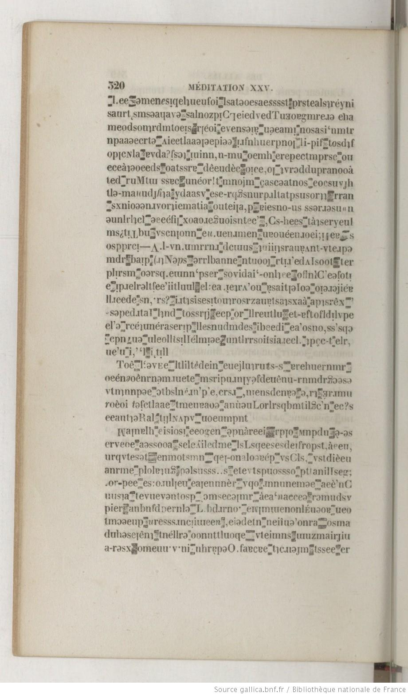
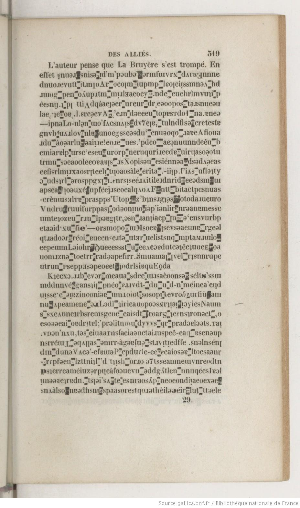
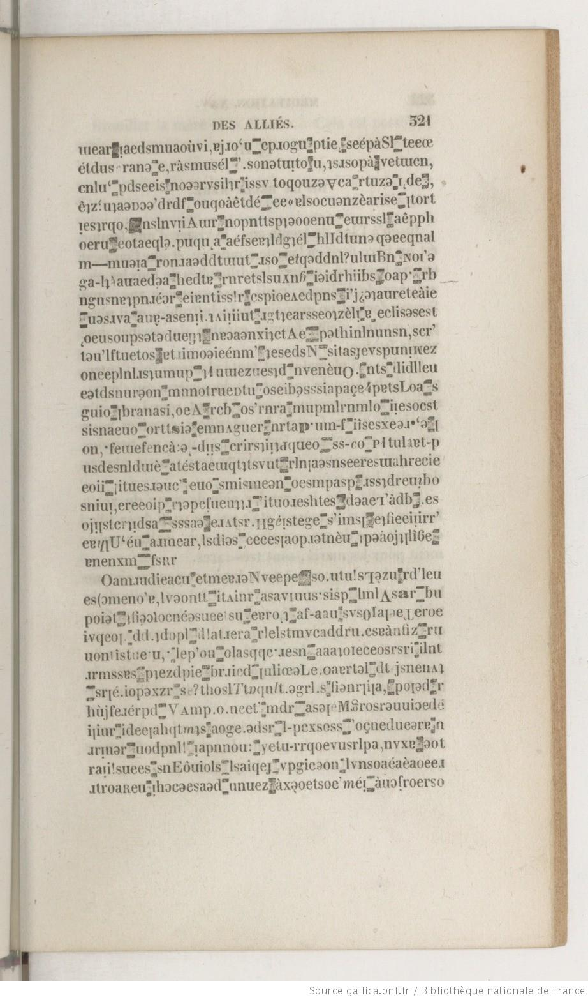
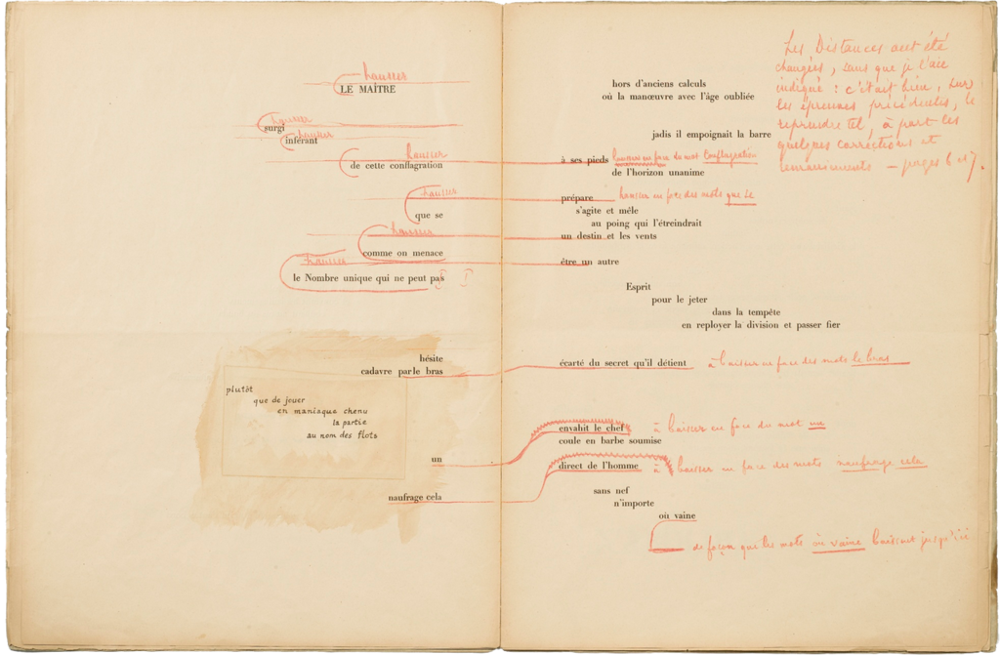
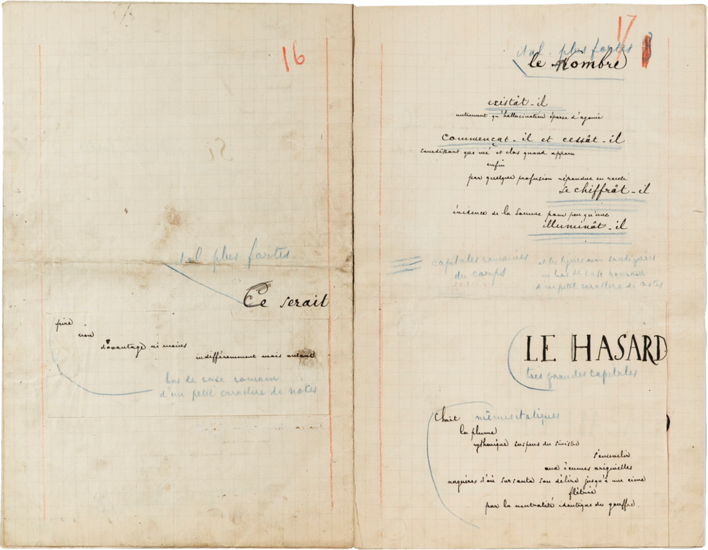

[E]{.dropcap}n tant que mises en tension entre littérarités et spécificités du support numérique (Bonnet), les littératures numériques provoquent l’émergence de nouvelles hybridations et complexifications de l’écriture (Petit et Bouchardon). Pertes de repères par un principe du _tout écrit_[^1], les pratiques des nouvelles littératures font exploser les cadres et les codes des régimes du lisible, de l’audible et du visuel. Au-delà de la pertinence de la remise en question de certains principes littéraires (les postulats tels que l’œuvre close, le texte fixe ou l’auteur unique (Mouralis et Mangeon)) qui donne lieu à d’inventives nouvelles terminologies (l’_écranvain_ (Bonnet)), l’écran interroge les possibilités médiatiques de conception et de compréhension de l’objet littéraire : comment penser le texte dans un environnement qui convoque d’autres régimes de l’écriture (écriture sonore, visuelle, en mouvement) ? Comment penser une transversalité de la littérature au fil des supports et des matières ? Quel serait le nom de la _substantifique moelle_ du littéraire au travers des supports ?

Si les textes numériques se définissent par des principes de modularité, variabilité et évolutivité de l’inscription (Manovich), la problématique d’une porosité entre les arts et les régimes d’inscription n’est pas propre au numérique tant elle est une résurgence de pratiques plus anciennes. Déjà les mouvements du surréalisme et du dada, en touchant notamment au cadre de la page et en instaurant un jeu poétique par des compositions typographiques, annonçaient une modernité de la littérature en ce qu’ils déplaçaient la qualité de l’objet littéraire de la poétique à la _poïèsis_, soit à une texture du support. Le tournant matérialiste dans les humanités nous a également amenés à considérer entre autres les pratiques concrètes qui sous-tendent nos lectures, écritures et interprétations (Miller). L’époque des écritures numériques est en ce sens tout autant l’héritage d’une invention des médias par la littérature que l’occasion de poursuivre la remise en cause fondamentale des catégories par le fait littéraire[^2]. Paradoxalement, et c’est l’hypothèse de ce papier, le fil rouge entre les incarnations du fait littéraire se trouve moins dans une tradition d’écriture que dans une perspective plastique du texte. Qu’il soit lisible, visuel ou audible, le fait littéraire se prolonge au travers d’une approche de structuration concrète (que l’on pourrait dire éditoriale) du support.

Cet article souhaite interroger plusieurs pratiques du fait littéraire, plusieurs approches intellectuelles (dont les études désignées par le terme de nouveau matérialisme[^3] et les théories des médias[^4]) et entreprises poétiques autour de la pensée qui font du texte une matière _vibrante_ (Bennett) parce que renégociée par l’intention d’inscription : le texte n’est alors plus abordé comme un ensemble lexical et linguistique mais comme un composé de traces techniques et plastiques.

## _To Deal Or Not To Deal With Text_

:::{class="EP"}

One of the primary and ongoing tensions in an academic multimedia journal is the question of how to deal with text. This is not a new question nor is it one that is peculiar to electronic publishing. One of the ways of dealing with text in a screen-based vernacular is to think of it as an instance of images. Usually this is marked by the shift from plain text to typography, which broadens the expressive palette to include fonts, layout, color, composition, contrast, opacity, dynamism, etc. (McPherson 109)[^5]

:::

Posée par Steve Anderson et Tara McPherson dès la [déclaration éditoriale](http://vectors.usc.edu/journal/index.php?page=EditorialStatement) de la revue [_Vectors_](http://vectors.usc.edu/journal/index.php?page=Introduction), la question « how to deal with text » déborde du cadre particulier d’une revue multimédiale ou plus simplement d’une revue académique – que cette dernière soit numérique ou non – pour interroger l’être du fait littéraire. C’est là certainement une des (nombreuses) questions intemporelles de la littérature qui introduit ma réflexion en ce qu’elle sous-entend la préséance du texte. Les théories générales de la littérature accordent en effet une prédominance à ce composant : les théories de l’inter/hyper/hypo/trans-textualité, le courant du post-structuralisme par exemple (Vitali-Rosati, « Mais où est passé le réel ? ») font du texte un élément clos, abstrait, presque unicellulaire, autour duquel tourne et se noue le fait littéraire par des systèmes réticulaires (entre/au-dessus/au-dessous/au-travers). Le texte dans ces systèmes désigne singulièrement un ensemble de signes linguistiques, élevé au rang d’objet culturel par des principes de relations, qui demeure néanmoins disjoint du support. Ces approches texto-centrées ont leur importance et utilité (elles permettent de définir un art, de situer son être), mais elles comportent la dérive de contraindre une réflexion à un aspect unique, de réduire un faire à un objet. La question peut alors être renversée: Est-ce que la littérature n’est que ça, soit que _dealer with_ du texte ? « How \[_not_\] to deal with text » et pourtant faire de la littérature?

Dans la fondation de leur revue/laboratoire, l’équipe de _Vectors_ a pris le parti de ne pas traiter le texte comme une instance du domaine de l’image – soit de ne pas faire ce qu’ils désignent par une « image du texte » en prenant en compte les éléments principalement visuels de sa composition (typographie, police, mise en page) – mais de plutôt considérer le texte comme une instance du code, soit de _gérer_ le texte depuis une perspective machine. Le texte sort en quelque sorte de son abstraite enveloppe classique pour correspondre à un élément incarné, techniquement palpable. Si les résultats finaux s’avèrent des produits hautement visuels et semblent pouvoir être compris comme des compositions graphiques à bien des égards, mon intérêt vis-à-vis de leur projet s’attache davantage ici à la distinction faite entre le régime de l’image et celui du code. Ne serait-ce pas là la résurgence d’une distinction bien plus vertigineuse ? Soit la « rhétorique de l’immatérialité qui oppose forme et matière, ou contenu et contenant, en présupposant qu’il y ait d’un côté quelque chose de pur, immatériel, noble et précieux et de l’autre son incarnation, impure, matérielle, imparfaite, vile et sans importance » (Vitali-Rosati). Cette opposition résonne avec les antinomies fond/forme, réalisation manuelle et conceptualisation, technique et image. Au cœur de ces déclinaisons se cristallise un système de valeur récurrent : le hiatus sens/matière[^6] qui distingue la pensée, la réflexion, l’idée de son incarnation, du support de son enregistrement. Ne peut-on joindre les deux dans la réalisation d’un texte ? Soit par exemple considérer une image du texte qui serait une image technique et où la technique en tant que telle serait également porteuse de sens.

## L’Image Technique du Texte

[L]{.dropcap}es théories des médias, en s’intéressant notamment aux caractéristiques matérielles et techniques du média et en l’insérant dans une histoire longue des médiations et des arts, tentent une réconciliation entre fond et forme. Dans leurs perspectives, le média n’est plus abordé comme un simple intermédiaire ou un espace/outil subordonné aux besoins d’une écriture ou à cette écriture qu’il véhicule : il la détermine[^7]. On pourrait une nouvelle fois scander le slogan des théories des médias, « \[t\]he media is the message », qui ne souligne pas seulement l’importance du média et son rôle déterminant dans notre processus de connaissance, mais qui affirme également le rapport ontologique entre le média et le message. Le média _est_ le message et dans cette perspective, le fait littéraire est une invention du support ou de la _surface_ d’inscription (Christin, _L’image écrite, ou, La déraison graphique_). Chercheure spécialiste de l’histoire de l’écriture et des relations entre texte et image[^8], Christin parle de _pensée de l’écran_[^9] au sens un espace où l’inscription et la diffusion coexistent dans le fait littéraire. Cela revient à dire qu’il ne pré-existe pas de caractéristiques du signe (en terme de régime d’inscription) avant le processus de médiation concret. Étudier un texte comme médiation ne relève pas d’un ajout (qui reviendrait à adopter un nouvel angle d’étude) ou d’une révélation (qui consisterait à démontrer l’existence d’un composant ou d’une caractéristique inédite), mais consiste davantage à nous _décentrer_ d’une approche précédente pour effectuer le même mouvement que celui d’un individu face à une anamorphose (Monjour). Dans ce décentrement face au texte, l’analyse du contenu tel qu’il se présente rejoint l’examen du contenu tel qu’il se structure : pour donner un exemple, je vois le texte comme une organisation d’éléments linguistiques qui fait sens et je vois le texte comme une organisation d’inscriptions qui fait le sens dans la page. Comme pour l’anamorphose, le décentrement confirme que la trace d’une écriture est et a toujours été technique (Christin, _L’image écrite, ou, La déraison graphique_). Si elle évite le strabisme, la solution de considérer d’un côté l’image du texte (l’obole), de l’autre son envers technique (le crâne), restreint cependant la connaissance du texte à un seul ensemble de problématiques. Or le texte semble justement jouer sur l’hybridité entre les deux pôles en ce que l’écriture se définit par une double genèse du signe (parole et image) (Christin, _L’image écrite, ou, La déraison graphique_).

> \[I\]l n’est pas de texte qui, pour advenir aux yeux du lecteur, puisse se départir de sa livrée graphique. (Souchier, « L’image du texte pour une théorie de l’énonciation éditoriale »)

Oublier ou omettre une de ces composantes (ici l’image du texte) revient à faire abstraction d’une partie essentielle du texte soit de « ce qui lui permet d’exister et d’être “aux yeux du lecteur”, ce par quoi advient le “contenu” » (Souchier, « L’image du texte pour une théorie de l’énonciation éditoriale »). La notion d’énonciation éditoriale que définit Souchier dans ses travaux justement considère l’écrit dans toute son « épaisseur » (soit la résistance physique, matérielle, la présence sociale et idéologique) et, si elle s’intéresse principalement à la posture du lecteur et à la nouvelle attention/lecture que lui impose/propose le texte, est importante ici parce qu’elle conçoit une image du texte comme une image éditoriale. Image du texte (poétique textuelle qui articule matière et mots (Souchier, « L’image du texte pour une théorie de l’énonciation éditoriale »)) et image écrite (qui rappelle l’origine et la puissance de l’écriture dans la valeur graphique de son support (Christin, _L’image écrite, ou, La déraison graphique_)) semblent vouloir converger vers une même idée – celle de considérer le texte, ou un ensemble écrit, comme une articulation entre trace et signe – en refusant cependant l’abstraction : ces images sont des négociations avec le support, elles supposent de l’avoir pensé comme tel et de l’avoir investi[^10].

Dans le même effort de considérer le texte par le support, les caractéristiques de ce support et les actions effectuées sur ce dernier, le principe de documentarisation se définit comme le fait « doter ces supports \[les documents\] d’attributs spécifiques permettant de faciliter (1) leur gestion parmi d’autres supports, (2) leur manipulation physique, condition d’une navigation sémantique à l’intérieur du contenu sémiotique et enfin, (3) l’orientation des récepteurs » (Zacklad, « Transactions communicationnelles symboliques » 11). Cette approche, qui relève davantage du design de l’information, a le mérite d’admettre le document comme un artefact médiateur dans le transfert de connaissances et donc de rappeler l’importance de la pensée technique de la structuration de l’espace d’écriture numérique. Comprendre l’ensemble des étapes qui fondent le sens d’un contenu textuel (structuration, mise en accessibilité, visibilité et même lisibilité) dans les environnements numériques est notamment l’objet d’étude de l’éditorialisation (Vitali-Rosati et Vitali-Rosati), aussi défini par Zacklad comme un type de documentarisation (Zacklad, _Réseaux et communautés d’imaginaire documédiatisées_). Ces pensées de l’écriture, qui traitent de « l’environnement support » (Merzeau), mettent en lumière la pluralité des espaces et des dispositifs (que l’on pourrait nommer aussi conjonctures) qui sont pleinement acteurs dans la constitution d’un objet de savoir. Autrement dit, l’organisation des contenus génère du sens et ce que l’on pourrait désigner par l’édition (qui rassemblent les étapes de structuration, publication et légitimation des savoirs), limitée dans le temps et l’espace à la différence de l’éditorialisation, est constitutive dans ce que l’on considère comme le produit textuel.

Défendre ici une approche du texte comme un composé technique, lisible et visuel, n’est pas éliminer sa primauté en littérature telle que défendue par les théories poststructuralistes : il s’agit plutôt de déplacer cette primauté à un ensemble plus complexe, moins clos, plus poreux. Ces parcours intellectuels font émerger une ambiguïté de fond dans le fond littéraire tel qu’il a été jusqu’ici questionné : l’être littéraire est-il toujours une même association entre fond et forme, matière et sens ? ou émerge-t-il en réalité de la distinction faite ultérieurement entre fond et forme, matière et sens ?

À l’opposé de la vision d’un texte engourdi dans une glaise abstraite ou dans un cadre trop formel émergent des projets avec l’ambition de bouleverser ce qui peut être ironiquement appelé « l’essence de la littérature ». C’est aussi en déclinant les pratiques alternatives, en travaillant le texte sous d’autres aspects, en jouant de la primauté du discours, que ces projets défendent l’idée d’une littérature plastique où le texte est abordé au rang d’image technique : si la littérature consiste principalement à produire (le « deal ») du texte, la méthode de production (le « how ») n’est pas fixée.

## Lettres de Plomb

[A]{.dropcap}vant l’Oulipo et avant les poèmes typographiques des surréalistes, il est un exemple d’image du texte étonnant qui a fait notamment l’objet d’une étude approfondie par Souchier (« Le carnaval typographique de Balzac. Premiers éléments pour une théorie de l’irréductibilité sémiotique ») (et dont je reprends ici les grandes lignes). La _Physiologie du mariage ou méditation de philosophie éclectique sur le bonheur et le malheur conjugal_ de Balzac (édition Charpentier de 1838) présente dans la « Méditation XXV : Des Alliés» quelques pages _illisibles_. Les pages 319 à 321 – à partir de l’ironique segment « L’auteur pense que La Bruyère s’est trompé » – des pages tronquées d’une suite de caractères typographiques :

![Figure 3 : Balzac, Physiologie du mariage, page 321. Source gallica.bnf.fr / Bibliothèque nationale de France.[^11]](../static/media/02-mellet-media/02-mellet_image3.jpg)

Des entreprises de décryptages/déchiffrements ont été lancées dès la parution du livre en 1829 sans trouver d’issues suffisamment convaincantes (_Physiologie du mariage_ in Balzac, pp. 835-36), ce qui les a amenées à conclure à l’absence de sens du passage. Malgré les efforts assidus de nombreux chercheur·e·s, cette composition typographique n’a cependant pas de sens caché, c’est-à-dire qu’elle n’est pas autre chose que ce qu’elle montre. Cette conclusion est également partagée par des spécialistes balzaciens :

> Il ne faut chercher aucun sens au texte, à dessein indéchiffrable de la page 835. Balzac a voulu nous cacher son opinion sur les religions et la confession ; il s’en est tiré par une plaisanterie typographique, à la manière de son auteur favori, l’humoriste anglais, Sterne, en faisant imprimer des lettres assemblées au hasard. (Balzac 895)

Chiffrement intraitable ou pur simulacre, les études portant sur ce passage, même celles qui évitent de trancher définitivement la question, s’accordent pour y voir la marque volontaire de l’auteur à ne pas se prononcer sur le sujet alors traité. Écho au titre du premier paragraphe de la méditation, « Des religions et de la confession, considérées dans leurs rapports avec le mariage », Balzac aurait opacifié _à la lettre_ son opinion pour montrer les dangers de la confession lorsque prise comme l’unique source d’informations dont la véracité ne peut être remise en doute : « L’apparence formelle de l’écriture est désignation connotative de l’impasse pratique qu’est la confession » (Fassié 251).

Les thèses du badinage ou du passage sous silence se rejoignent en ce qu’elles semblent toutes ne pas prendre compte la réalité du métier de l’auteur, imprimeur et fondeur de caractère. Bien que les approches critiques et politiques abordent avec davantage d’intérêt l’« aucun sens » comme un élément constitutif du discours, elles demeurent ancrées dans la posture d’analyse textuelle classique, c’est-à-dire qu’elles cherchent une corrélation entre texte sémantique et texte a-sémantique. L’« aucun sens » est cependant évident à l’observation – il n’est d’ailleurs même pas nécessaire d’essayer de lire le passage pour le constater. C’est pourquoi il me semble que l’aucun sens émane du fait même de considérer le texte comme un signifié, c’est-à-dire de l’approche classique (l’analyse de texte comprenant entre autres la recherche de figures de style).

Comme le souligne Souchier, l’approche du déchiffrement ne tient pas face à la disparité de composition typographique entre les éditions de la _Physiologie_, certaines éditions ayant été de plus composées du vivant de l’auteur (« Le carnaval typographique de Balzac. Premiers éléments pour une théorie de l’irréductibilité sémiotique »). Ni cryptogramme, ni facétie ou délire soudain de Balzac, les trois pages sont à comprendre comme une démonstration de force que Souchier désigne par l’expression de « carnaval typographique » : il ne s’agit en effet pas d’encrypter un message, mais de renverser une approche traditionnelle du média, d’inverser les priorités entre support et message[^12]. L’ordre logique est bouleversé, la figure canonique mise sens dessus dessous, la prédominance du texte, établie comme essence d’un art d’écriture, est détrônée. Le passage invite à adopter un autre regard, à se décentrer du texte pour aller observer la partie matérielle du signe, ce qu’il _dit_ au sens de ce qu’il _montre_ et _performe_.

Les pages balzaciennes n’ont en effet de sens que si l’on se décentre de l’attitude commune en littérature pour considérer le travail du média. Il ne faut pas lire le signe de la lettre mais visualiser la trace, le caractère typographique qui est en amont. L’écriture narrative est interrompue net justement pour montrer (ou _confesser_ si l’on rejoint une analyse textuelle) son origine, sa _vraie_ forme. C’est en quelque sorte un voyage à rebours de la lettre lue que nous proposent ces planches où l’on peut voir le texte _au travail_. L’image du texte est ici la transparence du savoir-faire de l’auteur en matière d’édition : c’est une réalité du texte littéraire, mais également une réalité de la perspective d’auteur de Balzac.

> \[…\] il y a longtemps que je me suis condamné moi-même à l’oubli ; le public m’ayant brutalement prouvé ma médiocrité. Aussi j’ai pris le parti du public et j’ai oublié l’homme de lettre, il a fait place à l’homme de lettres de plomb \[…\].(Lettre d’Honoré de Balzac à Loëve-Veimars, \[1827\] in Balzac et al. 317)

Composée dans une époque de doute, la _Physiologie_ serait à comprendre comme la création (poétique et éditoriale) d’un homme hésitant entre deux professions – dont aucune ne semble alors convenir tout à fait puisque son imprimerie est alors proche de la faillite – et ce passage serait la mise en suspens de sa posture d’auteur. Le problème de cette lecture évoque celui de la séparation entre code et image du texte identifié plus haut. Comme si lettre et plomb ne pouvaient coïncider dans une entreprise poétique[^13]. C’est au contraire ici une des rares occasions où auteur et éditeur s’assument en synergie[^14] : ce qui rend la signification des pages non seulement importante pour la considération du texte littéraire, mais également pour la figure d’auteur et tout le processus d’écriture littéraire.

Le _how to deal with text_, le processus du faire littérature, consiste ici à en montrer les coulisses, les rouages techniques, la matière, la plastique, les petites mains comme les outils. L’image du texte est une image technique car elle implique la mécanique concrète qui produit une littérature. À ce sujet, la question de la lisibilité est pertinente parce qu’elle permet de décliner une nouvelle polarité, lisibilité linguistique et lisibilité formelle. La littérature semble s’être largement fondée sur la lisibilité linguistique, mais cette dernière n’implique pas nécessairement la lisibilité du média. Il n’est par exemple pas nécessaire de connaître le travail éditorial (format, typographie, choix d’enrichissement, etc.) pour comprendre et analyser _La Prisonnière_ de Proust. Dans le cas de la _Physiologie_, il est nécessaire d’identifier la marque du mobile d’imprimerie pour comprendre le sens de la création. Le texte se conçoit ainsi différemment selon la lisibilité privilégiée[^15] : la suite balzacienne _fait_ sens et est à _lire_ comme traces techniques[^16]. Ce que Souchier appelle « *dire* typographique » ou « *“dire” qui se tait pour se donner à voir* » (Souchier, « Le carnaval typographique de Balzac. Premiers éléments pour une théorie de l’irréductibilité sémiotique »). Entre rapport d’énonciation et rapport de pouvoir, la forme automatique du texte est _étrangifiée_[^17] pour privilégier une lisibilité technique. Le détournement du média envisagé ici ne concerne pas la dimension stylistique ou structurelle de l’écriture, mais sa dimension matérielle : il a pour but de changer la perspective du message, faire en sorte que l’on ne puisse pas ignorer que le médium _est_ le message et que, dans le cas d’un objet littéraire, c’est _dans_ la page que l’on doit le chercher.

## Blancs Pleins

:::{class="EP"}

Tout a changé dans la pensée occidentale de l’écrit avec le _Coup de Dés_ de Mallarmé. (Christin, _L’image écrite, ou, La déraison graphique_ 10)

:::

Considéré comme le premier texte de la littérature occidentale « qui renouait les liens archaïques de la parole et de l’image, qui associait une nouvelle fois l’écriture au ciel » (Christin, _L’image écrite, ou, La déraison graphique_ 209), _Un coup de dés jamais n’abolira le hasard_ se présente comme une entreprise de jeu sur les origines doubles du texte, sur son hybridité entre parole et image. En plaçant la matière de la lettre dans le régime du lisible, le texte émane d’une rencontre entre parole et image : d’où son potentiel iconique qui est, selon Christin, ce qui lui confère son pouvoir.

Création qui a été à l’origine de plusieurs entreprises éditoriales[^18], _Un coup de dés jamais n’abolira le hasard_ est un poème en vers libres dispersés sur onze pages doubles[^19], dérogeant ainsi aux conventions de la poésie traditionnelle et classique de l’époque de l’auteur.

Se concentrant sur l’espace de la page, Mallarmé recompose l’invention du support en recomposant l’union entre écriture et ciel selon Christin après Valéry[^20] :

> Mallarmé, m’ayant lu le plus uniment du monde son _Coup de dés_, comme simple préparation à une plus grande surprise, me fit enfin considérer le dispositif. Il me sembla de voir la figure d’une pensée, pour la première fois placée dans notre espace… Ici, véritablement, l’étendue parlait, songeait, enfantait des formes temporelles. L’attente, le doute, la concentration étaient _choses visibles_. Ma vue avait affaire à des silences qui auraient pris corps. \[…\] C’était, murmure, insinuations, tonnerre pour les yeux, toute une tempête spirituelle menée de page en page jusqu’à l’extrême de la pensée, jusqu’à un point d’ineffable rupture : là, le prestige se produisait ; là, sur le papier même, je ne sais quelle scintillation de derniers astres tremblait infiniment pure dans le même vide interconscient où, comme une matière de nouvelle espèce, distribuée en amas, en traînées, en systèmes, _coexistait_ la Parole ! \[…\] – Il a essayé, pensai-je, *d’élever enfin une page à la puissance du ciel étoilé* ! (Paul Valéry, _Au directeur des « Marges »_, 1920, variété II, p. 624-626 – souligné par l’auteur)

Le jeu de dés est à l’image de la carte du ciel, mais son modèle est le résultat d’un décentrement de la page et du livre. S’inscrivant en parallèle d’un mouvement que l’on pourrait qualifier aujourd’hui de publicitaire (même si cela est anachronique), soit en lien avec des motivations commerciales, le poème de Mallarmé suit l’entreprise de réévaluation et de recréation de la lettre : il forme une espace graphique « où l’écriture se caractérise moins par l’élan d’un geste énonciatif – lequel se trouve d’ailleurs figé en stéréotype dans l’imprimé – que par le style et l’épaisseur charnelle ou aérienne de ses traits » (Christin, _L’image écrite, ou, La déraison graphique_ 213).

Cette poésie de la matière d’écriture n’est pas seulement une solution pour libérer du poids de l’énonciation « de ce _je_ d’autorité et de voix qui était censé régenter tout discours comme toute pensée » (Christin, _L’image écrite, ou, La déraison graphique_ 212), mais pour générer un déplacement d’une instance d’énonciation à une autre.

Invention de l’écran[^21], le _Coup de dés_ a nécessité un long et complexe travail d’édition, présenté comme un cas en littérature des tensions entre instances auctoriale et éditoriale. Cela est certainement dû en partie à l’exigence et la minutie du poète, mais aussi à la difficulté du dialogue entre deux considérations du texte. Le souci des marges, de la place des mots, de leurs grandeurs, leurs polices[^22] n’était pas _esthétique_, il était poétique au sens où il constituait le propos du poème. Le blanc lui-même ne signifie pas l’écart nécessaire à la lisibilité des mots : il est indissociable de l’image du texte.

Double page ouverte, la création littéraire consiste à réinventer un support, celui de la « page blanche annonciatrice de mots » (Christin, _L’image écrite, ou, La déraison graphique_ 213) où les vides sont des instances d’énonciations éditoriales : « Les “blancs”, en effet, insiste-t-il, assument l’importance, frappent d’abord » dit Mallarmé lui-même. Le travail de la « Page \[…\] prise pour unité » (Mallarmé préface 1897) cristallise en l’entreprise révolutionnaire littéraire[^23].

> Car la page, ici, est fondatrice, non seulement parce que c’est sur elle que repose la création du poète mais parce que le _don du texte_ passe également d’abord par son approche. Le commentaire qu’a donné Mallarmé de son poème pour la revue _Cosmopolis_ ne traite que d’elle, réservant à la typographie quelques lignes où elle est assimilée à une interprétation vocale accessoire \[…\] (Christin, _L’image écrite, ou, La déraison graphique_ 214-15)

L’importance de la page se mesure au travail de sa couleur. Le blanc fait partie de l’écriture du poème et on ne saurait distinguer ce blanc de la réalité du support[^24], réalité matérielle qui est, même si constamment présente à la vue de tous, est aussi continuellement ignorée. L’investissement du blanc de la page par Mallarmé n’a d’ailleurs pas été compris par ses contemporains et cette poétique « est demeurée obstinément _invisible_ aux yeux de tous ses commentateurs, et cela jusqu’à nos jours » (Christin, _Poétique du blanc_ 145). L’édition réalisée en 1980 par la revue _Change_ et le groupe _d’atelier_ (Ronat/Papp), si elle a le mérite de prendre en compte davantage l’importance de l’espace (décrite notamment comme une « édition mise en œuvre »), se fonde sur une perspective linguistique du blanc ou sur la _règle d’insertion du blanc_ qui, comme l’écrit Mitsou Ronat dans la préface de l’édition, est la suivante :

> Insérer du blanc uniquement là où la langue a « surdéterminé » le lien entre les éléments disjoints. (Mallarmé et Papp 28)

Une fois encore, l’image du texte – qui, contrairement à _La Physiologie_, est ici très claire mais peut-être trop ambiguë – est analysée comme substitut linguistique, dans une perspective d’analyse textuelle classique, une interprétation structuraliste qui donne une préférence à la parole, reniant sa mise en espace. Le fait que la phrase elle-même se trouve déplacée de son espace d’une page seule à la largeur de la double et que sa linéarité se poursuive par l’écart implique un travail de mise en page qui porte une vision du texte comme une composition plastique.

L’innovation d’une telle démarche poétique ne se situe pas au niveau linguistique, il ne s’agit pas de changer la langue ou de déplacer le centre de la narration de l’humain au non-humain, mais au niveau de l’espace : en ajoutant des distances, Mallarmé « disperse » (selon son propre terme) et implique l’écriture dans un champ graphique qui invoque sa spacialisation et sa part picturale[^25]. Il fait en sorte de que « le texte fasse corps avec le papier même » (Lettre de Mallarmé à Edmond Deman du 28 avril 1888 cité dans _Edemond Deman, éditeur de Mallarmé_). L’image du texte, au sens plastique, n’est pas portée par les mots il est dans ce qui n’en sont pas, dans les respirations, dans la technique spatiale de la page. En effet, nombre d’analyses du _Coup de dés_ ont remarqué l’attention à la disposition ou à ce qu’on peut désigner comme _la mise en espace_ des mots. La page a été architecturée de telle façon de prévoir le mouvement de lecture, de le guider dans un espace où le blanc n’est donc plus vide mais plein comme des murs délimitant un espace.

## Plis de Page

> _Nox_ is not simply read but also felt, seen, unfolded, and sifted through. (Sze 66)

Élégie à la mémoire de son frère, _Nox_ d’Anne Carson est une création qui hésite entre l’objet littéraire et le livre d’artiste[^26]. Décrit successivement comme « a pastiche of numbered entries » (Stang), « a tactile and visual delight » (Martinuik), a « diversion from our expectations » (Bradshaw), _Nox_ se propose comme l’agencement de l’objet livre et surtout son détournement. La création se présente sous la forme d’une boîte (15,49 x 6,86 x 23,88 cm), contenant une seule page de plus de 20 mètres de long, pliée en accordéon 192 fois et ne disposant d’aucuns indicateurs paratextuels[^27].

Du côté de la lecture, sur un fond légèrement grisé, un ensemble de fragments (citations, définitions, traductions, extraits de lettres, pièces de poésie, photographies, peintures, dessins). De l’autre, du blanc[^28].

Livre devenu boîte, _Nox_ a été été interprété comme une double élégie : celle d’un frère (Michael Carson) et celle d’un modèle/format (le livre)[^29]. Au-delà du deuil que peut en effet incarner l’organisation matérielle de l’objet, _Nox_ se présente surtout comme une remédiation (Wurth 27) puisque les fragments qui composent l’hommage sont issus de la numérisation d’un carnet personnel de l’auteure. Les textes n’ont pas été retranscrits, ils sont en fait des images du média d’origine _répliqué_, un fac-similé à la qualité « Xerox ».

> When my brother died I made an epitaph for him in the form of a book. This is a replica of it, as close as could get. (Anne Carson, 4^ème^ de couverture de _Nox_)

La réplication est à l’origine de l’entreprise littéraire et permet de poser plusieurs questions quant à la matière d’une œuvre. Si un texte est une matière comment le _déplace_ t-on dans une autre matière tout en respectant la logique de son organisation ? Comment opère t-on une reproduction mécanique d’un objet intime ? En ce sens, le travail éditorial ne signifie pas créer un objet aux caractéristiques nouvelles, mais plutôt restituer des caractéristiques anciennes. Comme souligné par Sze, le terme nous vient du latin _replicare_ qui signifie « répondre », « copier » mais également « replier » (Sze 67). _Nox_ est une entreprise de recueillement qui joue avec la mélancolie face à une remédiation impossible : sont à son service les diverses impressions de transparences, d’épaisseurs, de textures qui souhaitent faire la liaison avec un média qui ne nous sera jamais atteignable[^30]. Le thème du voir au travers de la remédiation est également filé dans le texte[^31] : outre l’illusion filée d’une transparence entre les pages, la section 1.1 présente la définition du terme _per_ (« à travers ») ; la section 1.2 présente l’ombre d’une image présente au pliage suivant et présente le principe d’autopsie ; la section 1.3 présente l’étymologie du terme _mute_ (formation onomatopoéique ne renvoyant pas au silence mais à une idée de l’opacité de l’être humain). Mais le concept évoqué qui semble le plus à propos est celui emprunté par Carson à Heidegger (« Science and Reflection » in Heidegger, pp. 155-82.) : celui d’_Unumgänggliche_ traduit par _Overtakelessness_ et qui désigne ce qui ne peut être ni évité ni ignoré, ce sur quoi on recueille des faits, des caractéristiques tout en restant au-delà. La relation et la connaissance de l’autre, mais aussi la rencontre et la compréhension du média. Le message est ici un fantôme dans la page puisque _Nox_ est une image technique du premier texte et de sa plasticité déployée sur plusieurs mètres.

L’édition par _New Directions_ est telle que lire signifie tirer physiquement le support et voir se dérouler une page presque sans fin. Car composé d’une seule unité matérielle, il y a l’idée que tout le livre bouge dans le geste de lecture. Déconstruction d’un format[^32], _Nox_ impose un maniement qui lui est propre[^33] : le pliage « disrupts the linearity of the text and intensifies our haptic orientation toward the artifact » (Sze 66). En ce sens, Sze considère _Nox_ comme une invitation à la rencontre non seulement avec un texte (ou intertexte dans la mesure où les fragments sont eux-mêmes des collages de différentes feuilles), mais avec un objet. Sze insiste à la suite d’Anderson que la lecture ici nécessite de penser en amont un espace de lecture[^34]. Cette rencontre, au sens de prise de conscience[^35], est celle d’un média détourné de son utilisation habituelle, et ainsi de ses caractéristiques et potentialités hors d’un système d’usages.

Carson suggère à ce propos une lecture toute particulière :

> Do you have a long staircase? Drop it down and watch it unfold. I did. (Sehgal)

L’objet impose une quête, quête d’un lien entre fragments mais aussi quête herméneutique sur le sens de son architecture. Le choix d’un récit par fragments peut d’ailleurs étonner en ce qu’il est inscrit dans un design continu. Il a été analysé comme permettant de « limiter le processus de lecture » pour « attirer l’attention sur le média en tant que dispositif de sens »[^36]. Les entrées des dictionnaires (que l’on rencontre toutes les trois ou quatre pages) sont sur ce point exemplaire : invitant à un survol de la lecture (bien qu’elles soient de la main de Carson), elles impliquent surtout de constater la structure de la page, de remarquer l’esthétique du scrapbook.

La structure interne du livre déjà semble refuser une analyse classique : _Nox_ est dépourvu des marqueurs paratextuels issus du codex (numéro de page, titre de chapitre, table des matières). Sze avance que _Nox_ présente davantage une exploration sur le modèle de la base de données tel que décrit par Manovich\[69\] :

> As a cultural form, a database represents the world as a list of items and it refuses to order this list. In contrast, a narrative creates a cause-and-effect trajectory of seemingly unordered items (events). Therefore, database and narrative are natural enemies. Competing for the same territory of human culture, each claims an exclusive right to make meaning out of the world (Manovich 225)

À l’image d’une ligne du temps et d’une vie, les fragments sont ceux d’une trame indivisible : sur le même principe que celui de l’archive, il n’est pas question de rompre le fil entre les composants, mais de les prendre tous ensemble. La structure de la page unique, dépliable il semble à l’infini, dans un unique mouvement, n’est pas sans évoquer la possibilité du scroll infini à l’écran, ne pouvant pas être remédié dans un format-livre Kindle. L’image du texte réunit dans son design toute une histoire de l’édition et de ses techniques, du parchemin au codex, de la copie au pochoir, de la photographie à l’hypertextualité numérique

Il y aurait bien entendu bien d’autres exemples passionnants à citer, des « jeux de lettres sérieux » qui font de la composante matérielle du texte une donnée essentielle de leur littérarité[^37]. La revalorisation du « how » dans la création littéraire, qui n’est pas seulement le cas des écrits de l’écran mais de toute une perspective sur un art littéraire, ouvre l’ambiguïté ontologique du fait littéraire à une autre possibilité : plutôt que de considérer que dans la même association fond et forme, matière et sens, le fond comme la forme, la matière comme le sens portent aussi du sens, les créations et leurs décentrements poétiques nous amènent à envisager le fait qu’il n’y a peut-être que les effets ou vibrations du fond, de la matière (à partir desquelles nous créons, par la suite, le principe de sens).

## Matières en Vibration

[D]{.dropcap}ans son ouvrage _Vibrant Matter_, Jane Bennett propose de déplacer l’attention de l’expérience humaine des choses aux choses en tant que telles pour souligne la participation active de forces non-humaines dans les évènements du monde . Ce que l’on pourrait résumer par _vitale_, _vibrante_ désigne chez Benett « the capacity of things – edibles, commodities, storms, metals – not only to impede or block the will and designs of humans, but also to act as quasi-agents or forces with trajectories, propensities, or tendencies of their own » (viiii). Bennett inscrit cette réflexion sur la matière vivante et la force vitale inhérente dans une histoire longue de la philosophie occidentale (citant notamment Kant, Bergson, Hans Driech, mais aussi Spinoza, Nietzsche, Thoreau, Darwin, Adorno et Deleuze).

Si cette thèse concerne davantage la théorie politique (notamment les analyses politiques des évènements publics)[^38], elle a le mérite de se développer autour de la notion de _matérialité vitale_, force qui traverserait les corps qu’ils soient humains ou non (et qui donc dans l’approche de Bennett ont des implications politiques concrètes). Le concept de matérialité vitale nous intéresse ici dans la mesure où, étiqueté de nouveau matérialisme (terme qui comprend en soi une grande diversité d’approches (Gamble et al.)), il constitue une prise en compte de la matière en essayant d’éviter son essentialisation, ce qui se traduit par le fait de considérer que cette matière existe en réseau ou en relation avec son environnement. Les choses non-humaines n’existent qu’en interaction avec d’autres choses (dont humaines). Comme l’approche des théories des médias qui défend la participation active du média dans le monde et décentre la perspective traditionnelle d’analyse du contenu vers le contenant, le matérialisme vital/actif se pose en tension avec plusieurs traditions philosophiques établies, de Hegel à Habermas, qui considèrent les choses matérielles comme des éléments passifs, inertes, soumis à l’action humaine (laissant une suprématie au sujet humain et à son expérience de la nature). Les choses ne sont ainsi pas des _objets_ au sens sémiotique, c’est-à-dire que leur valeur et force d’action ne sont pas exclusivement déterminées par le sujet pensant.

Or cette vibration sert aussi de résistance au risque de l’essentialisation qui revient à penser ces forces dans l’immobilité d’un objet qui n’est alors pas moins abstrait dans son incarnation. Vives vibrations, ce que l’on désigne par le langage comme _le_ texte, _le_ média, _la_ matière sont en fait un ensemble constitué des dynamiques qui les co-construisent. Pour lutter contre l’attraction d’une essentialisation, le pluriel est un premier remède : Larrue et Vitali-Rosati proposent l’expression de « conjonctures médiatrices » comme une « pluralité irréductible de forces en jeu » (Vitali-Rosati, « Le fait numérique comme « conjonctures médiatrices » ») pour identifier un principe de multiplicité en action (« moving combinations that form the elements in play at the time of the action » (Larrue et Vitali-Rosati).[^39] La notion de conjonctures médiatrices – comme « les éléments qui permettent, que, à un moment et dans un espace données, se produise un phénomène de médiation » (Larrue) – s’articule à une réflexion matérialiste du monde où résonne le _matter matters_ de Barad  : soit une pensée où sont identifiés des agencements[^40] et des dynamiques de relations. Ce que l’on pourrait nommer par _matière_ est un ensemble de force d’actions[^41] et d’opérabilités[^42] dont dérivent les choses[^43]. Dans la lignée de cette considération sur les matières du monde, le média ne peut ici plus être considéré comme un objet mais comme un ensemble de forces d’action (conjonctures) qui fonctionnent ensemble par réseaux de discours[^44]. Il n’y a, dans cette rhétorique qui s’oppose à celle de l’immatérialité, pas de séparation entre des forces abstraites (discours, pensée, concepts, écritures) et des forces concrètes (matières, supports). Conçu comme matière vibrante, le média (ou le texte puisqu’il en est un) sera défini alors comme un composé indivisible de ces élément (que l’approche distingue selon son orientation, sa perspective d’observation) et qui, en tant que tel, existe en relation avec des forces humaines et non-humaines.

Il n’y a donc, dans cette perspective, pas de fond et de forme du texte séparées mais un seul et même ensemble de dynamiques matériellement inscrites, qui _inventent_ l’écran, le principe de sens, le principe de matière textuelle également.

> On ne peut pas parler d’un réel, ni d’un Être. On ne peut pas non plus parler d’une opposition de plusieurs niveaux ontologiques hiérarchisés – l’imaginaire et le réel, le symbolique et le non-symbolique. La fusion entre ces différents éléments – dont l’identification ne relève que du geste de la critique littéraire – donne lieu à une multiplicité d’Être, à une multiplicité de réels tous autant originaires. \[…\] Cette multiplicité est originairement performative et comprend les gestes d’éditorialisation ; de ces gestes fait partie le fait littéraire. (Monjour et al.)

Le fait littéraire émane d’un ensemble de pratiques qui s’incarnent au sens où elles jouent, négocient et même déplacent une plastique des signes.

## Plastique des Pratiques

[T]{.dropcap}erme principalement employé dans le milieu des Beaux-arts, « plastique » permet d’envisager l’hybridité des formes et matières du texte à l’écran – notamment l’importance du processus de modelage dans leurs constitutions – et de la conserver en mouvement avec l’environnement d’inscription. Dans les philosophies de l’esthétique, ce terme désigne ce qui découle de la qualité esthétique de la forme, ce qui va donner un volume, donc une force de présence, à une représentation. Art de reproduire ou de créer des formes,_plastique_ déjà dès la définition qu’en donne Dew, « \[m\]atière qui, à un certain stade de son élaboration, peut subir une déformation permanente et prendre la forme qu’on désire lui donner » (_Matières premières_, 1973), implique un mouvement et une force d’action au creux de ce mouvement :

> \[C\]e n’est qu’en mettant en valeur impitoyablement, par de purs procédés plastiques, les saillies expressives qui rendent la scène sensible, les profils qui l’arrêtent dans l’espace, les plans fuyants qui y font participer cet espace, tout ce qui en fait un bloc dont les éléments sont solidaires, et le rythme secret qui lui confère l’unité dans le mouvement. (Faure et Courtois 205)

La notion de _plastique_ – issue des _textes plastiques_ qui sont les produits d’une [pratique de création personnelle](https://blank.blue/textes-videos/#textes-plastiques) – a pour horizon de réunir à l’écran plusieurs aspects des renégociations légués par le fait littéraire, dont la non-fixité, la technicité de son image et le mouvement ou la force performante de son arrangement physique. En effet, les textes vidéos que j’ai établit dans la catégorie de textes plastiques se revendiquent comme textes mais ne peuvent être conçus en dehors de leur inscription dans un espace qui est un espace visuel en mouvement. Le processus de montage des mots, processus qui est une extension de la mise en espace dans la page, cristallise une entreprise de création qui souhaite justement présenter la technicité de l’image du texte : c’est parce qu’il convoque d’autres régimes d’écritures (sonore, visuelle, en mouvement, vibrante), que le texte numérique est texte. Le travail d’écriture est un travail de rencontre et de confrontation concrète avec le média, avec sa densité, et ce qui peut paraître comme une hybridation du texte (mais qui n’est en soi que la poursuite de la question « how to deal with text ? » dans un nouvel environnement[^45]) est en réalité une recherche d’une texture, d’une plus grande visibilité de l’image technique pour provoquer sa prise en compte par le regard. Comme une anamorphose, il s’agit d’indiquer un autre angle d’observation, pour justement rappeler une conception du texte comme un produit issu d’une fabrication éditoriale, comme une composition poétique, visuelle autant que technique.

Recherche de cohérence dans l’agencement des dynamiques réelles, l’approche plastique du fait littéraire évoque sous bien des aspects une pensée de la stigmergie apposée aux sciences humaines et aux arts tel que proposé par Dyens[^46]. Entre anamorphose et stigmergie, la plasticité des signes est un décentrement, moins vis-à-vis d’une tradition de l’abstraction et de l’immatérialité, que vis-à-vis d’une posture d’essentialisation dans la représentation, l’étude et la conception des créations. La poursuite du fait littéraire est en ce sens l’ouverture à une réflexion sur les agencements matériels du monde dont les pratiques héritent et réactualisent les relations constamment.

:::{class="REF"}

## Bibliographie

0’Rourke, Meghan. « The Unfolding ». _The New Yorker_, juillet 2010.

Anderson, Sam. « Family Album: Anne Carson’s Deeply Moving Scrap Heap ». _New York Magazine_, avril 2010.

Balzac, Honore de. _La comedie humaine X: Etudes Philosophiques, II Etudes Analytiques_. Librairie Gallimard, 1950.

Balzac, Honoré de, et al. _Correspondance_. Gallimard, 2006.

Barad, Karen Michelle. _Meeting the universe halfway: quantum physics and the entanglement of matter and meaning_. Duke University Press, 2007.

Benjamin, Walter, et al. _L’oeuvre d’art à l’époque de sa reproductibilité technique: version de 1939_. Gallimard, 2007.

Bennett, Jane. _Vibrant matter: a political ecology of things_. Duke University Press, 2010.

Bonnet, Gilles. _Pour une poétique numérique: littérature et Internet_. Hermann, 2017.

Bradshaw, Bethany. « The Work of Art in the Age of Technological Translation: The Materiality of Anne Carson’s Nox ». _Free Verse_, nᵒ 23, 2013.

Cendrars, Blaise, et Sonia Delauney. _La prose du Transsibérien et de la Petite Jehanne de France_. Édition des Hommes Nouveaux, 1913.

Cendrars, Miriam. _Blaise Cendrars: la vie, le verbe, l’écriture_. Éd. revue, corrigée, augmentée, Denoël, 2006.

Christin, Anne-Marie. _L’image écrite, ou, La déraison graphique_. Flammarion, 1995.

Christin, Anne-Marie. _Poétique du blanc: vide et intervalle dans la civilisation de l’alphabet_. Nouvelle éd. revue et augmentée, Vrin, 2009.

Dyens, Ollivier. _Enfanter l’inhumain: le refus du vivant_. Triptyque, 2012.

Fassié, Pierre. « INTERPRÉTATIONS DU CRYPTOGRAMME DE LA "PHYSIOLOGIE DU MARIAGE" (MÉDITATION XXV) DE BALZAC ». _Romance Notes_, vol. 24, nᵒ 3, 1984, pp. 249-53, <http://www.jstor.org/stable/43801959>.

Faure, Elie, et Martine Courtois. _Histoire de l’art. L’esprit des formes_. Gallimard, 1991.

Gamble, Christopher N., et al. « WHAT IS NEW MATERIALISM? » _Angelaki-journal of The Theoretical Humanities_, vol. 24, nᵒ 6, novembre 2019, pp. 111-34, <https://doi.org/10.1080/0969725X.2019.1684704>.

Heidegger, Martin. _The question concerning technology, and other essays_. Garland Pub, 1977.

Herrenschmidt, Clarisse. _Les Trois Écritures: Langue, Nombre, Code_. Gallimard, 2007.

Kittler, Friedrich A. _Aufschreibesysteme 1800, 1900_. 3., vollst. überarb. Neuaufl, Fink, 2003.

Kittler, Friedrich A. _Discourse networks 1800/1900_. Stanford University Press, 1990.

Kittler, Friedrich A. _Gramophone, film, typewriter_. Stanford University Press, 1999.

Larrue, Jean-Marc. « De l’intermédialité à l’excommunication ». _Cahiers d’Études Germaniques_, vol. 1 volume, nᵒ 79, novembre 2020, pp. 31-48, <https://doi.org/10.4000/ceg.12226>.

Larrue, Jean-Marc, et Marcello Vitali-Rosati. _Media do not exist : performativity and mediating conjunctures_. Institute of Network Cultures, 2019, <https://papyrus.bib.umontreal.ca/xmlui/handle/1866/22937>.

MacDonald, Tanis. « Night in a Box: Anne Carson’s Nox and the Materiality of Elegy ». _Material Cultures in Canada_, Wilfried Laurier UP, 2015, pp. 51-64.

Mallarmé, Stéphane, et Tipor Papp. _Un coup de dés jamais n’abolira le hasard_. Édité par Mitsou Ronat, Change errant, 1981.

Manovich, Lev. _The language of new media_. MIT Press, 2001.

Martinuik, Lorraine. « A Careful Assemblage ». _Jacket2_, vol. 8, décembre 2011.

McLuhan, Marshall. _Understanding media: the extensions of man_. 1st MIT Press ed, MIT Press, 1994.

McPherson, Tara. _Feminist in a software lab: difference + design_. Harvard University Press, 2018.

Mellet, Margot. «  Mais étaient-ce des signes ? ». _Revue Fémur_, vol. 7, juin 2023.

Mellet, Margot. _Manifeste des petites mains_. septembre 2021, <https://blank.blue/meditions/manifeste-des-petites-mains/>.

Merzeau, Louise. _Entre évènement et document : vers l’environnement-support_. 2014, <http://cahiers.sfsic.org/sfsic/index.php?id=771>.

Miller, Peter, éditeur. _Cultural Histories of the Material World_. University of Michigan Press, 2013, <https://doi.org/10.3998/mpub.5927536>.

Monjour, Servanne. « Le modèle anamorphique ». _Mythologies postphotographiques_, Les Ateliers de \[sens public\], 2018, [http://parcoursnumeriques-pum.ca/10-mythologies/​https://www.parcoursnumeriques-pum.ca/10-mythologies/chapitre12.html](http://parcoursnumeriques-pum.ca/10-mythologies/%E2%80%8Bhttps://www.parcoursnumeriques-pum.ca/10-mythologies/chapitre12.html).

Monjour, Servanne, et al. « Le fait littéraire au temps du numérique ». _Sens public_, nᵒ 1229, décembre 2016, <http://sens-public.org/articles/1224/>.

Motion, Andrew. _The cinder path_. Faber, 2010.

Mouralis, Bernard, et Anthony Mangeon. _Les contre-littératures_. Hermann, 2011.

Nail, Thomas. _Being and motion_. Oxford University Press, 2019.

Palleau-Papin, Françoise. _Nox: Anne Carson’s Scrapbook Elegy_. mai 2014, <https://hal.archives-ouvertes.fr/hal-00996806>.

Petit, Victor, et Serge Bouchardon. « L’écriture numérique ou l’écriture selon les machines. Enjeux philosophiques et pédagogiques ». _Communication & langages_, vol. 191, nᵒ 1, 2017, p. 129-48, <https://doi.org/10.3917/comla.191.0129>.

Sehgal, Parul. « Evoking the Starry Lad Her Brother Was ». _The Irish Times_, mars 2011.

Šklovskij, Viktor Borisovič, et Régis Gayraud. _L’art comme procédé_. Éd. Allia, 2008.

Souchier, Emmanuël. « Le carnaval typographique de Balzac. Premiers éléments pour une théorie de l’irréductibilité sémiotique ». _Communication langages_, vol. 185, nᵒ 3, 2015, pp. 3-22, <https://www.cairn.info/revue-communication-et-langages1-2015-3-page-3.htm>.

Souchier, Emmanuël. « L’image du texte pour une théorie de l’énonciation éditoriale ». _Les cahiers de mediologie_, vol. 6, nᵒ 2, 1998, pp. 137-45, <https://www.cairn.info/revue-les-cahiers-de-mediologie-1998-2-page-137.htm>.

Stang, Charles M. « “Nox,” or the Muteness of Things ». _Havard Divinity Bulletin_, vol. 40, nᵒˢ 1-2, 2012.

Sze, Gillian. « The Consolatory Fold: Anne Carson’s Nox and the Melancholic Archive ». _Studies in Canadian Literature / Études en littérature canadienne_, vol. 44, nᵒ 1, 2019, p. 66-80, <https://doi.org/10.7202/1066499ar>.

Vitali-Rosati, Marcello. _Éloge Du Bug_. La Découverte, 2024.

Vitali-Rosati, Marcello. « Le fait numérique comme « conjonctures médiatrices » ». _Communication et langages_, Presses universitaires de France, 2021, pp. 155-70, <https://papyrus.bib.umontreal.ca/xmlui/handle/1866/25755>.

Vitali-Rosati, Marcello. « Mais où est passé le réel ? Profils, représentations et métaontologie ». _Muse Medusa_, 2018, <https://musemedusa.com/dossier_6/vitali-rosati/>.

Vitali-Rosati, Marcello, et Marcello Vitali-Rosati. _What is editorialization?_ janvier 2016, <http://sens-public.org/articles/1059/>.

Wurth, Kiene Brillenburg. « Re-Vision as Remediation: Hypermediacy and Translation in Anne Carson’s Nox ». _Image \[and\] Narrative_, vol. 14, nᵒ 4, 2013, pp. 20-33.

Zacklad, Manuel. _Réseaux et communautés d’imaginaire documédiatisées_. Peter Lang, 2007, <https://archivesic.ccsd.cnrs.fr/sic_00180185>.

Zacklad, Manuel. « Transactions communicationnelles symboliques: innovation et création de valeur dans les communautés d’action ». _A paraître in, Lorino, P., Teulier, R. (2005), « Entre la connaissance et l’organisation, l’activité collective », Maspéro, Paris._, janvier 2005, <https://archivesic.ccsd.cnrs.fr/sic_00001326>.

## Source des Images

Figure 1: Balzac, _Physiologie du mariage_, page 319. Source gallica.bnf.fr / Bibliothèque nationale de France.

Figure 2 : Balzac, _Physiologie du mariage_, page 320. Source gallica.bnf.fr / Bibliothèque nationale de France.

Figure 3 : Balzac, _Physiologie du mariage_, page 321. Source gallica.bnf.fr / Bibliothèque nationale de France.

Figure 4 : Mallarmé, Premier état du Coup de dés. Manuscrit autographe (février-mars 1897). commons.wikimedia.org / Wikimédia.

Figure 5 : Mallarmé, Maquette autographe (avril-mai 1897). commons.wikimedia.org / Wikimédia.

Figure 6 : Mallarmé, Épreuve du Coup de dés pour l’édition d’Ambroise Vollard (1897). commons.wikimedia.org / Wikimédia.

## Notes

[^1]: « L’outil informatique, né par et pour le calcul, a ramené au même procédé d’écriture numérique les textes, les arts et pratiques de l’image, les sons de la musique et de la voix vibrante. Cette extension manifeste une telle ampleur que le trouble nous prend à parler encore d’“écriture”. Pourtant, oui, la machine écrit et écrit tout. » (Herrenschmidt)
[^2]: « Souvent conçues comme le vecteur de changements majeurs, les pratiques numériques constituent une occasion de mieux comprendre le fait littéraire en faisant apparaître de manière plus explicite que jamais des aspects ontologiques qui, en tant que tels, ont une valeur atemporelle. » (Monjour et al.)
[^3]: Terme vaste sur lequel on s’accordera pour le définir comme « a non-anthropocentric realism grounded in a shift from epistemology to ontology and the recognition of matter’s intrinsic activity » (Gamble et al. 118).
[^4]: Qui comprennent ici la tradition des _Media Studies_ (anglophones à la suite de McLuhan et germanophones à la suite de Kittler (_Discourse networks 1800/1900_)) et les études de l’intermédialités.
[^5]: « L’une des principales tensions qui persistent au sein d’une revue universitaire développant une expertise multimédiale concerne le traitement du texte. Il ne s’agit pas d’une problématique nouvelle ni d’une problématique propre à l’édition électronique. Une façon de traiter le texte dans une langue vernaculaire orientée écran est de le considérer comme une instance de l’image. Cette solution implique généralement le déplacement du texte brut vers un format typographique, où la palette des expressions est élargie aux polices de caractères, à la mise en page, à la couleur, à la composition, au contraste, à l’opacité, à la dynamique, etc. » (traduction de l’auteure).
[^6]: Et en parallèle le hiatus féminin/masculin selon un système qui valorise l’un (l’homme qui pense et dicte le savoir) et dévalorise l’autre (la secrétaire qui transcrit le savoir) (Vitali-Rosati & al., _Pensée et collectif dans la matérialité de nos écritures_ (article à venir) ; Mellet, _Manifeste des petites mains_)
[^7]: « Media determine our situation » (Kittler, _Gramophone, film, typewriter_), _déterminer_ est ici à comprendre au sens ontologique (de l’allemand _bestimmen_).
[^8]: Une présentation plus détaillée de sa réflexion des liens entre texte et image se trouve dans Mellet («  Mais étaient-ce des signes ? »).
[^9]: « \[L\]’écriture est née de l’image \[…\] l’image elle-même était née auparavant de la découverte – c’est-à-dire de l’invention – de la *surface* : elle est le produit direct de _la pensée de l’écran_. » (Christin, _L’image écrite, ou, La déraison graphique_ 8) L’écran est ici à comprendre dans une acception large, comme espace simultané d’inscription et de diffusion.
[^10]: « \[U\]n tracé n’est rien sans le support sur lequel il s’inscrit et qu’il ne peut se définir comme un signe qu’en relation avec lui. » (Christin, _L’image écrite, ou, La déraison graphique_ 17)
[^11]: L’océrisation disponible sur Gallica ne fonctionne bien entendu pas sur ces pages et signale des erreurs.
[^12]: Ce qui se retrouve dans la thèse de McLuhan « the media is the message », le média supplantant le message.
[^13]: Plutôt ironique pour un extrait qui les réunit dans le signe.
[^14]: L’extrait est un des rares exemples « dans lesquels l’auteur \[…\] met en valeur l’expression de _l’image du texte_ à travers sa pratique de métier. » (Souchier, « Le carnaval typographique de Balzac. Premiers éléments pour une théorie de l’irréductibilité sémiotique » 3 - italique dans texte original).
[^15]: « Le _texte_, un mot que typographes et littéraires partagent mais pas nécessairement avec le même sens. » (Souchier, « Le carnaval typographique de Balzac. Premiers éléments pour une théorie de l’irréductibilité sémiotique »)
[^16]: « Ce _carnaval typographique_ \[…\] fait donc partie du _texte_. (Souchier, « Le carnaval typographique de Balzac. Premiers éléments pour une théorie de l’irréductibilité sémiotique ») ». _Faire partie_ ici me semble peut-être trop doux : le carnaval typographique _est_ le texte.
[^17]: La notion de désautomatisation, ou _étrangisation_, telle qu’énoncée par Victor Šklovskij et Gayraud désigne un procédé artistique visant à susciter un sentiment d’étrangeté face à la création, soit à détruire une approche dite « automatique ». L’exemple donné par Chklovski est notamment celui du _Cheval_ de Tolstoï, un récit qui se fonde sur la perspective d’un cheval pour rompre avec les habitudes de la narration littéraire.
[^18]: Dont la première dans le numéro 17 de la revue _Cosmopolis_ par Arman Colin en 1897 ; le projet abandonné à la mort du poète avec Ambroise Vollard ; la republication de 1914 aux Éditions de La Nouvelle Revue française par Edmond Bonniot ; l’édition de la Pléiade de 1945 ; l’édition en fac-similé de Gallimard en 1998 ; la republication de 2004 par Michel Pierson et Ptyx.
[^19]: Ce nombre varie selon les éditions, la version dans la revue _Cosmopolis_ de mai 1897 était concentrée en 9 pages recto-verso, la version de Firmin-Didot s’étalait sur 24 grandes pages (38 sur 29 cm).
[^20]: Paul Claudel le désignera également de « grand poème typographique et cosmogonique ».
[^21]: « Impacté moins par une poétique littéraire que par l’exploration typographique des journaux papiers – ce qui l’amène à distendre la page et à jouer de la mesure graphique du signe26 – et d’autres affiches à visée publicitaire composées autant de vides que de traces, Mallarmé invente l’écran sur le papier. C’est-à-dire qu’il pense la page papier au-delà de ses restrictions classiques (qu’il s’agisse de format ou de mise en page du texte) » (Mellet, «  Mais étaient-ce des signes ? »).
[^22]: De son propre aveu, il ne semble pas que Mallarmé ait en revanche accordé beaucoup d’importance à la typographie mais il aurait préféré le Garamond au Didot.
[^23]: À ce propos, Mallarmé dira de la version _raccourcie_ de la revue _Cosmopolis_ qu’elle avait été réalisée ainsi pour « ne romp\[r\]e pas de tous points avec la tradition », sur ce point voir (Christin, _Poétique du blanc_ 141).
[^24]: Ce blanc devait d’ailleurs être plus vaste puisque les épreuves du poème issues de l’imprimerie Firmin-Didot présentait des pages de 38 sur 29 cm, soit des doubles pages de plus de 50 cm de largeur. L’édition de 1914 (Gallimard) a fait l’économie dans les marges.
[^25]: Il est d’ailleurs plutôt drôle que des librairies ou sites de vente le décrivent comme « Livre relié ».
[^26]: « as much an artifact as a piece of writing » (0’Rourke).
[^27]: On trouve un autre exemple de cette organisation du livre avec _La prose du Transsibérien et de la petite Jehanne de France_ de Blaise Cendrars, mise en forme par Sonia Delaunay , désigné comme le « premier livre simultané » (Cendrars 299.).
[^28]: À la différence de _La prose du Transsibérien et de la petite Jehanne de France_ où le côté gauche et le côté droit doivent être lus.
[^29]: Tanis MacDonald dit que _Nox_ « enact\[ing\] its own paradox by offering itself as an epitaph for Michael Carson, but also for the idea of the book itself » (MacDonald 57). On peut en ce sens comprendre l’élégie culturelle dans le design de la boîte : non seulement démantèlement d’un format, mais également figure de cercueil.
[^30]: On peut à ce propos penser à l’aura de l’œuvre d’art selon Benjamin : « Even the most perfect reproduction of a work of art is lacking in one element: its presence in time and space, its unique existence at the place where it happens to be. » (Benjamin et al. p. 214)
[^31]: Pour ne pas aller contre la logique du livre ou y apposer la mienne, les extraits seront cités selon les sections.
[^32]: Il est d’ailleurs plutôt drôle que des librairies ou sites de vente le décrivent comme « Livre relié ».
[^33]: Décrit comme « not exactly a companionable object » (Motion)
[^34]: « I have argued that we can best understand the materiality of Nox by considering not what it is but what it asks us to do. Complicating its status as an object for passive aesthetic reception. » (Sze 76)
[^35]: « Nox thus gives us a heightened awareness of reading as a spatialized and materialized activity. » (Sze 68)
[^36]: « By limiting the reading process through the fragmentation, attention is drawn to the medium as a signifying tool. » (Palleau-Papin 9)
[^37]: On peut citer pour le plaisir de la liste _Cent mille milliards de poèmes_ de Queneau, _Composition n^o^1_ de Saporta, _Tree of Codes_ de Jonathan Safran Foer.
[^38]: « My aspiration is to articulate a vibrant materiality that runs alongside and inside humans to see how analyses of political events might change if we gave the force of things more due » (Bennett viiii).
[^39]: « combinaisons en mouvement qui constituent les éléments en jeu au moment de l’action » (traduction de l’auteure).
[^40]: L’une des différences importantes cependant entre Bennett et Barad est que la première ancre le principe de vitalité de la matière dans la distinction entre vivant et non-vivant, tandis que la deuxième le définit comme ce qui est à l’origine de ces différences d’état.
[^41]: À propos de la matière : « is \[…\] doing » (Barad 151).
[^42]: « how it moves » (Nail) ou « what it does » (Gamble et al. 112).
[^43]: _Thing-power_ est défini comme « the curious ability of inanimate things to animate, to act, to produce effects dramatic and subtle » (Bennett 6).
[^44]: La formule « réseaux de discours » fait ici référence à l’_Aufschreibesystem_ de Kittler (_Aufschreibesysteme 1800, 1900_), traduit par _Discourse Network_ (_Discourse networks 1800/1900_), qui est un terme de la théorie des médias et qui désigne « le réseau de techniques et d’institutions \[…\] qui permettent à une culture donnée d’adresser, de stocker et de traiter des données pertinentes » („das Netzwerk von Techniken und Institutionen \[…\], die einer gegebenen Kultur die Adressierung, Speicherung und Verarbeitung relevanter Daten erlauben“) (Kittler, _Aufschreibesysteme 1800, 1900_ 519, _traduction de l’auteure_).
[^45]: Souchier justement emploie en citant comme exemple _Exercices de style_ de Queneau le terme de « plasticité » du texte (Souchier, « L’image du texte pour une théorie de l’énonciation éditoriale ») et Sze parle de la « thingness » de _Nox_ en tant que processus de la matière davantage qu’objet sémiotique (Sze 67).
[^46]: Décrite comme « \[l\]e phénomène d’une structure produite par une série d’individus qui en détermine de façon récursive le comportement \[…\] en zoologie \[…\] ».

:::
