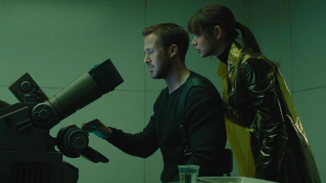
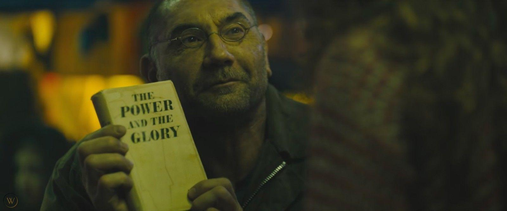
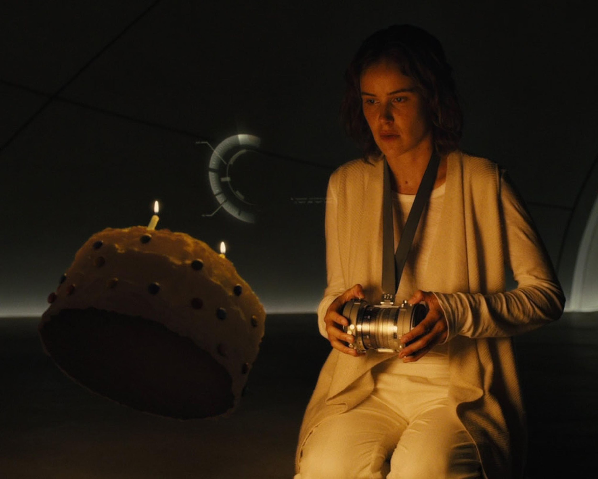

[I]{.dropcap}f androids dream of electric sheep, do replicants read analog novels? In the dystopian sci-fi world of _Blade Runner 2049_ (BR2049; 2017), the sequel to an adaptation, literature plays a complex role: as source text, as a symbol of human culture in a post-human future, and as a reflection upon themes of originality and reproduction, plural authorship, narrative ambiguity, and more. In particular, the film engages in a multi-leveled and strangely playful way with Vladimir Nabokov's novel _Pale Fire_ (1962*)*. An old hardcover copy of the book appears briefly in one scene—a surprising detail in a futuristic world of sentient holograms and flying cars—and it is quoted and covertly referenced in others. These appearances are like metafictive keys to a pattern of possible meanings, varying refractions of the image of “pale fire,” or light reflected from an elusive original source. _BR2049_ is structured as a procedural mystery that unfolds through a sequence of archival revelations through which it both embodies and reflects upon its method of archival replication to create a kind of recombinant archival poetics. Translating between codex, screen, and holographic media, _BR2049_ archives and reanimates its filmic and literary precursors, questioning the links between preservation and entropic decay, and between literature as a medium of control or a vector of resistance. Within a patriarchal techno-corporate world that violently reinforces troubled boundaries, the reading and circulation of books functions as a sign of displaced humanity. In the film, books are mortal bodies, while bodies become textual archives subject to uncanny replication and violent erasure. If replicants read analog novels, they also write electric dreams: the design of artificial life is figured as authorship, and artificial memory as cyborg writing. In analysing these distinct but overlapping layers of meaning, I argue that the film’s engagement with _Pale Fire_ implies a playful questioning of hermeneutic authority and an undermining of authoritative narrative framing, while offering clues to a subversive matriarchal politics, and to an open-access future literature based on the illicit circulation of texts, bodies, and interpretations that could break the informatic control held by the patri-archive.

The first part of my argument examines what it could mean for an artificial life form such as a replicant or holographic AI to read literature, particularly a book like _Pale Fire_. Reading like a replicant, in this section, opens questions of memory and personal identity, cultures of literary transmission, and the dialectic of freedom and control. In the second part I show how the film’s plot progresses through instances of archival reading, through which the film dramatizes the relation between textual embodiment and archival reanimation while also reflecting upon its own complex appropriation of its source materials. Finally, in the third part I reverse the perspective and argue that the film’s metafictive use of _Pale Fire_ leads us from the idea of reading like a replicant to _writing_ like a replicant. My reading of _BR2049_’s intertextual “adaptation” of _Pale Fire_ takes theoretical inspiration from N. Katherine Hayles and Donna Haraway’s ideas about forms of cyborg literary embodiment, Gilles Deleuze on literature and control, Linda Hutcheon on adaptation, and Jacques Derrida’s notion of archive fever; I also reflect on recent critical work on both _BR2049_ and _Pale Fire_.

As a sequel to a film adaptation of a novel, _BR2049_ involves a complex relation between visual and textual media; this is both heightened and symbolized by the way it splices _Pale Fire_ into the narrative. Director Denis Villeneuve’s interest in linguistic themes and literary material is evident in his first sci-fi film _Arrival_ (2016). In _Arrival_, a bookish linguist (whose library we see in an early scene) is tasked with interpreting and translating the non-linear language of an alien species. The story pivots on an extrapolation of the Sapir-Whorf hypothesis, in which linguistic relativity not only conditions perception of reality but alters reality itself. As Stephen Mulhall observes, _Arrival_ and _BR2049_ share an “interest in the way language can inform and transform thought and experience” (Mulhall 34). In _BR2049_, Villeneuve “declares a conviction that language is as much part of the resources of authentic contemporary cinema as vision, and that any inheritance of a cinematic universe that luxuriated in the visual as much as Scott’s will be true to Villeneuve’s directorial identity only insofar as it can synthesise word with image” (Mulhall 41). _BR2049_’s complex engagement with _Pale Fire_ is emblematic of this synthesis of the visual and the literary, and it suggests a future for literature not only in its intertextual afterlife but in its own right as an irreplaceable embodied medium.

## Literature, A Sign of Displaced Humanity

[L]{.dropcap}iterary themes are not what most viewers would have expected from _BR2049_, the much-anticipated sequel to director Ridley Scott’s _Blade Runner_ (1982), but they prove to be crucial to the story and its possible meanings. The new film’s nominal hero is an artificial human known as Officer KD6-3.7, or “K” for short (surely a literary allusion to the cipher-like protagonists of Franz Kafka’s bureaucratic nightmares). I say “nominal hero” because although he is apparently the main character, his agency and efficacy are problematized by a shift in perspective introduced by the film’s literary intertextuality. K is a product of the Wallace Corporation, and his assigned vocation, like Rick Deckard in the first _Blade Runner_ film, is to hunt down and kill rogue replicants. As a blade runner, K erases others like himself, making him a mechanically brutal defender of the very hierarchical order to which he himself is subject. Surprisingly, however, K is also a reader, and his favourite book appears to be Nabokov’s novel *Pale Fir*e. This is a very interesting choice on a number of levels.

_Pale Fire_ is a masterpiece of ludic literature, an intricate concatenation of word games about literature, exile, madness, and life and death. At the heart of the novel is a 999-line poem by the fictitious poet John Shade, also entitled “Pale Fire,” but the majority of the novel is a parasitic scholarly commentary and index by a highly unreliable narrator, Charles Kinbote, who insists on his own overbearing interpretation of the poem. Kinbote claims that Shade was directly inspired by his own tales of the (fictitious) kingdom of Zembla, and that he is a king in exile being hunted by an assassin. Shade’s poem, however, is (at least on the surface) a poem of mourning for his dead daughter, Hazel Shade, and a meditation on the possibility of life after death. Complicated parallels and echoes between the poem and its extensive paratexts suggest elusive (and allusive) meanings, particularly the notion that Shade’s poem may actually be Kinbote’s own work, or that Kinbote’s commentary may be Shade’s own joke. In short, this is not the kind of book one would expect to see a replicant reading, or to see referenced in a blockbuster science fiction movie. What can it mean?

First, it suggests that literature functions as a sign of displaced humanity (a “humanness” that is not essentially fixed to any particular physical embodiment). In an early scene, K’s holographic girlfriend, Joi, picks up a hardcover copy of _Pale Fire_ and asks if K will read to her (see fig. 1). “You hate that book,” he replies. Why does Joi hate _Pale Fire_? One critic suggests that it is because, as a reflection of K’s unexpressed emotions, she is able to hate what he is required to accept, or “perhaps Joi just found _Pale Fire_ disappointing after loving _Lolita_. Who knows?” (Ericson 23). I would suggest instead that it is because, as a holographic life form projected by a perishable electronic device and programmed to serve a human owner, she is uncomfortably close to “pale fire” herself, a mere reflection of another person’s desires. However, as I will argue in more detail below, there is a strange affinity between K, Joi, and the book itself: all three are forms of artificial intelligence, responsive archives of humanity embodied in different material substrates. For now the question remains, why would a replicant want to read any book, let alone a strange novel such as _Pale Fire_? Literature has been understood as a vital mode of human self-interpretation and self-unfolding—art is, after all, “a means of human self-exegesis” (Iser xiii)—but what could it mean to an artificial life form such as Officer K, who seemingly has no self to speak of? What does it mean to read like a replicant?

Reading physical books seems to help replicants become more human. Replicants are “born” fully-grown; they have no childhood, and are supplied with just enough implanted memory to provide a basic sense of personal identity. In the first _Blade Runner_ movie, replicants cling anxiously to their collections of photographs, material traces of the artificial memories on which their fragile selves are based. Literature, however, could supply an archive of high-grade memories to enhance a scant biography and feed electric dreams of what it would be like to be “born not made.” In _BR2049_, the memory designer Dr. Ana Stelline remarks that “authentic memories” (constructed by her) help to “maintain a stable product” in Wallace’s army of replicants. Similarly, in the first _Blade Runner_, Tyrell explains to Deckard that replicants are given artificial memories because “If we gift them the past, we create a cushion or pillow for their emotions, and consequently we can control them better.” The consensus view is that for replicants, stable personhood and functional reliability are based on the interweaving of memory, emotion, and identity; and ultimately, “memories are used as a mechanism of control” (Heersmink and McCarrol 93). Yet there is more at play in _BR2049_’s deployment of _Pale Fire_: fictional literature offers something in excess of personal memory, something like a patterning of possible human experiences, generative of deeper psychological and moral reflection, not to mention aesthetic pleasure and intellectual play, all archived in the form of the relatively durable paper codex, a seemingly antiquated technology that is not dependent on electricity after its initial production. Artificial memories are a means of control, whereas literature has a more ambiguous, even liberating status.

The notion of literature as a portable archive of human experience is borne out by the short prequel film _2048: Nowhere To Run_ (2017; screenplay by Hampton Fancher, screenwriter of the full-length movies) in which another literary cameo signals the importance of the printed book. Set immediately before the action of _BR2049,_ the story focuses on Sapper Morton, the burly replicant whom K kills in the first act of _BR2049_ proper. Sapper is seen lending a young female friend an old hardcover copy of Graham Greene’s _The Power and the Glory_ (1940; see fig. 2), explaining that “It’s about an outlaw priest who’s trying to understand the meaning of being human” (Scott 2017). Moments later, he defends his young friend and her mother from sexual assault by a group of men, thereby outing himself as a replicant and precipitating his imminent death. Literature functions here as a sign of displaced humanity, a material form of narrative linked to a bundle of traits such as empathy, vulnerability, generosity, courage, and self-sacrifice, which seem to be lacking in the dominant class of actual humans. Sapper was designed to be a war machine, but he has diverged from his programming and seems to have humanized himself through reading. Reading like a replicant, in this instance, is not about creating a base of artificial personal memories, but rather the unfolding of alternative possibilities for the self and ethical relations in an open yet dangerous world.

This preliminary narrative provides some context for Officer K’s literary interests, yet his choice of _Pale Fire_ in particular remains surprising. It is a postmodern metafiction with a complex and involuted narrative structure, replete with word games, intricate intertextuality, and intellectual playfulness—not the obvious choice of reading material for an artificial assassin. It is an exemplary ludic novel with deep intertextual ties to English and Russian literary traditions; it is also “a humanist game designed to be read and re-read inexhaustibly” without finding a single conclusive interpretation (Karshan 215). Like _BR2049_, _Pale Fire_ is about adaptation and elusive origins. The title itself is an allusion to Shakespeare: “The moon’s an arrant thief/And her pale fire she snatches/From the sun” (_Timon of Athens_, IV.iii). The image of pale fire is emblematic and multifaceted. Nabokov’s novel is in part a comic reflection on the research he conducted while translating Pushkin’s _Eugene Onegin_ into English, and the game involves “dramatising the intertextual puzzles he faced as an editor, and inducing his readership to share in the challenge of searching for sources and origins, genres and conventions, reminiscences, coincidences, and parodies” (Karshan 197). Embedding _Pale Fire_ in the DNA of _BR2049_ thus implies a playful questioning of hermeneutic authority and an undermining of authoritative narrative framing, which our replicant Officer K is in no position to grasp. Indeed, it is ironic that K is a reader of _Pale Fire_, a novel that undermines its overt protagonists’ claims to centrality, since he doesn’t appear to recognize his own decentred position in the narrative. This perspective also provides another answer to the question of why Joi hates the novel: its unconventional narrative form questions reliable patterns of identity and causality, which could destabilize her software and impede her function as a reassuring companion to K. Rodrigo Fresán discusses _BR2049_ in his recent essayistic novel _The Remembered Part_, commenting that it is understandable that Joi would dislike _Pale Fire_ because it is “a book that forces you, when reading it, to ask who is who, who created whom, who exists and who doesn’t, who remembers what’s remembered and who remembers what they’ve been forced to remember” (607)—troubling questions for artificial beings acting in the interests of their creator.

The humanizing factor is further complicated by the book’s appearance in a different context, one that suggests that literature may also be part of a system of control. In _BR2049,_ the classic Voigt-Kampff empathy test, used to detect replicants hiding in plain sight, has been replaced by a new “baseline” test designed to constrain affect and control behaviour. The test is in a way emblematic of Villeneuve’s blending of visual and literary idiom, for, as Mulhall points out, “the baseline test privileges linguistic responsiveness over physiological visibilia as the most effective medium for revealing a replicant’s inner life” (41). In this scene, a cold debriefing after having just “retired” the replicant Sapper Morton, Officer K recites a control text while being aggressively questioned in a way that seems calculated to provoke any feelings of resentment he might have developed in relation to his subaltern and murderous role. The text of Officer K’s baseline test, which sounds like a strange mantra or hymn to his artificial origin, is lifted from the poem “Pale Fire.” Nabokov’s text reads:

> “And blood-black nothingness began to spin
>
> A system of cells interlinked within
>
> Cells interlinked within cells interlinked
>
> Within one stem. And dreadfully distinct
>
> Against the dark, a tall white fountain played.”
>
> (Nabokov 47, lines 703-707)

Officer K recites the lines while an unseen agent interrupts with belligerent questions and demands to repeat certain words. Abstracted and decontextualized, the text has been repurposed as a tool of domination, reduced to a command signal in a system of control that sustains a state of post-traumatic dissociation in its subject. Literature may be captured by this system, but it can also resist. Haraway, Hayles, and Deleuze have all argued that we are living in an era of informatic control, but, as Deleuze writes, “there is a fundamental affinity between a work of art and an act of resistance” (327). Art resists decay, and it resists control, though it is subject to both, and therefore exists in a vulnerable and precarious situation.

In contrast to the baseline test, Officer K is subjected to a different kind of literary test when he first meets Deckard, the original blade runner. The first time we see Deckard on screen after a thirty-year hiatus, his opening line is “Have you got any cheese about you, boy?” This is a quotation from Robert Louis Stevenson, as K quickly discerns. “_Treasure Island_?”, he replies. “He reads! That’s good,” says Deckard. This test is clearly different from the baseline in both intent and method: it is a face-to-face dialogue rather than rote repetition of control phrases, and despite the tense atmosphere it is a playful moment, evoking a human response rather than attempting to limit and control its possible emergence. Again, literature functions here as a sign of the human, and the juxtaposition of literary tests dramatises the film’s overarching conflict between informatic control and autonomy.

## Textual Bodies, Embodied Texts, and Archive Fever

[I]{.dropcap}n the world of _BR2049_, the physical embodiment of texts matters, and printed books highlight the affinity between mortal bodies and texts. The film’s fascination with printed matter echoes our contemporary interest in “vintage” material culture, an archival response to the anxieties of accelerating disembodiment in the information age. Awash in digital distractions and virtual relations nearly as strange as those between K and his holographic girlfriend, we seem to crave a return to embodied experience and the comfort of more familiar media objects. Hayles argues that the dominance of informatics leads to the “_systematic devaluation of materiality and embodiment_” (48; emphasis in the original). What we see dramatized in _BR2049_, however, is just the opposite: a re-investment in singular embodiment which is coded as vulnerable resistance to informatic power. There is a deep affinity between books and bodies, as Hayles argues:

> “The entanglement of signal and materiality in bodies and books confers on them a parallel doubleness. As we have seen, the human body is understood in molecular biology simultaneously as an expression of genetic information and as a physical structure. Similarly, the literary corpus is at once a physical object and a space of representation, a body and a message. Because they have bodies, books and humans have something to lose if they are regarded solely as informational patterns, namely the resistant materiality that has traditionally marked the durable inscription of books no less than it has marked our experiences of living as embodied creatures.” (29)

The physical book of _Pale Fire_ is embedded in a wider pattern of texts inscribed upon a variety of material substrates—other printed books, a replicant’s eyeball, an engraved tree, Rachael’s skeleton, a crystal data sphere, old orphanage record-books with pages torn out, a wooden horse, genomic codes, and brain-based memories both human and artificial. Texts are figured as bodies, and bodies as texts. Bodies can be reduced to information, stored, retrieved, copied; and they can also be “erased,” as Lt. Joshi instructs K to do with the replicant child. Bodies can be (re)produced from archival data, and bodies are themselves archivable, but they remain subject to entropy. As Hayles further argues,

> “Information, like humanity, cannot exist apart from the embodiment that brings it into being as a material entity in the world; and embodiment is always instantiated, local, and specific. Embodiment can be destroyed, but it cannot be replicated. Once the specific form constituting it is gone, no amount of massaging data will bring it back.” (49)

In _Do Androids Dream of Electric Sheep?_ (1968), Philip K. Dick invents the term “kipple” for the detritus, dust, and abandoned junk that accumulates in all corners of the forsaken earth: “Kipple is useless objects, like junk mail or match folders after you use the last match or gum wrappers or yesterday’s homeopape. When nobody’s around, kipple reproduces itself” (61). Hayles elaborates this neologism into “entropic decay” (174). Archival desire is premised on the entropic force of forgetting, a kind of “radical finitude” (Derrida 19). Books resist entropy because of their durable bodies, outliving generations of individual readers, but they are still subject to decay. The best resistance to the kipple-ization of literature is its active circulation through embodied practices of reading and interpretation: a kind of archival relay.

The significance of _Pale Fire_, both as metaphor and material text, is deepened when we consider how it is embedded in the film’s dramatization of competing archival logics, one based on ownership and exploitation and another based on illicit circulation and free play. Reading like a replicant involves a kind of “archive fever” (Derrida 2005) that unfolds on multiple levels at once. _BR2049_ proceeds through a series of archival revelations, a search which Officer K undertakes without realizing that it will displace him from his own story. The plot focuses on the race to find the child of Rachael and Deckard, who is the first child born of a replicant mother. Niander Wallace, the film’s corporate arch-villain, sees the child as a means to consolidate his power. Frustrated by his inability to manufacture fertile female replicants, he thinks the child will provide him the key to infinite human expansion, the power to create and control life on a vast scale and extend human exo-colonization into distant space. Wallace’s archives—including those he acquired from Tyrell, the first creator of replicants—are the foundation of his power over life and death; his power stems from his possession of the patents for the bio-engineering of abundant food supplies, and extends to control over replicant genomes. Archives, as Derrida argues, are both originary and nomological, both a commencement and a commandment (1). Wallace’s archives are “topo-nomological” in Derrida’s sense: based in a secure location and investing hermeneutic authority in their owner (3).

In contrast to Wallace’s fortified archives, we have Deckard’s library. Crammed bookshelves line his living space, and we glimpse a neat stack of books next to a framed photo of his lost love Rachael; books are intimate objects linked to personal memory, identity, and relationships. Literature may become a carrier signal for an “informatics of domination” (Haraway 463), as with the baseline test, but it is also linked to an informal network of free circulation, a gift economy. In contrast to Wallace’s patri-archives, literature is sustained through what we could call a nomadic archive. Literature here is not confined, but functions as a mobile mediator circulating through networks of intimate contact: books mediate relations between generations, between the sexes, and between humans, replicants, and holographic artificial intelligence. Literature, to use Derrida’s phrase, is a “transgenerational and transindividual relay” (35), connecting readers and writers across differences of time and place, social hierarchies and archival technologies.

The film depicts several intriguing moments of archival reading. At the LAPD DNA Archive, K reads sequences of genes, rapidly scanning data in a way that would be impossible for any human reader (see fig. 3). As K reads, Joi marvels at the construction of human beings from columns of coded information, an alphabet of four letters in contrast to the two of her digital code; she herself is a kind of text, a virtual body supported by a perishable physical substrate.

Pursuing the case to Wallace’s vast archives, K learns that most electronic files were corrupted in “The Blackout” of 2022. Little information apart from paper records survived, which helps to explain why there are still antique books in circulation, and also draws our attention to the perishable material substrate of embodied texts. Bodies can be reduced to information, stored, retrieved, copied, and erased. K is able to find a corrupted holographic video file of Rachael’s Voigt-Kampff test from the first film, and we see a fragment of her dialogue: “Are you testing whether I’m a Replicant or a lesbian, Mr. Deckard?” (Villeneuve 2017; Scott 1982). This moment is one of the few fragments of _Blade Runner_ that is copied almost exactly from Dick’s novel, which was adapted quite freely in many other respects: “Is this testing whether I’m an android,” Rachael asked tartly, “or whether I’m homosexual?” (47). It is an uncanny archival _mise-en-abyme_. This archival reanimation is given a further twist when Wallace creates a new Rachael to entrap Deckard: as viewers of the film, we see a computer-generated likeness of the actor Sean Young as a timelessly young Rachael mapped onto body double Loren Peta, the substrate of a projected pattern (see fig. 4).

In the same scene, the lighting design of Wallace’s headquarters plays conspicuous homage to the appearance of Tyrell’s lair in the first Blade Runner. Both make ample use of reflected light, with shimmering interference patterns of “pale fire” rippling across vaulted ceilings, although Scott’s film achieved this with practical effects that Villeneuve was able to reproduce with the relative ease of digital production. These scenes are thus permeated with a visual metaphor for the film’s own poetics: _BR2049_ both embodies and reflects upon its method of intertextual adaptation. As the sequel to an adaptation of a book, _BR2049_ is several degrees of separation from any claim to originality. Although we cherish and fetishize originality, this an-archivic quality is endemic to all art. As Linda Hutcheon notes, “art is derived from other art; stories are born of other stories” (2), and “an adaptation is a derivation that is not derivative—a work that is second without being secondary. It is its own palimpsestic thing” (9). It is this process of derivation that allows works to survive, albeit in mutated form:

> “Adaptation, like evolution, is a transgenerational phenomenon. \[...\] Stories do get retold in different ways in new material and cultural environments; like genes, they adapt to those new environments by virtue of mutation—in their “offspring” or their adaptations. And the fittest do more than survive; they flourish” (32).

Through these images of reflected light, _BR2049_ ingeniously “adapts” the unadaptable novel _Pale Fire_, reproducing it in mutated form, while dramatizing its own processes of archival reanimation.

Crucially, Officer K’s own memory proves to be an essential piece of the archival puzzle. Through his search, K comes to believe that he himself is the miraculous child, the one who will “break the world”—or at least become “a real boy now,” as Joi says, furnishing the obligatory Pinocchio reference—but through a narrative manoeuvre inspired by _Pale Fire_ he is displaced from this role (Villeneuve 2017). K knows that his own memories are fabrications, but he comes to believe that one particular memory, a vision of the toy wooden horse that he finds buried with Rachael’s remains, is true. This leads him to seek out the memory designer, Dr. Ana Stelline, who admits that K’s memory is not a pure fabrication like the others written into replicant minds but rather, and against the law, someone’s actual memory. In fact it is her own memory, and by inscribing it in K’s mind she has set in motion the plot that will reveal that she is the daughter of Rachael. Stelline is the specimen sought by Wallace, the key to controlling replicant reproduction, but she is also an active agent whose creative transgression sets the narrative in motion.

## Cyborg Mnemopoiesis

[T]{.dropcap}he creative agency of Ana Stelline is emphasized by a narrative structure strikingly similar to that of _Pale Fire_, which we might call “Nabokovian displacement.” In several of Nabokov’s fictions, including _Pale Fire_ and the infamous _Lolita_, the story is told from the perspective of a manipulative and insane narrator who manically tries to implicate readers in his own sordid tale, while marginalizing a sympathetic character who, we indirectly learn, is morally and creatively central to the story. _Pale Fire_ consists largely of mad narrator Kinbote’s self-absorbed commentary on John Shade’s poem, which he entirely fails to understand. Displaced by Kinbote’s framing is Shade’s mourning for his departed daughter Hazel, an aspiring poet and arguably the true moral and creative centre of the novel. One of _Pale Fire_’s narrative games involves strategic undecidability concerning the true authorship of the novel’s multiple texts, and Hazel Shade herself is one of the possible authors, if only from beyond the grave. Against the division of _Pale Fire_ scholars into “Shadeans” and “Kinbotians” claiming that one of the two men is the sole author of both text and commentary, this third interpretive possibility is argued at length by Brian Boyd, the foremost American Nabokov scholar. In Boyd’s exhaustive re-rereading of the novel, he shows that Hazel “appears to inspire her father with material for a poem that sums up her death, his life, and his life-long quest to probe the mystery of death (174); at the same time, “The evidence Nabokov conceals within _Pale Fire_ suggests that Hazel’s spirit somehow inspires Kinbote with the idea of Zembla \[…\] because she can turn Zembla into a chance to both express and ironize her own experience as a woman spurned” (173). Through a similar narrative game, Officer K is displaced from the centre of _BR2049_’s narrative, and the focus shifts to the lost daughter, Dr. Ana Stelline. But the film introduces a crucial difference: Hazel dies, but Stelline lives to spark the illicit circulation of texts and bodies.

If Officer K reads like a replicant, Stelline writes like a replicant, creating dreams and memories for other replicants in her isolated creative laboratory (see fig. 5). In her cyborg manifesto, Haraway imagines a contemporary political subject able to navigate and resist the techno-scientific domination increasingly structuring our social reality. “By the late twentieth century our time,” she writes, “we are all chimeras, theorized and fabricated hybrids of machine and organism; in short, we are cyborgs” (457). Cyborgs transgress boundaries between traditional dualisms, like natural and artificial; they are “illegitimate offspring of militarism and patriarchal capitalism,” but they can draw strength from their muddled origins (458). Stelline represents the open-sourcing of artificial life, so to speak. She herself is an unforeseeable event—an embodied rewriting of the future. Not only is she the body(text) that will break the world, it is her text(body) that initiates the process. Ultimately, however, it is her act of cyborg mnemopoeisis that has the potential to change the world, not her status as a fertile female specimen. I suggest we read Stelline as a feminist cyborg author whose poietic agency represents the possibility of a living matri-archive.

Stelline’s memory writing is a kind of literary practice. She sees herself as a creator, and remarks that “every artist puts something of themselves in their work.” Another archival moment: creation is the reflective relay of lived experience. Fresán, again in _The Remembered Part_ (another link in the relay of reflections!), imagines Stelline as a literary heroine, hidden in a corner of the canvas; she has “the look of a solitary Victorian writer or a pre-Raphaelite model,” but “Stelline wasn’t making autofiction with her imagined memories. Stelline created from what she lived: because to imagine was to create and to create was to live” (605-606). Stelline is a cyborg writer, and her poeitic intervention in history multiplies meanings and possibilities. As Haraways puts it:

> “Writing is pre-eminently the technology of cyborgs, etched surfaces of the late twentieth century. Cyborg politics is the struggle for language and the struggle against perfect communication, against the one code that translates all meaning perfectly, the central dogma of phallogocentrism” (470).

We can construe Stelline’s art as an enactment and precursor of a future literature that has been with us all along, a subversion of the hermeneutic authority invested in the patri-archive, a powerful kind of writing that provides the means to resist and subvert informatic control.

At this point it’s worth reflecting on some possible objections to this story I’ve been telling. Some of the most incisive critiques of _BR2049_ came from feminist writers who found its aesthetics deceptively derivative, its depictions of women gratuitously negative, and its politics of reproduction deeply problematic. Regarding the film’s reproduction of its source materials and seeming lack of engagement with contemporary social issues, Shama Rangwala writes that “The only future made possible by _Blade Runner 2049_’s final scene is more and more Blade Runners.” But _BR2049_ is more than another example of the flood of sterile reproductions, reboots, sequels, prequels, and spinoffs of previously profitable intellectual properties that dominates contemporary culture: as the use of _Pale Fire_ as a metaphor for adaptation suggests, it is an ironic and satiric commentary on the fatal sterility of that same process, and one that holds the potential for liberation from the power of a certain kind of archival control. Arguably, the intertextuality with Nabokov is too subtle a strategy for such ends, possibly limited to a certain kind of reader; but many critics have also overlooked or downplayed the creative agency of Stelline. Emma Louise Backe criticizes the film’s over-reliance on the trope of reproduction, arguing that despite Stelline’s role as memory engineer and potential mother, she is nothing in herself; “Despite her importance to the _Blade Runner 2049_ plot and mythos, Dr. Stelline is defined primarily by her significance to the men around her and her biological identity, rather than any personal qualities inherent to her.” In effect, such a critique reduces Stelline to “pale fire” as well. I would argue, however, that Stelline’s artistry transgresses the order imposed by the patriarchal world in which she is confined, and represents the precarious possibility of escape from control.

Ian Campbell (no relation) has examined a similar topic but come to different conclusions. He argues that the film’s use of _Pale Fire_ is metafictive, inciting viewers to look beyond the seemingly optimistic story about K’s heroism to see that he has likely been a self-deluded puppet of Wallace all along; the film’s use of holographic imagery, deployed with Joi and Rachael, is a self-aware illusion that comfortingly mimics the more optimistic first film while ultimately suggesting the illusory nature of the optimistic ending. “The future is (fore)closed, not open. _BR49_ \[sic\] only seems optimistic because of its familiar tropes and because it borrows some of its predecessor’s aura through Rachael’s iconic look \[…\] The film seems to end well, but that’s because its use of illusion distracts us from thinking about metafiction in the way that _Pale Fire_ demands.” This argument, however, requires additional information that is conspicuously not supplied by the film itself. “We’ve been putting microchips in our cats and dogs since before the millennium; is it really plausible that the Wallace Corporation can’t track all the Replicants, even those who have plucked out their right eyes? How likely is it that Replicants don’t have remotely-activated devices that can drop them unconscious or kill them instantly?” If this were the case, however, and replicants could easily be remotely deactivated, what need would there be for blade runners at all? The whole premise of the story would collapse. Ironically, the wish to interpret the film’s future as definitively foreclosed is a distinctly Kinbotian overreach.

The argument hinges on the question of control: how likely is it that K, Deckard, and especially Stelline have escaped from Wallace’s control? Just as the first _Blade Runner_ hints at and leaves open the question of whether Deckard himself might be a replicant, _BR2049_ ends in openness and indeterminacy. It is true that the ending is problematic and that Stelline’s position is a very precarious one, but what advocates of foreclosure forget is the possibility that freedom in the realm of fiction may have a causal relationship to freedom in the actual world. If interpretations of indeterminacy condition praxis, an inability to play can have fatal consequences. Literature, embodied in physical books or other media, may be either a vector of control or an unexpected pathway to freedom. The choice is ours.

To return to “Pale Fire,” the poem: in the section included in the baseline test, John Shade (or Hazel!) writes that “a tall white fountain played/dreadfully distinct.” This is the vision of life after death that he briefly glimpses while blacked out due to a heart attack, and he thinks he finds it corroborated in the newspaper account of a woman who also saw a white fountain during a near-death experience—but this turns out to be a misprint: “_Mountain_, not _fountain_” (Nabokov 62). The confusion based on a misprint is clearly echoed in _BR2049_’s trope of the confusion between K and Stelline, who was hidden from Wallace through the creation of a false doubling in the genetic archive. It also hints at the possibility of misreading in general, and the need for ludic strategies in dealing with the world of appearances. The poem continues:

> “Life Everlasting—based on a misprint!
>
> I mused as I drove homeward: take the hint,
>
> And stop investigating my abyss?
>
> But all at once it dawned on me that _this_
>
> Was the real point, the contrapuntal theme;
>
> Just this: not text, but texture; not the dream
>
> But topsy-turvical coincidence,
>
> Not flimsy nonsense, but a web of sense.
>
> Yes! It sufficed that I in life could find
>
> Some kind of link-and-bobolink, some kind
>
> Of correlated pattern in the game,
>
> Plexed artistry, and something of the same
>
> Pleasure in it as they who played it found.”
>
> (lines 803-815, p. 62-63)

In viewing _BR2049_’s correlated patterns as an intertextual homage to _Pale Fire_, it would be fitting to embrace this ludic aspect. As Boyd writes in his conclusion, “Nabokov designed _Pale Fire_ so that we make discoveries at every phase of reading, so that the interplay of problems and promise keeps luring us on to still more sweeping surprises” (247). Similarly, the film yields additional meanings on repeated viewings, especially if we learn to read like replicants.

## Conclusion

[R]{.dropcap}eading like a replicant can mean reading for a store of artificial memories, or for something more transformative. It is a hybrid reading: analog, digital, holographic, forensic, archival, and ludic. Reading like a replicant also means attending to the material embodiment of texts, and the competing archival logics they are caught up in. It means considering the textual permeability of bodies, or the ways in which chance encounters between bodies and texts can yield unforeseeable events. Textualization can be a means of controlling bodies, or a vehicle of liberation. In its parables of reading (and writing) like a replicant, _Blade Runner 2049_ suggests that the fate of free bodies and minds is somehow bound up with the fate of literature.

The film depicts a world in which culture and archival retrieval and reanimation have become virtually synonymous. What appears to be most alive is artificial, and nothing new is being created apart from the products of a consumerist control society endlessly reproducing past creations, such as the monumental, glitch-ridden Elvis hologram spliced into the scene of K and Deckard fighting in an abandoned casino. The world of _BR2049_ is much like our own, in other words, and it seems to pose the question of how the resistant materiality of literary texts entering into unforeseen relations might contribute to the genesis of an Event that would escape such terminal nihilism. Literature is a trans-individual process that depends on specific, contingent, and embodied practices of reading and writing, archiving and interpreting. Texts and bodies are mortal and must be replicated and transmitted in order to endure, but if this process is to be liberated from archival necro-power reproduction will need to introduce error, transgression, creativity, and free play. Literature is the transgenerational relay of our mortal humanity, a collective inheritance sustained by an open archive, and it may be a crucial form of resistance to the forces that would subjugate life under a single code.

:::{class="REF"}

## Works Cited

Backe, Emma Louise. “Replicants and Reproduction: Blade Runner 2049 and Sci Fi’s Obsession with Motherhood.” _The Geek Anthropologist_, Oct. 19 2017, [[https://thegeekanthropologist.com/2017/10/19/replicants-and-reproduction-blade-runner-2049-and-sci-fis-obsession-with-motherhood/]{.underline}](https://thegeekanthropologist.com/2017/10/19/replicants-and-reproduction-blade-runner-2049-and-sci-fis-obsession-with-motherhood/).

Boyd, Brian. _Nabokov’s Pale Fire: the Magic of Artistic Discovery_. Princeton University Press, 1999.

Campbell, Ian. “Metafiction and _Pale Fire_ in _Blade Runner 2049_.” _The Projector_, vol. 19 no. 2, summer 2019, https://www.theprojectorjournal.com/campbell-metafiction-and-pale-fire/.

Deleuze, Gilles. “What is the Creative Act?” _Two Regimes of Madness_, edited by David Lapoujade, translated by Ames Hodges and Mike Taormina, Semiotext(e), 2007, pp. 317-329.

Derrida, Jacques. _Archive Fever: a Freudian Impression._ Translated by Eric Prenowitz, University of Chicago Press, 1998.

Dick, Philip K. _Do Androids Dream of Electric Sheep?_ Del Rey, 2017.

Ericson, Aron. “Are You For Real?” _Blade Runner 2049 and Philosophy: This Breaks The World_, edited by Robin Bunce and Trip McCrossin, Open Court, 2019, pp. 19-25.

Fresán, Rodrigo. _The Remembered Part_. Translated by Will Vanderhyden, Open Letter, 2022.

Haraway, Donna. “A Cyborg Manifesto.” _Simians, Cyborgs and Women: The Reinvention of Nature_, Routledge, 1991, pp. 149-181.

Hayles, N. Katherine. _How We Became Posthuman: Virtual Bodies in Cybernetics, Literature, and Informatics_. University of Chicago Press, 1999.

Heersmink, R., and C.J. McCarrol. “The Best Memories: Identity, Narrative, and Objects.” _Blade Runner 2049: a Philosophical Exploration_, edited by Timothy Shanahan and Paul Smart, Routledge, 2020, pp. 87-107.

Iser, Wolfgang. _The Fictive and the Imaginary: Charting Literary Anthropology_. Johns Hopkins, 1991.

Karshan, Thomas. “Pale Fire and the Genre of the Literary Game.” _Vladimir Nabokov and the Art of Play,_ Oxford University Press, 2011, retrieved from Oxford Scholarship Online, 4 Aug. 2021, DOI: 10.1093/acprof:oso/9780199603985.003.0007, pp.195-232.

Mulhall, Stephen. “The Alphabet of Us: Miracles, Messianism, and the Baseline Test in _Blade Runner 2049_.” _Blade Runner 2049: a Philosophical Exploration_, edited by Timothy Shanahan and Paul Smart, Routledge, 2020, pp. 29-47.

Nabokov, Vladimir. _Pale Fire_. Vintage, 1989.

Rangwala, Shama. “No Future.” _Jacobin_, Nov. 11 2017, [[https://jacobin.com/2017/11/blade-runner-2049-science-fiction-dystopia]{.underline}](https://jacobin.com/2017/11/blade-runner-2049-science-fiction-dystopia).

Scott, Luke, director. _2048: Nowhere to Run_. Screenplay by Hampton Fancher and Michael Green. Alcon Entertainment, Columbia Pictures, Thunderbird Entertainment, Scott Free Productions, 2017.

Scott, Ridley, director. _Blade Runner_. Screenplay by Hampton Fancher and David Peoples. Warner Brothers, The Ladd Company, Shaw Brothers, Blade Runner Partnership, 1982.

Shakespeare, William. _Timon of Athens_. Edited by John Jowett, Oxford UP, 2004.

Villeneuve, Denis, director. _Blade Runner 2049_. Screenplay by Hampton Fancher and Michael Green. Alcon Entertainment, Columbia Pictures, Bud Yorkin Productions, Torridon Films, 16:14 Entertainment, Thunderbird Entertainment, Scott Free Productions, 2017.

## Image Notes

Figure 1: Pale Fire, Officer K’s favourite book? Still from _Blade Runner 2049_ (2017).

Figure 2: “It’s about an outlaw priest who’s trying to understand the meaning of being human.” Still from _2048: Nowhere to Run_ (2017).

Figure 3: Reading like a replicant? Still from _Blade Runner 2049_ (2017).

Figure 4: Body double Loren Peta merged with a de-aged digital Sean Young as Rachael. Still from _Blade Runner 2049_ (2017).

Figure 5: Dr. Ana Stelline’s cyborg mnemopoiesis. Still from _Blade Runner 2049_ (2017).

:::
