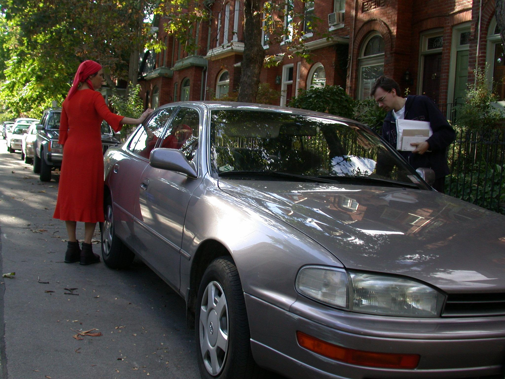
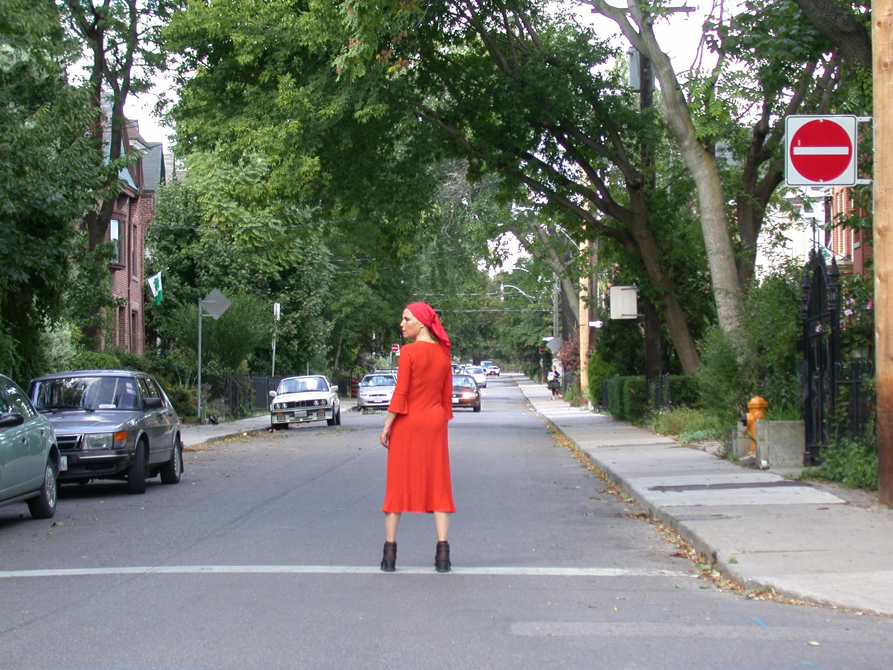
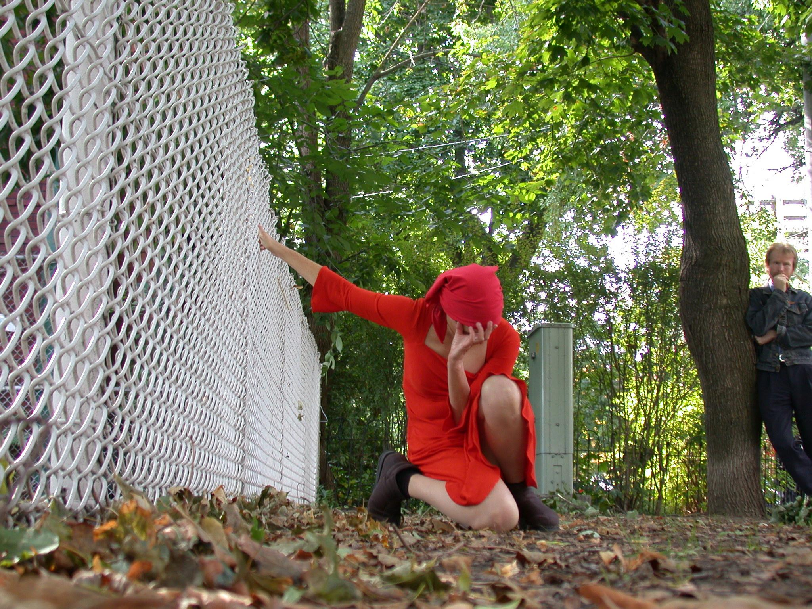

## 0. Introduction

[I]{.dropcap}n the call for this issue of _Imaginations_, authors are asked to consider, "How can an examination of the modes of inscription across media, platforms, and interfaces, draw greater attention to what is often ignored in critical conversations about texts, objects, and bodies: the vitality of their materiality?" This paper responds first by attending to what it might mean to pinpoint vibrancy and agency as inhering to _things_—a stance that contrasts with our tendency to read intentionality (not to mention aesthetics) as resting firmly in the domain of human _consciousness_. The first four sections explore some of the theoretical underpinnings of these contrasting ways of approaching the presumed separation between a "who" inhabiting and acting upon a world and a "what" that simply exists within an objective environment. Rather than privileging a human quality of conscious intentionality, this paper advocates an approach oriented toward a consideration of _relationality_, where intelligibility is understood to emerge across a field of entities that enact their connectedness and connectability to each other. Each thing, body, and person manifests in relation to its world.

Having established this philosophical ground, the paper turns to a descriptive territory that might feel more familiar to most readers of this publication. The fifth section frames Viktor Shklovsky's device of defamiliarization (_ostranenie_) in relation to the preceding arguments, suggesting that art actions can reorient our relational fields toward new possibilities of connectability, opening us up to the "who-ness" of objects: that is, the particular connectabilities that constitute their worlds. In doing so, the paper also proposes a move away from thinking art's productive force in textual terms, or _modes of inscription_, in favour of privileging the disclosive power of animateness, where _acts of conscription_ can bring previously unacknowledged or unrealized connectabilities into potential alignment. The final three sections consider some of the acts of conscription, human and non-human, at play in the Toronto iteration of _Disposition_, a work of site-specific performance art by Israeli artist Adina Bar-On.

## 1. Vibrancy, Agencement, and Distributed Awareness

[I]{.dropcap}n her book _Vibrant Matter_, Jane Bennett encourages her readers to view _things_ anew. As _vibrant_ entities, things are not only what a human consciousness can make of them. They appear in relation to both a "recalcitrance" that resists human understanding and a "positive, productive power of their own" that can affect and transform us (1). Affirming the vibrancy of matter is a move away from a traditional perspective that attempts to restrict agency to human intentionality. To say that a thing has vibrancy is to recognize it as an actant rather than simply as an object. In broad terms, Bennett is interested in "a theory of distributive agency" in which "there are \[…\] always a swarm of vitalities at play" (31-32). Seeking to situate what she calls "thing-power," Bennett turns to a notion of assemblage to describe matter's potential vibrancy, arguing that a thing's power corresponds to the way it exerts force within a network. While the concept of assembly is central to actor-network theory,[^1] which is often closely linked to vital materialism, Bennett cites Mark Bonta and John Protevi's definition of "assemblage (_agencement_) as 'an intensive network or rhizome displaying "consistency" or emergent effect by tapping into the ability of the self-ordering forces of heterogeneous materials to mesh together,' (Bonta and Protevi, _Deleuze and Geophilosophy_, 54)" (130). This identifies her understanding of assemblage as having a Deleuzian inflection.

Invoking Gilles Deleuze and Félix Guattari's notion of assemblage, however, demands something more complex than a simple redistribution of agency among material entities, human or otherwise. Erin Manning, in her book _The Minor Gesture_, has pointed out the tendency of the English word assemblage—the generally accepted translation for Deleuze and Guattari's term _agencement_—to be read too much in terms of objects. She writes, "_agencement_ speaks to the interstitial arena of experience of the interval, \[…\] where the field is still in formation. \[…\] Unfortunately, assemblage has too often been read as an object or existent configuration, rather than in its potentializing directionality. \[…\] _Agencement_ \[…\] carries within itself a sense of movement and connectibility, of processual agency" (123).

This suggests that the vibrancy Bennett is so interested in exploring may be less a quality that emanates from objects than it is a function of a field of potentializing directionality: an animateness inherent at least as much to _relationality_ as to materiality. If causality cannot be confined to human intentionality, neither can vibrancy be confined to material objects; both are indices of a shared relational field.

Brian Massumi points to something similar in _Parables for the Virtual_ when he suggests, "perception lies _between_ the perceiver and the perceived" (90). For him, the way creatures perceive a thing is defined by how they are able to encounter and act upon that thing, where "the properties of the perceived thing are properties of the action more than of the thing itself" (90). While it may appear that Massumi's equating of perception with an ability to act upon a thing privileges an intentionality that is at least organic if not exclusively human, he is quick to add, "This does not mean \[…\] that the properties are subjective or in the perceiver. On the contrary, they are tokens of the perceiver's and the perceived's concrete inclusion in each other's world" (90).

Massumi points to "the reciprocity of perception" (96), a configuration that reveals multiple aspects of mutually determinate presencing: things, bodies, and worlds. In his schema, "a thing 'in itself' \[…\] is its connectability with other things outside itself" (92). This connectability need not be actualized; rather, "the humblest flower enfolds forces that no creature, not even a human, will ever know how to connect to: colors outside the visible spectrum, forces too small, too large, too subtle, or simply too different to conjoin" (93). At the same time, connectability is what determines both things and the perceiving bodies positioned at the other end of perception. "The thing _is_ its being-perceiveds. A body _is_ its perceivings. 'Body' and 'thing' \[…\] exist only as implicated in each other" (95). The connectability of perception that flows between things and bodies—the potential for two things to be implicated in one another—is what Massumi calls the world. As he puts it, "That two-headed perception is the world" (95).

Conflating perception and world in this way moves away from a traditional subject-object relationship that locates perceptions in bodies and qualities in things. Perception-as-world conjoins these two manifestations—body and thing—as poles of an axis that connects and defines them both. Put another way, a body does not exclusively own its world, nor does a thing simply populate a body's world. Both body and thing inhabit a shared world of sheer connectability, and what is distributed—not within or among them so much as _between_ them—is not simply force or agency, but also awareness. The unfolding of a world amounts to a fundamental, localized, and reciprocal intelligibility that manifests as matter as much as it does as consciousness.

## 2. Things and Being

[M]{.dropcap}assumi's way of understanding things can be viewed as both a challenge to and a reworking of Martin Heidegger's analytic of Dasein in _Being and Time_. Heidegger posits _Dasein_—a term that translates literally into English as "there-being"—as grounded in a particular type of self-understanding. Michael Inwood offers a brief history of the term:

> "\[Da\] means 'there' \[…\] and 'here' \[…\], as well as 'then', 'since', etc. Prefixed to sein, 'to be' it forms dasein, 'to be there, present, available, to exist'. In the seventeenth century the infinitive was nominalized as (das) Dasein, originally in the sense of 'presence'. In the eighteenth century Dasein came to be used by philosophers as an alternative to the latinate Existenz ('the existence of God'), and poets used it in the sense of 'life'. \[…\] Colloquially it is used for the being of life or persons. (Dasein in Heidegger is quite distinct from Dass-sein, 'that-being')" (42).

Heidegger understands human being or Dasein as fundamentally different from the being of things or of other creatures, which is his way of sidestepping Cartesian analyses that treat consciousness as a distinct type of "thingly" being. René Descartes insisted on the separation of _res cogitans_ from _res extensa_, thereby positing consciousness in terms of non-material but still ontological entities such as soul or spirit. This, in Heidegger's view, is a decisively misleading detour away from the possibility of thinking being as such:

> "an unexpressed anticipatory ontological characterization is contained in addressing beings as "things" (_res_). An analysis which starts with such beings and goes on to inquire about being comes up with thingliness and reality. Ontological explication thus finds, as it proceeds, characteristics of being such as substantiality, materiality, extendedness, side-by-sideness.… \[…\] When one designates things as the beings that are 'initially given' one goes astray ontologically" (§15, 67-68).

Rather than describing human being as a composite of material body and ethereal soul or spirit as distinct entities, Heidegger starts from an understanding of human being as a singular unity: "Beings are a _who_ (existence) or else a _what_ (objective presence in the broadest sense)" (§9, 44). He asserts that of all beings, Dasein "understands itself in terms of its existence" (§4, 11); or, put another way, "Dasein is a being which is related understandingly in its being toward that being (Sein)" (§12, 53). This is contrasted with the being of "objectively present" things: "To something objectively present its being is a matter of 'indifference' ('gleichgültig'), more precisely, it 'is' in such a way that its being can neither be indifferent nor non-indifferent to it" (§9, 42). Heidegger's highly anthropocentric claim pointedly structures intelligibility and meaningfulness in terms of human awareness and perception. His formulation dismisses tout court, for example, the possibility that animate responsiveness and innate biological processes and dispositions focused on self-preservation or survival enhancement demonstrate a living entity's understanding of and concern for its being. In his view, "Life has its own kind of being, but it is essentially accessible only in Dasein" (§10, 49). Dasein's exclusive access to understanding being—which is key to the concepts of unconcealedness and openness that run through all of Heidegger's writings—hinges on human consciousness coupled with language. In "The Origin of the Work of Art," Heidegger argues that language "brings beings as beings, for the first time, into the open. Where language is not present, as in the being of stones, plants, or animals, there is also no openness of beings, and consequently no openness either of that which is not a being (_des Nichtseienden_) or of emptiness" (46).

What such an argument fails to recognize is that beings enact their openness _as and through their being_, that is, by _how they act_. A bee recognizes and is open in particular ways to a flower, and vice versa; they share a world of mutual intelligibility through their interactions without having to name their responsiveness to each other in language. This is no less true of the earth and the moon, which enact their openness to each other through their gravitational dance. Being does not require an act of "unconcealing" in language, which, as an inscriptive layer of representation, transforms as much as it reveals. At best, one might say that language facilitates a particular kind of openness of being _for human consciousness_.

Thinking ontology through perception rather than language—by focusing on the imbricated and localized unfoldings of time, space, and matter—has become relevant in new ways as we have extended human awareness to domains where different laws and behaviours appear to apply than those detectable to an unenhanced human sensory system. If one is to concern oneself with the meaning of being, then it is fair to ask how it is that entities and events manifest in particular ways by inquiring into the suchness of matter and animateness without immediately prioritizing human awareness, intentionality, and expression. How is it that there are particles that move and vibrate, attract and repulse in relation to one another? Can their responsiveness be equated with a kind of concern for their being? Heidegger argues in _Being and Time_ that a chair and a wall could never "touch" each other because they are "worldless"—incapable of becoming "accessible" to each other in "their being present" (§12, 55-56). But surely his description of the contact between chair and wall overlooks the basic wonder that two things—which appear to be mostly empty space at the subatomic level—can maintain their structural integrity, assert their distinctiveness, and eschew the possibility of simply melting together or passing through each other, notwithstanding their lack of humanly understood or measured self-perception. Their contact enacts an expressive dance of entities recognizing—or in Massumi's terms, connecting with—each other, even without a human witness. Against Heidegger, then, I would argue that the meeting of chair and wall is indeed an _encounter_ that influences or determines each of them in specific ways and that reveals them as belonging to a shared world.

## 3. Things at Hand

[H]{.dropcap}eidegger argues that Dasein's initial everyday encounter with entities is never a matter of examining objectively present things, but rather, involves "things at hand being taken care of." Thus, "handiness" (_Zuhandenheit_) as opposed to "objective presence" (_Vorhandenheit_) is "_the ontological categorial definition of beings as they are_ '_in themselves_'" (§15, 71).[^2] Things appear to Dasein in the context of their usefulness and familiarity: what they can do and what one can do with them, as well as how they fit within or open onto a larger world of actions and inter-relationships. Massumi's argument that a body's perceptions correspond to how that body is able to act upon a thing could be taken as a less anthropocentric rejoinder to Heidegger's assertions. This might suggest that a thing's vibrancy for a body—its tendency to excite compulsion, attraction, or interest within a relational field—is a function of its usefulness for that body. Yet what Bennett points to is something quite the opposite. Her descriptions of the vibrancy of things tend to focus on their uncanniness, that is, their tendency to stand out and not behave as expected or humanly willed.

Heidegger argues that seeing entities "objectively" in terms of their material qualities rather than as already integrated into one's world by virtue of their handiness requires an extra step of cognition. A thing's presence as a discrete object with particular material qualities only comes to the fore when that thing fails to function as expected or desired. Heidegger notes three modes in which a useful thing can recede from handiness and thereby call attention to its presence: _conspicuousness_, as when a thing is damaged or malfunctioning; _obtrusiveness_, as when a thing is missing some essential element; and _obstinacy_, as when a thing becomes an obstacle to one's aims (§16, 72-73).

While it may well be true that an adult, Western human tends not to pay close attention to the materiality of familiar things, Heidegger's argument does not account for how handiness is largely learned through an extended apprenticeship of socialization. If Dasein in its average everydayness is inattentive to the objective qualities of things, it is largely because experience has allowed these qualities to recede into the background through a process of familiarization. In Heidegger's well-known example of Dasein's relationship to a hammer, he never addresses the fact that one is not born recognizing what a hammer is, when and why it is useful, how best to use it, or how it might be connected to a larger network of things, sites, and actions. Heidegger claims, "The act of hammering itself discovers the specific 'handiness' ('Handlichkeit') of the hammer" (§15, 69), but such a description does not get back behind either how hammers as produced items ever came to be, or how a hammer's user ever came upon the notion of using a hammer to pound a nail. In a similar way, he describes the materials that make up the hammer, and their origins, as if they are discoveries that only ensue from the hammer's use: "Hammer, tongs, nails in themselves refer to—they consist of—steel, iron, metal, stone, wood. 'Nature' is \[…\] discovered in the use of useful things, 'nature' in the light of products of nature" (§15, 70). These descriptions seem to ignore how one learns about hammers by being around them and seeing others use them in various contexts. A child's perception of a hammer is very different from that of an adult. For a child, objects are things to be sucked, tasted, rubbed against and touched in myriad ways—intriguing as much for their sensory and sensual qualities as for what one can do with them: their ways of moving, their shape, their colour, the way they glint in the light, their softness or hardness, their heat or coolness to the touch, the way they smell and sound. Both the act of hammering and the perceived handiness of a hammer are grounded in prior experiences of tactile-kinaesthetic exploration and practice.

Furthermore, hammers are not naturally occurring entities. A tool is, by its very definition, something that has been adapted so that its objectively present qualities can serve a particular purpose. In other words, a tool's telos as a manufactured object _is_ usefulness. Its utility is key to what makes it a tool rather than some other kind of object. A tool avoids being immediately conspicuous, obtrusive, and obstinate as an entity in large part because it has been constructed with just such a goal in mind—designed and refined, possibly over generations, to be useful without calling attention to itself, through a process that no doubt demanded a precise attentiveness to the objectively present qualities of its composite materials. One cannot take as a given that all types of beings are apprehended by Dasein according to an imperative of handiness based on the example of a hammer.[^3]

## 4. Things in a World

[I]{.dropcap}n thinking through the concepts of _Zuhandenheit_ and _Vorhandenheit,_ Heidegger aims to arrive at the appearance of a world, by which he means something quite distinct from either a general environment or the sum of all the material entities that populate one's surroundings. Inwood, citing Heidegger's _The Essence of Reasons_, offers a helpful summary of the philosopher's deliberations on the history of the term _world_: "The conclusion \[…\] is that there are three notions of world: (a) beings as a whole (_das Seinde im Ganzen_); (b) the community of men; and, most satisfactorily, (c) men in relation to beings as a whole" (246). For Heidegger, the world is "that '_in which_' Dasein 'lives'" (§14, 65), but it is not in itself a physical being, and certainly not merely a spatial container. Rather, it constitutes an interconnected milieu and sphere of reference that opens onto and supports human dealings with things. The world provides a structure of relevance that presents and presences beings for Dasein, encompassing one's engagement at both a localized, individual level and as part of a larger society: "world can mean the 'public' world of the we or one's 'own' and nearest (domestic) surrounding world" (§14, 65).[^4] The world reveals physical entities in their being as something other than objectively present things—as absorptions or involvements. It exerts a kind of agency in its ability to make evident or orient us toward the liveliness and interplay of things, which Heidegger sometimes expresses with the phrase "world worlds." In "The Origin of the Work of Art," he writes, "_World worlds_, and is more fully in being than all those tangible and perceptible things in the midst of which we take ourselves to be at home. \[…\] World is that always-nonobjectual to which we are subject as long as the paths of birth and death, blessing and curse, keep us transported into being" (23).

Heidegger asserts not that the world _is_, but rather, that the world worlds. This suggests that the world is as much a doing as a being, an enacting force that guides or determines our discernment of things—a description not so far removed from Massumi's configuration of perception-as-world. The difference, of course, is that while Heidegger posits a world that only Dasein truly inhabits, Massumi argues that body and thing share a world. If both body and thing have their own worlds of connectability each would count, in Heidegger's terms, as being a _who_.

## 5. Things Made Strange

[H]{.dropcap}eidegger argues that we only notice the objectively present material qualities of things when those things become conspicuous, obtrusive or obstinate by failing to be immediately handy or useful in already familiar ways. When the world is posited as sheer connectability, however, other revelations of a thing's vibrancy can come to the fore. The vibrancy afforded by assemblage is the opening of perception to unfamiliar potentialities. Humans are able to notice things as vibrant not simply in relation to how we can use them, or even in terms of how those things resist being useful to us—what Bennett calls their recalcitrance—but also in terms of how things shimmer in their unanticipated connectability to other entities and agencies—that is, in their positive, productive power. Entering into a worldly relationship with a thing can sometimes lure one's awareness toward other aspects of that thing as it is "in itself"—in its connectability to nonhuman perceptions—that would not otherwise or previously have been accessible. Massumi frames this opening to potentiality in terms of pure sensation: a feeling not yet crystallized as perception, or, as he puts it, "the actual registering of the potential more of which perception is not all; its tending, pending envelopment in each connection" (271). Vibrancy, then, could be understood as a registration of sensation signalling a potential shift of intelligibility: a reorientation of relational fields to encompass previously unimaginable connectabilities.

Acknowledging vibrancy as a function of assemblage—and perception as the manifestation of a relational field—provides a clue to understanding the ability of art to make things appear strange—art's imperative, as Viktor Shklovsky describes it, "to make the stone _stony._" The Russian theorist and critic argued that this is the very purpose of art:

> "Art exists that one may recover the sensation of life; it exists to make one feel things, to make the stone _stony_. The purpose of art is to impart the sensation of things as they are perceived and not as they are known. The technique of art is to make objects 'unfamiliar,' to make forms difficult, to increase the difficulty and length of perception because the process of perception is an aesthetic end in itself and must be prolonged. _Art is a way of experiencing the artfulness of an object: the object is not important_" (219).

Shklovsky's description uses the word "perception" in a way that that is contrary to Massumi's—as describing a feltness that precedes any possibility of knowing rather than as the knowable limits of one's ability to act upon a thing—but this is more a semantic than conceptual divergence. The unfamiliarity of the not-known that Shklovsky points to seems closely related to what Massumi wishes to signal by the use of the term sensation. Furthermore, Shklovsky's insistence that the object is not important points toward the idea that vibrancy is a relational more than material phenomenon.

Still, one may ask, just how can art make the stone stony? Artists are often able to draw our attention to the vibrancy of materials—allowing us to see them anew, to get closer to apprehending them as the things they are in themselves—not so much by making them "unhandy" as by drawing our attention to other potentials for their connectability. Sometimes this is accomplished by initiating new forms of assemblage, but it can also be achieved by bringing us into worlds—into other relational fields of possible assemblages—that our everyday actions had not previously attended to. This requires approaching things not from the point of view of their utility, already knowing or imagining what they can do, but by approaching them in unlikely ways to see what happens. Massumi argues that this is the true process of invention. As he puts it, "An invention is an in-situ plumbing of potential rather than an extrapolation of disengaged possibility" (95). Art is often understood in terms of _modes of inscription_ that mark or transform existing materials, either to reveal what was hidden or to bring new possibilities into being. Defamiliarization might be better understood, however, in terms of _acts of conscription_ that shift audiences' relational fields by attuning their bodies to other potentials of connectability: to nonhuman worlds of perception.

## 6. The Play of Relationality in Disposition

[I]{.dropcap} would like to explore art's ability to shift relational fields in this way by briefly considering the Toronto iteration of _Disposition_, a site-specific performance by the Israeli artist Adina Bar-On that I produced in my role as the Performance Art Curator of Fado Performance Inc.[^5]^,^ [^6] While this is not a particularly recent work—_Disposition_ was presented in Toronto on the afternoons of Saturday, October 5 and Sunday, October 6, 2002—it remains vivid in my memory after almost two decades.

At first glance, _Disposition_ was primarily concerned with human relations, exploring concepts of home and territory. The performance was driven by the pliable relationships Bar-On established with her audience—presenting herself by turns as seductive, confrontational, conspiratorial or seemingly indifferent—but it also engaged closely with its surroundings to generate shared meaningfulness. In "A Soliloquy," a reflection on the experiences and impulses that guided the development of her practice, Bar-On notes, "I think that I'm an environmental artist, in more than one sense. \[…\] And the situations I choose to perform in \[…\] are environmental, social situations" (129). This insistence on overlaying the environmental and the social is key to the way Bar-On is able to draw attention to the vibrancy of things by altering her audiences' sensibilities to intersecting fields of connectability and relationality.

_Disposition_ was structured as a two-hour walking tour through the residential neighbourhood of Cabbagetown. Rather than offering a linear narrative, _Disposition_ unfolded as a series of interrelated and resonant sensations, in Massumi's sense of the term: a rhizomatic jumble of unanticipated images, sounds, textures, movements, and moods that challenged the audience to construct their own meanings. As the tour's unconventional guide, Bar-On greeted the audience dressed conspicuously in a calf-length bright red dress made in flowing material, heavy enough to drape but light enough to shimmer in the breeze, along with a red headscarf that framed her face and hung down the back of her neck. This elegant attire, which left her upper front chest and lower arms and legs bare, was offset by her sturdy black boots. Bar-On's physicality throughout the performance was not at all typical of an average 50-year-old woman. She would not only walk, run, and stand, but also march, skip, bend, crouch, reach, and roll, now turning her legs awkwardly inward as one might see a child do, now throwing back her shoulders and pushing out her chest aggressively, now stooping forward like an elderly person.

Even more unnerving was her transgression of the norms of private and public space. One minute, she would be strolling quite unremarkably along the sidewalk. Then coming upon a patch of green lawn, she would plop herself down as if to loll in the grass, turn toward the ground and begin rooting in the dirt. Now posing, she crouched on one knee, head bent forward and one arm held out, her hand curled inward as if she were pulling against the sky. A man was washing his 
car in a driveway. No mind—she stepped onto the lawn beside him and lay prostrate on her front taking the form of a cross, then went up onto the steps of the house and knelt as if to pray as he stood, mouth agape, watching her. Stepping out into the road, she danced fearlessly with passing  cars, pirouetting in front of them, running alongside them, touching them as they passed. Standing  stock-still in front of a stop sign, she stood with her arms crossed and stared at its message. Later she did the same with a neighbourhood watch sign with its red icons of houses with giant eyes. A man was getting out of his car, having just parked. Bar-On stepped up to the opposite side and confidently touched the car, even as he was locking it. Wrought iron fences might be touched or grabbed to brace her body in a particular pose; at any moment, she might open a gate at the front of a property and step inside.

On one level, Bar-On's actions could be understood as having more to do with human territoriality and civil strictures than the vibrancy of things. When we occupy and move through space, we have learned to do so in specific, regulated ways. Bar-On's gestures immediately made visible our tacit acceptance of particular rights of possession and expectations around public decorum, reminding us that a human world is inscribed by rules of property and ownership. Roads are for cars. Lawns, and even the fences and gates that separate them from the street, are private, as are parked vehicles. Things appear to humans not only according to their material qualities, not only according to our projected aims, needs or even desires toward them, but also according to specific claims on who can use them and how. The borders that mark particular territories may be invisible, but their unspoken presences are enacting forces that impinge on our being and behaviour materially and animately, also affecting our perception of individual things' vibrancy.

Bar-On's occupation of space and handling of objects was notable not only for her refusal to respect conventions around the privacy of property, however, but also for the sensual, full-bodiedness of her interactions. In _9Questions_, Bar-On links this deliberate tactility with the audience's gaze: "My fingers touch and fondle the objects to arouse the sensuality inherent in the physical material, as an extension of the observer's eyes" (9).[^7] Put another way, Bar-On's way of touching things conscripts the viewers' eyes, drawing her audiences into a heightened sensory engagement. One of her tactics was to shift unexpectedly from ordinary, everyday ways of negotiating space to grand movements, heroic body postures and still poses framed by the surrounding landscape. Bar-On notes the disclosive effect of this technique in her performances: "something which a moment before looked like a fragment of life, and the next moment it's frozen and has become a picture" ("A Soliloquy" 130). In an interview with Martin Zet after presenting _Disposition_ in Belfast, Northern Ireland, Bar-On described these moments of tableau as "visual, film-like images she \[the performance's protagonist\] creates as 'woman in landscape,' 'woman with vehicle,' 'woman with flag' and situations provoked between herself and the audience as leader and follower" ("Lady in Red"). These dilated moments of _relationality_—always in, with, or between—have the double effect of encouraging the audience to see not only the performer but also the spaces she inhabits—and, crucially, the other things that share those spaces—in unexpected ways.

In her performances, Bar-On defamiliarizes the everyday world by highlighting aspects of relationality—whether with an audience, with her surroundings, or with things—through play. Bar-On writes, "I play with you—not in the bad sense, but like playing on memories, sentiments, aesthetics, behavior and culture, on what is right, what isn't right, what you give of yourself, or where you can't give more" ("A Soliloquy" 130). Play discloses the boundaries of our shared understandings by testing their borders, which can lead us to reimagine not only _who_ we are, but also _what_ we are. At the same time, play can draw the entities we encounter out of their concealedness as either simply familiar or specifically useful items, opening up the possibility of viewing a place or a thing not only as a _what_, but also as a _who_. Bar-On affirms, "The place where I have chosen to perform already has, to my sensibility, a state of consciousness; it already has a vision, in itself, which I wish to retain and envelop into my own" (_9Questions_, 10).[^8]

## 7. Vibrancy and Competing Interests

[B]{.dropcap}ar-On's environmental art practice engages with sites of competing and intersecting interests and affinities, not all of them human. The Toronto iteration of _Disposition_ brought these concerns into sharp focus during a segment of the performance that traversed Riverdale Farm, a 7.5-acre "working farm" that serves as an admission-free educational and recreational destination. As an idealized, artificially pastoral environment in the heart of the city, the site offered Bar-On a rich setting to illuminate tensions around home and territory by attending to the complex presencing of world.

During one vignette—much to the consternation of the Farm's employees—Bar-On stepped behind a chain link fence while the audience stood on the main pathway. A green sign with white lettering made the fence's purpose plain:

> Wildlife Sanctuary
>
> Public Prohibited
>
> By Law 319-69

Riverdale Farm is situated on a slope that once formed part of a wetland along the Don River. Efforts were underway to reclaim portions of the Farm's acreage: removing invasive plant species and repopulating the slope with native vegetation, as well as allowing some of the marshy areas to regenerate as a habitat for local wildlife. Where Bar-On was standing, just behind the fence, was an area slated for reclamation, although any such work was clearly incomplete; in fact, the immediate area was piled with rubble, bits of brick, and discarded wood. As the audience watched from a sanctioned trail, Bar-On extracted some intact bricks from the jumbled pile and used them to build a miniature square structure—a tiny, rogue house at the dividing line between a temporary waste dump and a green space in the process of renaturalization.

The action was poignant in relation to the textual content of the performance. Throughout the tour, Bar-On's persona offered sporadic recollections of places visited and lived in, for a time, by her and her family—of the Old City of Jerusalem with its palpable history and captivating atmosphere, the eagerness of the residents to sell their wares, but where, finally, "we couldn't visit \[…\] any more because of antagonism between Arabs and Jews"; of Ramat HaSharon, a suburb of Tel Aviv; and of Metula, in the northernmost part of Israel bordering Lebanon, originally a Druze settlement that was purchased and colonized by agents of Baron de Rothschild at the end of the nineteenth century. From these narrative fragments emerged an image of a family condemned to continual nomadism, drawn to verdant landscapes evoking "the garden of Eden," but constantly uprooted by forces of urbanization, industrial farming, and ethnic and religious disputes. The story of one people's colonization and settlement is often also the story of another's suppression, decimation, exile, or annihilation.

Bar-On's construction of the miniature house within a restricted area designated for wildlife but replete with traces of human activity made evident multiple competing personal and public interests, as well as tensions around how the use and occupation of space is regulated and policed in relation to those interests. Whether wittingly or not, however, Bar-On's intervention into this forbidden zone also exceeded _Disposition_'s concern for the various human agents and institutions that lay claim to a site's use. The audience was confronted not only with _Disposition_'s inscription of human territorial conflicts onto the site, but also with the interests of competing plant species, unseen wildlife, discarded but materially obdurate construction materials, and the shifting ecology and geography of the lower Don Valley. Objects that might not have incurred a second glance under other circumstances—the chain link fence, the pile of rubble, the various plant species—suddenly loomed large and became unexpectedly meaningful in their complex, multi-layered interconnectedness. They emerged as actants, taking on a character and intentionality—a _who_-ness—that called for their inclusion in the polity and politics of the public realm the performance enacted.

## 8. Who Is?

[T]{.dropcap}his evocation of things-as-whos could be viewed as an instance of poetic licence, driven by an exclusively human imagination and linguistic facility that gives animistic support to unthinking and even inanimate things. These particular things' roles and interests, after all, were made palpable in _Disposition_ by virtue of human fiat—the sanctuary sign—and Bar-On's defiance of a municipal ordinance.[^9] Such a reading, however, fails to take full account of the way intelligibility is distributed, however asymmetrically, _across_ the axis of perception that is a world. Our worlds are not enclosed by either our individual consciousnesses or even our collective cultures. They are worlds not only because we in our human awareness inhabit and are part of them, but also because they extend beyond our permeable borders to encompass many types of others who have the capacity to connect with us. However inscrutable a nonhuman creature or material entity's _interests_—that is, their potentials for connectability that mark them as having their own worlds—may usually be to an everyday human observer, our shared worlds nevertheless have the surprising potential to spark with unexpected glimmers of another thing's being. Put simply, a thing's who-ness is to be found in its connectability.

Undoubtedly, Bar-On's infiltration into the Cabbagetown neighbourhood in _Disposition_ operated as mode of inscription, overlaying a human narrative—whether real or fictional, certainly from another time and place—onto a distinct site. At the same time, however, the resonances of the location and its nonhuman inhabitants intervened in an act of conscription, revealing themselves and their interests in a way that exceeded _Disposition_'s ostensive narrative. Matter appeared as vibrant. I locate this vibrancy not as an aura emanating from the object, but as a function of the potential openness of a shared world. Vibrancy registers as sensation: a felt quality in relation to an object that is at the edge of—or perhaps just beyond the limits of—the human and the humanly knowable. Vibrancy is a marker of a potential shift of awareness, which is to say a potential shift of one's relational field to recognize other possibilities of connectability. Manning identifies a capacity for vibrancy as occurring when "new modes of experience are created from the perspective of the event itself. This making-operational, from within the event, is what produces not only new modes of life, but livelier living" (34). To make operational from _within the event_ is a delicate task that relies not only on an assertion of human intentionality, but also on things' capacity to encounter and act upon us as bodies.

Events, of course, are in no way unique to art. If art events are instructive as a particular relational coalescence of time, space, and matter, it is perhaps because the conventions of art are not confined to either what we find to be useful or what we understand as already actualized. Art is artful at least in part because it privileges the vastness of the imaginable, attending to the unpredictability of connectability and the unique (or perhaps ubiquitous) _character_ of things. Art as an event is where the aesthetic—the perceivable—intersects with the ethical by encouraging us to approach objects as having a life—and a world—of their own.

:::{class="REF"}

## Works Cited

Bar-On, Adina. "A Soliloquy." _Adina Bar-On, Performance Artist_, edited by Idit Porat, Hakibbutz Hameuchad Publishing House & Herliya Museum of Art, 2001, pp. 136-124.

Bar-On, Adina. "Adina Bar-On." _9Questions_, edited by Gustaf Broms, Fado Performance Art Centre and Centre for Orgchaosmik Studies, 2018, pp. 8-10.

Bar-On, Adina. _Disposition_. 2002, Toronto. Photo: Miklos Legrady.

Bennett, Jane. _Vibrant Matter: A Political Ecology of Things_. Duke University Press, 2010.

Bonta, Mark, and John Protevi. _Deleuze and Geophilosophy: A Guide and Glossary_. Edinburgh University Press, 2004.

Couillard, Paul. "Public Spaces/Private Places (Summary)." _Fado Performance Art Centre_, www.performanceart.ca/index.php?m=program&id=125.

Heidegger, Martin. _Being and Time_. Translated by Joan Stambaugh, State University of New York Press, 2010.

Heidegger, Martin. "Building Dwelling Thinking." _Basic Writings: Martin Heidegger_. Routledge, 1993, pp. 347-363.

Heidegger, Martin. "The Origin of the Work of Art (1935-36)." _Off the Beaten Track_, translated by Julian Young and Kenneth Haynes, Cambridge University Press, 2002, pp. 1-56.

Inwood, Michael J. _A Heidegger Dictionary_. Blackwell Publishers, 1999.

Latour, Bruno. _Reassembling the Social: An Introduction to Actor-Network-Theory_. Oxford University Press, 2005.

Manning, Erin. _The Minor Gesture_. Duke University Press, 2016.

Massumi, Brian. _Parables for the Virtual: Movement, Affect, Sensation_. Duke University Press, 2002.

Shklovsky, Viktor. "Art as Technique." _Modernism: An Anthology of Sources and Documents_, edited by Vassiliki Kolocotroni, Jane Goldman, and Olga Taxidou, University of Chicago Press, 1998, pp. 217-221.

Zet, Martin "Lady in Red." _Revista Umělec_, 2002(4), 1 April, 2002, divus.cz/london/en/article/lady-in-red.

## Image Notes

Figure 1: Adina Bar-On crouching beside a chain-link fence as the curator looks in _Disposition_ (2002). Photo by Miklos Legrady.

Figure 2: Adina Bar-On lays face-down in a cross position on a private lawn in _Disposition_ (2002). Photo by Miklos Legrady.

Figure 3: Adina Bar-On stands in the middle of the street as cars approach in _Disposition_ (2002). Photo by Miklos Legrady.

Figure 4: Adina Bar-On touches a parked car as the driver exits in _Disposition_ (2002). Photo by Miklos Legrady.

Figure 5: Adina Bar-On defies zoning rules to build a small model structure in a restricted area in _Disposition_ (2002). Photo by Miklos Legrady.

## Notes

[^1]: See, for example, Bruno Latour's _Reassembling the Social: An Introduction to Actor-Network Theory_.
[^2]: Earlier English translations of _Being and Time_ use the phrases "ready-to-hand" for _Zuhandenheit_ and "present-at-hand" for _Vorhandenheit_.
[^3]: To be fair, Heidegger continually reworked his understanding of things in his writing. In "The Origin of the Work of Art," he takes up the task of thinking thingliness independently of both equipmentality and workliness by laying out an approach that considers things, equipment, and works of art in their interrelatedness on a comparative spectrum. In "Building Dwelling Thinking," he describes built objects as resting in the unity of the fourfold (_das Geveirt_), a coming together of earth, sky, mortals and divinities that seems to come much closer to an acknowledgment of the potential for vibrancy in materials.
[^4]:
    After _Being and Time_, Heidegger would revise his description of "world" in its openness by detailing its relationship to a sheltering and concealing "earth":

    > "The world is the self-opening openness of the broad paths of simple and essential decisions in the destiny of a historical people. The earth is the unforced coming forth of the continually self-closing, and in that way, self-sheltering. World and earth are essentially different and yet never separated from one another. World is grounded on earth, and earth rises up through world. But the relation between world and earth never atrophies into the empty unity of opposites unconcerned with one another. In its resting upon earth the world strives to surmount it. As the self-opening it will tolerate nothing closed. As the sheltering and concealing, however, earth tends always to draw the world into itself and to keep it there" ("The Origin of the Work of Art" 26).

    In this reconfiguration of world, the relationship between world and earth appears to roughly correspond to that between culture/civilization as the world only given to Dasein and nature as the earth that grounds materials according to its own physical laws.

[^5]: Fado is a Toronto-based artist-run centre dedicated to promoting and producing performance art. It was formed in 1993 as an ad hoc collective of five performance artists, and was incorporated as a non-profit artist-run centre in 2001 with me as its only employee. My title was Performance Art Curator, although I was responsible for all administrative as well as curatorial duties. Since my departure from the organization in 2007, Fado, now operating under the trade name FADO Performance Art Centre, continues to be English Canada's only artist-run centre devoted exclusively to performance art.
[^6]:
    _Disposition_ was produced in the context of a performance art series entitled Public Spaces/Private Places, presented between 2000 and 2003. The series featured a total of 22 projects involving 26 artists from six countries. My curatorial premise was to explore

    > "the elements that turn neutral 'space' into meaningful 'place' through performances that examined the degrees of intimacy, connection and interaction that mark the dividing line between public and private. The series was particularly focused on performances created for intimate audiences. Some projects featured site-specific or installational environments that invited participants into a sensory or experiential journey. Others were process-oriented, involving public intervention, intimate gestures, or actions that were, by their nature, nearly invisible. Above all, the series explored the points where identity and geography intersect to generate meaning" (Couillard).

[^7]: Gustaf Broms's _9Questions_ features a number of experienced performance artists answering the same prepared list of questions. Bar-On's answer cited here responds to the question, "What motivates you to introduce MATERIALS/OBJECTS into your work?"
[^8]: This comment was offered in response to Broms's question, "What are your thoughts on SPACE/EMPTINESS in your process?"
[^9]: The by-law cited on the sign was in fact no longer in effect at the time of Bar-On's performance, having been superseded by Chapter 608 of the City of Toronto Municipal Code. The revised Code was put in place to harmonize city policies in conjunction with the amalgamation of various municipalities to form a Toronto "megacity" in 1997. While a similar regulatory regime remained in effect, there is something poignant about the sign's appeal to a defunct statute that speaks to the way texts can enact disciplinary practices that enforce territorial boundaries and social constraints, whether the content of those texts is accurate or not.

:::
