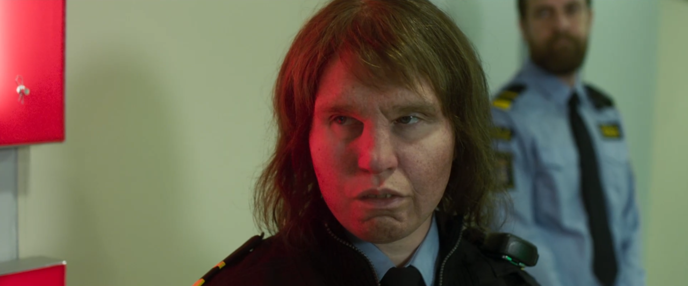
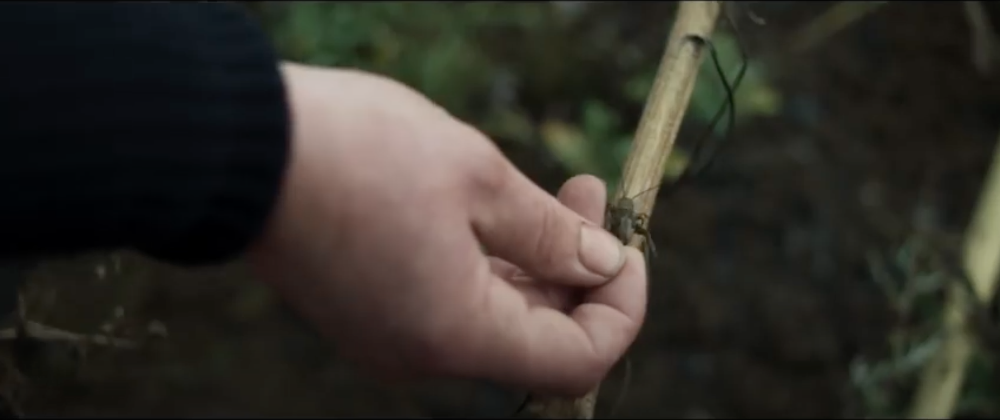
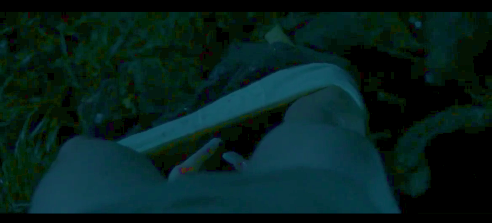
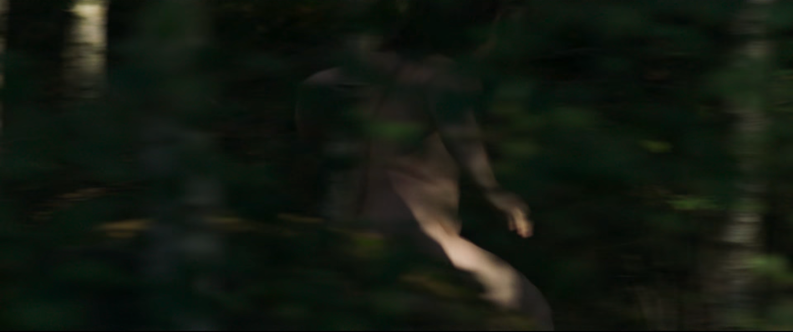
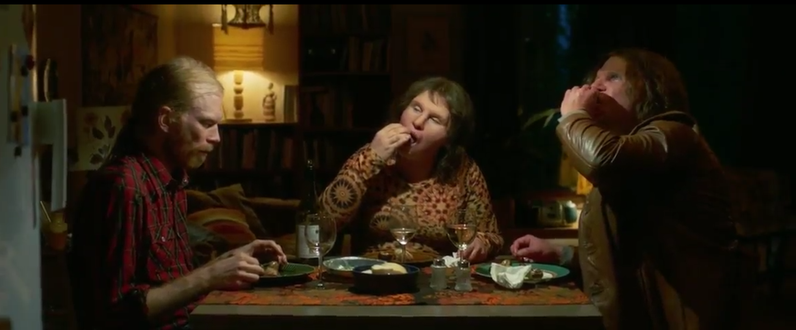

[I]{.dropcap}ranian-Swedish filmmaker Ali Abbasi’s 2018 genre-bending film _Border_ (_Gräns_) takes the form of a politico-philosophical study of the body as medium and as matter. The film tells the story of a border agent, Tina, whose extraordinary sense of smell has been put to use by the police for sniffing out fear, anxiety, and lies told by people whose deceits range from smuggling alcohol to dealing child pornography. This paper centres the overlapping concepts of materiality that subtend the conceptual ecosystem of the film in order to trace the patterns made by movements of the film’s bodies, their adjacencies and points of contact, their insides and outsides, porosities and boundaries, and in so doing, teases out the grounding of both the film’s politics and ethics.

The story knits together a number of genres. It retrieves European folk traditions about disruptive figures outside of the social order, such as trolls, wild women, and changelings. It is a narrative of identity: Tina learns that she is a troll, saved through forced adoption from the genocide of her kin. It is a romance: a story about how two social outcasts, Tina and her _dopplegänger_ Vore (Eero Milonoff), find and lose each other, leaving Tina to mother their child. It is a crime story: Tina investigates a pedophilic kidnapping ring. And perhaps most importantly, it is a story about adjacencies between bodies; about foxes and fungi and forests, about stones and cold water.

Critics and reviewers often approach Abbasi’s film as an allegory about “minorities” (Rappold, Slater-Williams), immigrants and others (Jenkins; Mazaj; Szianowski), linking the director’s own story of migration from Iran to Sweden to Denmark to his protagonist’s position as a border guard. It is curious, then, that Abbasi himself has rejected readings of the film that see Tina’s outsider status as an allegory for political border-crossings:

> “Je reste prudent sur le fait de voir des allégories dans les films. Certains voient dans _Border_ une histoire sur la crise des migrants. Non. Si j’avais voulu faire un film sur les migrants, j’aurais fait un film sur des migrants et non sur des trolls.” (Abbasi)

_Border_, Abbasi insists, is a film about trolls—mythical beings who in folk and fairy tale traditions dwell in forests, are afraid of lightning, and switch human babies with their own. Trollness is the film’s connector to primordial, elemental, powerful, and vibrant things on the one hand and a matrix of generative storying on the other.

Abbasi’s trolls need to be considered as what Donna Haraway would call Chthonic ones. In _Staying with the Trouble_, Haraway seeks to cut the bonds that tie us to the Anthropocene and Capitalocene using conceptual tools from science and speculative feminism. Haraway retrieves the ancient stories of monsters whose position outside of human time generates a time of beginnings (_kainos_) “full of inheritances, of remembering, and full of comings, of nurturing what might still be” (2):

> “Chthonic ones are monsters in the best sense; they demonstrate and perform the material meaningfulness of earth processes and critters. They also demonstrate and perform consequences. Chthonic ones are not safe; they have no truck with ideologues; they belong to no one; they writhe and luxuriate in manifold forms and manifold names in all the airs, waters, and places of earth. They make and unmake; they are made and unmade. They are who are.” (2)

Abbasi’s trolls do offer an effective stand-in for those whose physical and social otherness along axes of gender, sexuality, dis/ability, and race are consistently excluded, subjected to pain and vulnerability or annihilated (Lykke 26), but trollness is always more-than. Trollness operates as a conduit or taproot to the more-than-human world where other models of kinship and epistemologies are available that hold great power to grow worlds (Meyers) and weather droughts, tapping into sensational, tentacular thinking and sharing networks (Cunningham-Rogers).

Haraway is not alone in calling for a monstrous turn. In “Trolling Humanism: New Materialist Performativity in _Border_,” Rebecca Pulsifer brings Abbasi’s film into dialogue with feminist new materialism, starting from Karen Barad’s provocation that “matter matters.” Pulsifer draws from disability studies, affect theory, ecological humanities, and feminist and queer theory to examine what the film teaches about the “entanglement of technoscience and naturecultures” (Pulsifer 7). New materialists’ attention to matter, she explains, “calls into question familiar divisions between culture and nature, human and nonhuman, body and mind, and animate and inanimate at the level of ontology,” divisions that overlook “how matter that is considered insensate, immobile, deathly, or otherwise ‘wrong’ animates cultural life in important ways” (Chen 2 qtd. in Pulsifer 8). Pulsifer outlines some of the presuppositions of “new materialist paradigm\[s\]”: First, that “matter is not passive residue or background; it is the medium through which interactions occur.” Second, that there is a need “for discourses, ethics, and politics that attend to more-than-human worlds” (Pulsifer 8). And last, that it is necessary to interrogate the humanist presupposition that humans are autonomous agents and therefore have the right to dominate nature (Pulsifer 8).

Following in Pulsifer’s footsteps, bringing feminist new materialist frameworks to the film, I show how Abbasi works with complexity models through pairs and chiasms, overlapping and inverting domains, histories, fictions and realities, through a matrix of organizing questions derived from different definitions of the word “matter”—as body (matrix, womb) as wood and as transformation (hyle); as mother (mater, mother); and as place (chora) (Malpas 67). These questions centre matter as a condition of possibility through a process of worlding I would call wilding.

Worlding is a term that for Heidegger refers to the intertwined processes through which existence and the world mutually shape and reveal each other. It has been taken up in a wide range of disciplinary contexts, from postcolonial studies (Spivak), globalization (Wilson), and world literature (Cheah), to international relations (Ozkaleli), always underlining with the gerundive the active, ongoing, and often contested processes of world-making. Worlds are not merely backdrop settings but are active productions, continuously shaped and reshaped by human and non-human actors, stories, practices, and relations. For Helen Palmer and Vickie Hunter, for example, worlding “removes the boundaries between subject and environment” and thus “affords the opportunity for the cessation of habitual temporalities and modes of being.” What I see in Abbasi’s film that I call "wilding" can be conceived as a transformative process that combines the nuances of "worlding"—the constant unfolding and re-shaping of the world through interrelated narratives and practices—with the substance of "mattering"—the recognition of the vital and dynamic agency of matter in the constitution of reality and construction of meanings “across and through human and nonhuman bodies” (Jones 245). In Abbasi’s film, wilding is a radical palliative that refuses the civilization-wilderness divide as it restores the materiality of bodies-in-relation. Wilding grows viable worlds by signaling the fluid, ever-changing relationships and boundaries between entities, challenging binary and rigid structures of thought that dichotomize existence into fixed categories, through the cultivation of bewilderment, a state of openness to not-knowing which requires the unlearning of anthropocentric epistemologies.

The film's title might suggest that it is about boundaries, separations, limits, and exclusions. However, for Abbasi, borders also signal contiguities and porosities. Abbasi deploys the chiasm, a rhetorical figure which, for Merleau-Ponty, describes a "unique space which separates and reunites, which sustains every cohesion" (Merleau-Ponty 187). The chiasm represents the intertwining or overlapping of the body and the world, the perceiver and the perceived, the touching and the touched.

An understanding of the film’s study of materiality and wilding must start with the film’s most commented-upon element: Tina’s body. Tina is a figure whose interiorities and exteriorities trouble. Played by Eva Melander, who wore extensive prosthetics for the role, Tina is heavyset and masculine. She has a thick brow ridge, too much hair on her body and not enough hair on her head, and she has a mysterious scar on her tailbone. These exterior morphological features have been medicalized; she recounts how she was told she has a gene defect. Her interiorities are similarly deemed pathological; Tina explains that she has troubles “down there” which seem primarily to involve pain upon penetrative intercourse and infertility. She also suffers from the experience of being an outsider in her social worlds.

Tina’s presentation of imbricated problems of emotional numbness and sexual pain, of sterility and ecstasy—problems at every place where bodies come into being and where they intersect with others—is pivotal for the film’s development of her character’s wilding. Throughout most of the film, Tina’s affect is deeply stunned (see fig. 1). Her unsmiling face, slow movement, and delayed responses must be understood as a symptom of her deep dispossession and alienation. In Marxist terms, Tina is alienated from her labour, from her body, from others, and from the sensuous world. Marx says that under alienated labour, humans are reduced to animals; "political economy knows the worker only as a working animal — as a beast reduced to the strictest bodily needs." "As a result,” Marx writes, “man (the worker) only feels himself freely active in his animal functions–eating, drinking, procreating, or at most in his dwelling and in dressing-up, etc.; and in his human functions he no longer feels himself to be anything but an animal. What is animal becomes human and what is human becomes animal." It is meaningful, then, that her workplace uses her as it would a sniffer dog; her extraordinary sense of smell allows her to identify hidden smuggled contraband such as plants and alcohol. In the terminal, Tina is a gentle helper, an inverted double of the fighting dogs that her boyfriend keeps and who snarl at her as she enters her own home. However, because of her uncanny more-than-human abilities, Tina is seconded from the ferry terminal into a police investigation of a pedophilic kidnapping ring, relying entirely on her heightened sense of smell.

Tina is able to smell “what people feel”—she notes shame, guilt, rage, sex—but it is important to note that her powers extend beyond feelings. She first finds the evidence of the pedophile ring on a flash drive hidden in a cell phone case, and next, on a digital camera hidden inside a trophy. A forensic approach to media would underline the fact that these digital recordings have dematerialized the violence to bodies; what was experienced in the flesh is, at the moment of her sensing it, decontextualized, stored inert in metal, plastic, and silicon. Her sense of smell is thus capable of so much more than identifying the residue of shame the storage medium’s handlers leave behind on surfaces. She initiates a kind of reverse-engineering of what has been encoded in the physical materiality of a recording. Tina’s use of the sense most deeply connected with the neurobiology of memory brings into light the histories of bodies that the cold, logical, and immaterial materialities of digital storage devices conceal (Kirschenbaum). Digital recording effaces what is essential to the thing in the world (Malpas). Troll sensing retrieves the specificity and thickness of embodied experience and lived history.

The sense of smell involves taking the outside in. While the objective of her support for the police investigation is to protect the vulnerable from violence, the way her workplace harnesses her deeply embodied attunement to the material and the mediated is itself a violence. Of all the tasks in the film that labouring bodies must undertake, hers is the darkest, for she must not only see and hear the recordings of what might be child rape or snuff that we viewers are spared, but must incorporate it. Vision leaves the body’s envelope intact. Smell is involuntary, fundamentally nonconsensual. Her alienated labour is thus coextensive with the sexual assault of children.

Yet, if Tina’s stunned affect is a matter of her alienated labour, it is also psychosexual. The Latin _mater_, Judith Butler notes, shares a root with _matrix_ (womb) (Butler 6). Tina flinches when her live-in partner climbs on her in bed, and she complains of pain. With this flinch, Abbasi raises the history of debates about women’s bodies that centre on their insides. The Greek world thought that the uterus (Gk. _Hystéra_ – womb; _hysterikos_ – of the womb) was like an animal that could migrate through the body, mechanically causing havoc by being where it should not. Cures for hysteria from the ancient world onward centred women’s sex and sexuality, and included abstinence but more often, orgasm and motherhood (Tasca et al; Maines)—the two experiences that precipitate and follow from Tina’s wilding in the film.

In the context of nineteenth- and early twentieth-century debates in the then-emerging field of psychoanalysis, Tina’s sexual resistance and stunned affect would be considered as part of a complex described as hysterical anesthesia. While this condition, whose symptoms include numbness, indifference, and dissociation (Janet), was in some contexts attributed to traumatic lived experience, the framework that came to dominate understandings considered it a “fundamental condition indicating weakness, instability, degeneration” (Linenthal 20).

![Figure 2: Paris, centre hospitalier universitaire Pitié-Salpêtrière, intérieur. Bibliothèque Historique de la Ville de Paris Cote 1-EST-02480. Public Domain. [[https://bibliotheques-specialisees.paris.fr/ark:/73873/pf0002019084/0003/v0001.simple.selectedT]](https://bibliotheques-specialisees.paris.fr/ark:/73873/pf0002019084/0003/v0001.simple.selectedT)](../static/media/06-tschofen-media/06-tschofen_image2.jpg)

Abbasi deliberately invokes traumatic histories of institutionalization and forced sterilization (Thompson) when Tina’s adoptive human father tells her about the facility from which Tina was rescued. Imagined as a cross between a Salpêtière and a Ravensbrück, this institution systematically eradicated the troll people in service of some unarticulated notion of racial/species hygiene, leaving Tina’s troll kin scattered across a graveyard indicated only by anonymous stone markers. Trolls, like so many other of civilization’s others, were victims of a genocide (see fig. 2).

However, and importantly, Abbasi ultimately wants to move past both Marxist and psychoanalytic human frameworks for understanding the obstinate materiality of Tina’s body. Her stunned affect and retreat from human touch does not only emerge from the construction of the female/monstrous body as other, nor is it only the result of lived experience of trauma. Tina’s presentation of pain and numbness is epistemological, the result of a state of not-knowing. Tina is bewildered, that is, “perplex\[ed\], puzzle\[d\], confuse\[d\],” a term whose etymological roots relate the spaces outside of knowing to the spaces of wildness and wilderness (“be- ‘thoroughly’ + archaic wilder ‘lead astray, lure into the wilds’ (“Bewilder”)).

Confusion as a function of forgetting is a central theme of the film. Two of the major parallel story lines involving memory work—Tina’s discovery of her own troll nature and of the genocide of her people—threaten to be cut short by her adoptive father’s dementia. She is not assured on each visit to his home that he will remember her, let alone her past he has hidden from her since her childhood. Tina is herself forgetful, as she notes, having promised Vore a peaceful retreat in her guest cottage, when pulling up to her driveway to caged dogs’ aggressive barking. Politically, the stakes of “knowing but not knowing” are high (Fischer 6). Not knowing the traumatic history of who she is would leave the human race unaccountable for its genocide, but also would all but guarantee biological and cultural extinction.

Yet while the memory work reconstituting both personal and collective troll history is essential to the film’s politics, it is not essential to the film’s ethics. The political work of the film invites a rethinking of how through “capitalism, colonialism, racism, heteronormativity and other hegemonic power regimes \[…\] \[which\] function in complicity and compliance with intersecting institutionalized norms (gender, race, ethnicity, class, sexuality, age, dis/ability, geopolitical position, regimes of health/illness, human/earth other,” bodies such as Tina’s have always been disciplined and subjected to “unease, pain, discomfort, vulnerability” (Lykke 26). The (posthuman) ethical framework of the film rejects accountability frameworks that cannot undo constructions of self and other. As Abbasi underlines, Tina is troll. Ancient. Chthonic. There is nothing the matter with her. Tina is matter, primordial. Her wilding—which activates states of not-knowing—thus needs to be appreciated as an extension or outgrowth of rather than a symptom of her bewilderment.

Tina’s wilding activates a complex of meanings related to materiality from ancient Greek and Latin. As Jeff Malpas notes, “the Greek word, _ὕλη (hyle_), which our words ‘matter’ and ‘material’ can be taken to translate, originally seems to have referred to wood – that from which things can readily be made” (Malpas 67). Abbasi’s film is nothing if not a love poem to wood and woods. Throughout the first part of the film, it is clear that Tina is most comfortable in the woods. She stands outside barefoot on the earth. She reaches towards the fox that comes to her window. She pets an elk. She pauses on the way to and from work in liminal zones such as parking lots. There, she attends not to the landscape views, which in their cultural construction of a “way of seeing from a distance” (Andrews 22) offer the hubris of a human/god’s-eye view that renders the world an object, but rather to the smaller scales where contiguities, not distance, govern relations. She picks up a grub, and moves a beetle out of the way (see fig. 3). Close-ups and insert shots underline how touch completes a circuit that connects “socialities and materialities crucial to living and dying with critters on the edge of disappearance so that they might go on” (Haraway 8). While smell alienates, touch connects Tina to her species-being (_Gattungswesen_) (Marx 77).

The sense of touch is the sense that “underpins the idea of the materiality of things.” (Malpas 65). For Vivian Sobchack, the sense of touch provides the material foundation for ethical behaviour towards the world and others precisely because it yields “awareness of what it is to be a material object” (288):

> “through reaching toward or touching the material object that is other than oneself, \[one\] seeks to actively grasp both a concrete sense of one’s own self as immanently material and a concrete sense of how some of the world’s objects may also be subjects.” (290)

Sobchack elaborates:

> “Our recognition of and care for ourselves not only as objective subjects who are capable of grasping and feeling the alterity of other worldly objects but also as subjective objects that can be experienced in such a way by others allows us the possibility of appreciating—and caring for—the form and substance of ‘things’ external to ourselves. It also allows us to hope that the world and others’ material grasp of us will be similarly appreciative and ‘care-full.’” (290)

Tina wanders with Vore into the forest, showing him her favorite places, juxtaposing her childhood construction of the woods as spaces filled with magic and wonder to the epistemological frameworks that the human world has imposed upon her. Tina points Vore to a mossy stony area and says: “I used to fantasize about fairies dancing here.” Vore tells her: “They probably did. Presumably.” However, she dismisses her own vision as childish: “I don’t really believe in things like that. You want it to be true. It would be great but…” “But?” Vore asks. Tina answers: “As a child I thought I was special. I had all these ideas about myself. But then I grew up and realized I was just a human being. An ugly strange human with a chromosomal flaw.” The construction of her body as monstrous, Abbasi suggests, is the result of a tradition that can only conceive of nature as “a field of multiple exclusion and control” (Plumwood 15) rather than as the wellspring for “wonderful, messy tales to use for retelling, or reseeding, possibilities for getting on now, as well as in deep earth history” (Haraway 119).

In _Staying with the Trouble_, Donna Haraway insists that

> “\[i\]t matters what matters we use to think other matters with; it matters what stories we tell to tell other stories with; it matters what knots knot knots, what thoughts think thoughts, what descriptions describe descriptions, what ties tie ties. It matters what stories make worlds, what worlds make stories” (12).

Folktales, as Johann Gottfried Herder had already underlined in the eighteenth century, are like philosophy in that both are modes of accessing knowledge through the arousal of “astonishment, curiosity, wonder—_Staunen_, _Neugierde_, _Verwunderun_” (Weissberg 23). Part of a radical, utopian praxis that can take binaries of self and other, powerless and powerful, nature and civilization, and then perform inversions and subversions, fairy tales make it possible to conceive entire worlds of contestation (Zipes, _Fairy Tales_) and thus play a “potent formative social and political role” (Teverson, qtd. in Bacchilega 9). The Nordic fairy and folk tales about nature beings, including fairies, trolls, wild women, and changelings that Abbasi “weave\[s\]\[…\] into the cellular fabric of the film” (Mazaj) are important intertexts because they lead directly to “where the wild things always were” (Henneghan 104).

In this tradition, moreover, monstrous figures are tangible expressions of the breakdown of traditional classifications. Jeffrey Cohen writes about monsters’ “refusal to participate in the classificatory ‘order of things’”:

> “\[T\]hey are disturbing hybrids whose externally incoherent bodies resist attempts to include them in any systematic structuration. And so the monster is dangerous, a form suspended between forms that threatens to smash distinctions. Because of its ontological liminality, the monster notoriously appears at times of crisis as a kind of third term that problematizes the clash of extremes—as ‘that which questions binary thinking and introduces a crisis.’” (6)

Tina’s epiphanic discovery halfway through the film from Vore is that she has pain on penetration not because she is deformed but rather because troll bodies confound interiorities and exteriorities. Troll genitals are not vaginal, but neither, as we learn as she and Vore have intercourse on a bed of moss, are they phallic. It is tempting to call trolls intersex (Crucchiola) or non-binary, as many reviewers have. To do so misses the crucial point that Tina and Vore’s genitals are agential, intelligent, reaching, like a snail’s tentacle or a crab’s jaw or a mushroom. When Vore is strip-searched at the border, the agent notes that he has a vagina, but Abbasi’s closeup reveals a “sex which is not one” (Irigaray) (see fig. 4).

Savina Petkova reads Tina’s transformative encounter with Vore as “\[e\]cstatic pleasure, savage frenzy, and bloodthirst” bordering “the axis where humanity and animality meet.” However, I would counter that the closeups of troll genitals signal an ecstasy more akin to what biologist Lynn Margulis, in her work _Symbiotic Planet_, describes as “interliving,” which involves “an infiltration and assimilation far more profound than any aspect of human sexuality \[and that\] produced everything from spring-green blooms and warm, wet, mammalian bodies to the Earth’s global nexus” (Margulis, qtd. in Manning 95). Abbasi shows how, to use Margulis’ words, “bodies become in relation to an ecosystem of \[other\] bodies” (Margulis, qtd. in Manning 95). If the main position of Western epistemology upholds divisions of centre and periphery, human and non-human, self and monster, civilization and wilderness, civility and wildness, Abbasi presents ecstasy as an experience “where human being and thinghood overlap,” where “the us and the it slip-slide into each other” (Bennet 4).

An older conception of ecstasy (from _ek_- ‘out’ + _histanai_ ‘to place’) is thus warranted, which considers ecstasy as a condition of outsides and outsiders; in ecstasy, one stands outside the self and outside of the socius, in “a position that is off the spectrum of position” (Danforth). At the beginning of the film, as Evren Oczelcuk notes, Tina is coded as feminine and passive, while Vore is “associated with rebellion, transgression, and violence (all features of normative masculinity).” She is “settled,” an agent of law and order and against violence, and her experience of non-belonging is painful to her. Vore, in contrast, embraces his outsider status and nomadism. She is numb. He is sensual, magnetic. Ek-stasy moves them beyond these assigned positions and predictable structures of relationality and modes of embodiment.

Abbasi seems to be thinking about Jane Bennet’s notion of “vibrant materiality” as he develops the relational topographies of this film. Bennet calls for a reimagining of the ontological field in a way that stresses coextension and coexistence:

> “In lieu of an environment that surrounds human culture, or even a cosmos that cleaves into three ecologies, picture an ontological field without any unequivocal demarcations between human, animal, vegetable, or mineral. All forces and flows (materialities) are or can become lively, affective, and signaling. And so an affective, speaking human body is not radically different from the affective, signaling nonhumans with which it coexists, hosts, enjoys, serves, consumes, produces, and competes. \[…\] The source of effects is, rather, always an ontologically diverse assemblage of energies and bodies, of simple and complex bodies, of the physical and the physiological. In this onto-tale, everything is, in a sense, alive. This liveliness is not capped by an ultimate purpose or grasped and managed through a few simple and timeless (Kantian) categories. What I am calling vital materiality or vibrant matter is akin to what is expressed in one of the many historical senses of the word nature.” (Bennett 116-117)

In Abbasi’s film, the _ek-static_ vibrancy of matter exceeds interpersonal (and thus socio-political) registers. In this context, then, the meaningfulness of Abbasi’s insistence that the film is not an allegory about migrants becomes apparent; Abbasi’s more vitally materialist model of matter makes it possible to visualize assemblages, agencies, and accountabilities between, among, and across animate and inanimate bodies living and dying and thus illuminates the limitations of models of critique that focus on relationalities in dyads of self and other, feminine and masculine, static and moving, powerful and suffering.

After she experiences her body in symbiotic relation to another’s body that itself appears to be co-constitutive and entangled with other bodies, she and Vore run barefoot and naked together through the forest, sit on rocks, plunge into icy water, yell at the sky, and laugh. Abbasi’s haptocentric filming of Tina’s wilding draws viewers into the enchanted forest spaces with long dolly shots and rapid pans through blurs of greens and blues (see fig. 5). Abbasi’s dynamic camera, rushing, stalling, and rushing again, explores the possibilities of sensing bodies in movement in multiple sensory registers.

Savina Petkova describes the affective and sensational intensities of Abbasi’s film that audiences and other critics have described as well, suggesting that Abbasi’s success is in making the spectator identify with troll experience: “The rawness of bodily sensations punctures the spectator’s reception and lures her perception in the debris of intimacy”; “it is her \[the spectator’s\] own body that craves the purification of mountain ponds, and most of all, she feels like screaming out of pleasure and pain.” But Abbasi’s haptic cinematic representations of stone, cold water, deep moss, and sky de-anthropocentrizes the gaze. Extreme close-ups make it hard to orient to up or down; changes in focus make it hard to orient to surfaces and contours. Removing the spectator’s capacity to orient and thereby name and categorize bodies, Abbasi elaborates an experience of what it is to be not only human, not only troll, but to be still or fast or wet or cold or green or blue. Forcing the spectator’s gaze to shift between foreground and background, Abbasi activates practices of not-knowing that expand sense-ability (Sobchack 290). An activity rather than a passivity, not-knowing, which encompasses sensing and feeling, requires both unlearning and forgetting.

It is necessary to return to the question of matter as _mater_, that is, as mother, matrix, or womb. Throughout the film, vivophilia (Behar), that is, its “configuration of matter as a site of generation or origination” (Butler 6), is in tension with necrophilia (Behar 127), energized by parasitism rather than symbiosis. Troll bodies in the film can propagate through asexual reproduction, producing beings that exist on the border between the living and the dead. These offspring, called _hiisit_, look almost like normal babies, but they are waxy, cold, insensate, and short-lived—abject and uncanny doubles of vital and vibrant living (human and troll) beings.

When Tina first meets Vore, she knows he is hiding something. Abbasi mobilizes visual and narrative tropes from mythology and horror genres, building narrative tension. At the ferry terminal, she finds a metal container that at first looks like a time bomb, but turns out to be an insect incubator. After Vore moves into her guest house, she finds that he has duct-taped her refrigerator shut. Inside the fridge is a box, and inside the box is a _hisiit_, whom she later sees Vore spoon-feeding the incubated insects. Vore has been birthing them in the woods to sell to pornographers and abusers, or to switch with human babies as revenge for the troll lives that humans harmed through medical experiments and abuse. Vore’s defense for stealing human babies is that “humans are parasites that use everything on earth for their own amusement. Even their own offspring.” He does not recognize that the extraction of his own painful labour in the forest producing changelings to provide raw materials to support an exploitative economy that brings harm to the vulnerable further alienates him.

However, Tina’s curiosity breaks the spell of horror. When she sees the changeling in the box, her impulse is not to recoil, but rather, to reach in and poke its body. Seeking knowledge tentacularly, through touch, not smell, Tina’s gesture transforms the scare of abjection into a form of care. According to Julia Kristeva, abjection is caused by “what disturbs identity, system, order. What does not respect borders, positions, rules. The in-between, the ambiguous, the composite” (4). Tina’s tactile encounter with a being born at the border of living and dying tutors her in trollness. She was other; entering into a circuit, touching and being touched, she is becoming mother.

It is also necessary to go back to etymological roots of materiality as “whatever serves as nourishment for infants: nutrients that act as extensions of the mother’s body” (Butler, _Bodies_ 7). Troll bodies with their agentic, reaching parts, are coterminous with the woods. It is in this ecosystem that Tina, who has been raised by humans, must learn that the “symbiotic world individuates violently, passionately, indifferently, fighting, feeding, mating, dancing, dying. Generating novelty, symbiogenesis brings together different life forms through matings that are often incorporations” (Manning 91-92); this knowledge about an infinitely complex web of relations will be essential to her survival. In the first half of the film, insects, grubs, and snails are beings Tina will protect. In the second half, these same beings are food. An early meal of spaghetti pushed around a plate—a poor substitute for worms, it turns out—is contrasted with a later meal in which Tina and Vore slurp on snails with joy and abandon (see fig. 6). Ingestion is not a sign of dominance over the forest, but rather a sign of integration with a foodweb that provides, in María Puig de la Bellacasa’s words, “glimpses of alternative livable relationalities, with other possible worlds in the making, ‘alterontologies’ at the heart of dominant configurations” (170).

It is thus no coincidence the film visually rhymes troll food with troll sexual organs; more-than-human bodies become in relation to more-than-human bodies. If troll genitals are non-binary—a “sex which is not one”—troll maternity is not dyadic, but rather, part of a specific ecology of intra- and inter-dependent materialities living and enduring and dying. Knowing her place in this porous, vibrant contact zone where everything reaches for and touches everything means she will be able to feed her child. The “foodweb,” after all, as María Puig de la Bellacasa writes, is “a figure of alternative caring relations with soil \[…\] \[that\] offers new obligations within existing ones, immanent obligations that could unfold uneventfully, ordinarily” (Puig de la Bellacasa 200). And so, as Tina’s bewilderment turns to wilding, so too does her knowledge turn to growth. “Planting seeds” for the future, writes Haraway, “requires medium, soil, matter, mutter, mother” (120). In thinking about motherhood as interrelational across all these axes, Abbasi shows how inseparable these aspects of the matter of futurity are.

Jeff Malpas’s etymology of materiality underlines that the associations of matter with womb or matrix, wood/s, and nourishment have to do with becoming. Malpas writes:

> “‘Matter’ and ‘material’ both come from the Latin, materia, and so relate to matrix (womb) and to mater (mother), and the idea of matter or material also connects with one of the central Greek terms for place: χώρα – chōra. Plato calls this the ‘receptacle \[ὑποδοχή – hypodochê\] of becoming’, as well as the ‘nurse’ of becoming (Plato 1960, p. 49a), and some translators and commentators treat it as ‘womb’ or ‘matrix’ (the chōra is that which holds things in such a way as to allow them to come to appearance or to emerge into being).” (Malpas, “In the Presence” 67)

The penultimate scene of Abbasi’s love song to the places where fairies danced takes Tina to the graveyard where her troll kin are buried. Each anonymous grave is marked with a stone, which she caresses, bringing her face into contact with the cold surface. Given the significance of stone in earlier parts of the film, I read this less as an act of mourning than as necrophilia—a “philosophy that takes dead objects as love objects” (Behar 128). As an act of love for the dead, the gesture encompasses the transmigration of matter—cold for warm, enduring for living, thing for thing—that is firmly mattered and emplaced.

Abbasi’s film thus invites consideration of the ethics of being human through material adjacencies with an uncanny non-human that literally trolls human sensibilities of subjectivity, troubling, loosening, and decentering. Judith Butler writes, “In both the Latin and the Greek, matter (_materia_ and _hyle_)\[…\] is always in some sense temporalized. This is true for Marx as well, when ‘matter’ is understood as a principle of transformation, presuming and inducing a future” (7). This is what Abbasi’s film is about: inducing a future. Tina, barefoot in the snow, with her child, the detritus of her car and her house now just another one of the forest’s many decaying things, like all others, whether cold or metallic or wooden, calls to mind Butler’s proposal: “\[t\]his unsettling of ‘matter’ can be understood as initiating new possibilities, new ways for bodies to matter” (6). The film ends in silence, in the post-discursive materiality of motherhood, and compels us to think about the small shifts this love story introduces in our thinking about how materiality is integral to our being and becoming. Abbasi asks, with Karen Barad:

> “What if it is only in facing the inhuman—the indeterminate non/being non/becoming of mattering and not mattering—that an ethics committed to the rupture of indifference can arise? What if it is only in the encounter with the inhuman—the liminality of no/thingness—in all its liveliness, its conditions of im/possibility, that we can truly confront our inhumanity, that is, our actions lacking compassion? Perhaps it takes facing the inhuman within us before com-passion—suffering together with, participating with, feeling with, being moved by—can be lived. How would we feel if it is by way of the inhuman that we come to feel, to care, to respond?” (Barad 216)

## Acknowledgements

Thank you to the Media and Materialities Working Group for listening to an early version of this work; to Jolene Armstrong, Al Cunningham-Rogers, and Evren Özselçuk for reading drafts of this paper; and thank you to Alevtina Laipy and Eva Escandon for research assistance.

:::{class="REF"}

## Works Cited

_Border_ (_Gräns_). Dir. Ali Abbasi, performances by Eva Melander, Eero Milonoff, Jörgen Thorsson, screenplay by John Ajvide Lindqvist, Ali Abbasi, Isabella Eklöf, cinematography by Nadim Carlsen. Sweden, Meta Film Stockholm, Black Spark Film & TV, Kärnfilm, Film i Väst, Sveriges Television (SVT), 2018.

Abbasi, Ali. “Ali Abbasi: L’instinct Avant La Technique – Interview Pour Border.” _Écran Fantastique_, vol. 44, Jan. 2019, [[https://www.cineteleandco.fr/ali-abbasi-linstinct-avant-la-technique-interview-pour-border/]](https://www.cineteleandco.fr/ali-abbasi-linstinct-avant-la-technique-interview-pour-border/).

Alaimo, Stacy. _Bodily Natures: Science, Environment, and the Material Self_. Indiana University Press, 2010.\
Andrews, Malcolm. _Landscape and Western Art_. Oxford: Oxford University Press, 1999.

Bacchilega, Cristina, et al. _Contemporary Fiction and the Fairy Tale_. Wayne State University Press, 2008.

Barad, Karen. “On Touching—the Inhuman That Therefore I Am.” _Differences_, vol. 23, no. 3, Dec. 2012, pp. 206-23. [[https://doi.org/10.1215/10407391-1892943]](https://doi.org/10.1215/10407391-1892943).

“Bewilder.” _Online Etymology Dictionary_, [[https://www.etymonline.com/word/bewilder]](https://www.etymonline.com/word/bewilder). Accessed 12 July 2022.

Bennett, Jane. “The Force of Things: Steps toward an Ecology of Matter.” _Political Theory_, vol. 32, no. 3, June 2004, pp. 347-72. [[https://doi.org/10.1177/0090591703260853]](https://doi.org/10.1177/0090591703260853).

Bernheimer, Richard. _Wild Men in the Middle Ages, a Study in Art, Sentiment, Demonology_. Cambridge, Harvard University Press, 1952. _Internet Archive_, [[http://archive.org/details/wildmeninmiddlea00bern]](http://archive.org/details/wildmeninmiddlea00bern).

Bettelheim, Bruno. _Empty Fortress: Infantile Autism and the Birth of the Self_. Free Press, 1967.

Bloch, Ernst. _The Utopian Function of Art and Literature: Selected Essays_. MIT Press, 1988.

Braidotti, Rosi. _Metamorphoses: Towards a Materialist Theory of Becoming_. Polity Press, 2002.

Butler, Judith. _Bodies That Matter: On the Discursive Limits of “Sex.”_ Routledge, 2011.

Cheah, Pheng. “Worlding Literature: Living with Tiger Spirits.” _Diacritics_, vol. 45, no. 2, 2017, pp. 86-114. <https://doi.org/10.1353/dia.2017.0008>.

Cohen, Jeffrey Jerome, editor. “Monster Culture (Seven Theses).” _Monster Theory: Reading Culture_, University of Minnesota Press, 1996, pp. 3-25.

Cunningham-Rogers, Al. Personal communication, August 24, 2023.

Fischer, Nina. _Memory Work: The Second Generation_. Palgrave Macmillan UK, 2015. [[https://doi.org/10.1057/9781137557629]](https://doi.org/10.1057/9781137557629).

Haraway, Donna Jeanne. _Staying with the Trouble: Making Kin in the Chthulucene_. Duke University Press, 2016.

Heidegger, Martin. “The Thing.” _Poetry, Language, Thought._ Harper and Row, 1971, pp. 163-186.

Heneghan, Liam. _Beasts at Bedtime: Revealing the Environmental Wisdom in Children’s Literature_. University of Chicago Press, 2018.

Irigaray, Luce. _This Sex Which Is Not One_. Cornell University Press, 1985.

Jenkins, Richie. “Identity & Belonging In Ali Abbasi’s Border.” _25YL_, 1 June 2020, [[https://25yearslatersite.com/2020/06/01/identity-belonging-in-ali-abbasis-border/]](https://25yearslatersite.com/2020/06/01/identity-belonging-in-ali-abbasis-border/).

Jones, Brandon. “Mattering.” _Posthuman Glossary_, Bloomsbury Publishing, 2018, pp. 244-47.

Kirschenbaum, Matthew G. _Mechanisms: New Media and the Forensic Imagination_. The MIT Press, 2007.

Leask, J., et al. “Evidence for Autism in Folklore?” _Archives of Disease in Childhood_, vol. 90, no. 3, Mar. 2005, pp. 271-271. <https://doi.org/10.1136/adc.2003.044958>.

Lykke, Nina. “Passionately Posthuman: From Feminist Disidentifications to Postdisciplinary Posthumanities.” _A Feminist Companion to the Posthumanities_, edited by Cecilia Åsberg and Rosi Braidotti, Springer Berlin Heidelberg, 2018, pp. 23-32.

Magliocco, Sabina. “Folklore and the Animal Turn.” _Journal of Folklore Research_, vol. 55, no. 2, 2018, pp. 1-7. _Project MUSE_, [[https://doi.org/10.2979/jfolkrese.55.2.01]](https://doi.org/10.2979/jfolkrese.55.2.01).

Maines, Rachel P. _The Technology of Orgasm_. Johns Hopkins UP 2001. [[https://www.press.jhu.edu/books/title/2867/technology-orgasm]](https://www.press.jhu.edu/books/title/2867/technology-orgasm). Accessed 24 Sept. 2022.

Malpas, Jeff. “In the Presence of Things.” _After Discourse_, edited by Bjørnar J. Olsen et al., 1st ed., Routledge, 2020, pp. 59-71. [[https://doi.org/10.4324/9780429200014-5]](https://doi.org/10.4324/9780429200014-5).

Manning, Erin. _Politics of Touch: Sense, Movement, Sovereignty_. University of Minnesota Press, 2007.

Marks, Laura U. _The Skin of the Film: Intercultural Cinema, Embodiment, and the Senses_. Duke University Press, 2000.

Marks, Laura U. _Touch: Sensuous Theory and Multisensory Media_. University of Minnesota Press, 2002.

Mazaj, Meta. “Border Aesthetics and Catachresis in Ali Abbasi’s _Gräns/Border_ (2018).” _Transnational Screens_, vol. 11, no. 1, Apr. 2020, pp. 34-47. [[https://doi.org/10.1080/25785273.2019.1682229]{.underline}](https://doi.org/10.1080/25785273.2019.1682229).

Meyers, Natasha. “How to Grow Livable Worlds: Ten Not-So-Easy Steps.” _The World to Come: Art in the Age of the Anthropocene_, edited by Kerry Oliver-Smith, Samuel P. Harn Museum of Art, University of Florida, 2018, pp. 53-64.

Merleau-Ponty, Maurice. _The Visible and the Invisible_. Edited by Claude Lefort, translated by Alphonso Lingis, Northwestern Univ. Press, 1968.

Moseley-Christian, Michelle. “From Page to Print: The Transformation of the ‘Wild Woman’ in Early Modern Northern Engravings.” _Word & Image_, vol. 27, no. 4, Oct. 2011, pp. 429-42. [[https://doi.org/10.1080/02666286.2011.611381]](https://doi.org/10.1080/02666286.2011.611381).

Ozkaleli, Ferit Murat, and Umut Ozkaleli. “De-Worlding IR Theory.” _Postcolonial Studies_, vol. 25, no. 2, Apr. 2022, pp. 192-209. <https://doi.org/10.1080/13688790.2021.1898729>.

Ozselcuk, Evren. Personal correspondence. August 25, 2023.

Palmer, Helen, and Vicky Hunter. “Worlding.” _New Materialism_, 16 Mar. 2018, [[https://newmaterialism.eu/almanac/w/worlding.html]](https://newmaterialism.eu/almanac/w/worlding.html).

Plumwood, Val. _Feminism and the Mastery of Nature_. Routledge, 2003.

Pulsifer, Rebecah. “Trolling Humanism: New Materialist Performativity in _Border_.” _Gender Forum_, no. 71, 2019, pp. 7-63.

Rappold, Nicholas. “NYFF Interview: Ali Abbasi.” _Film Comment_, 21 Sept. 2018, [[https://www.filmcomment.com/blog/nyff-interview-ali-abbasi/]](https://www.filmcomment.com/blog/nyff-interview-ali-abbasi/).

Sheldon, Rebekah. “Form/Matter/Chora: Object Oriented Ontology and Feminist New Materialism.” _The Nonhuman Turn_, edited by Richard A. Grusin, University of Minnesota Press, 2015, pp. 193-222.

Spivak, Gayatri Chakravorty. “The Rani of Sirmur: An Essay in Reading the Archives.” _History and Theory_, vol. 24, no. 3, Oct. 1985, p. 247. <https://doi.org/10.2307/2505169>.

Stewart, Kathleen. “Tactile Compositions.” _Objects and Materials_, edited by Penny Harvey et al., Routledge, 2014, pp. 119-27. <https://doi.org/10.4324/9780203093610>.

Szaniawski, Jeremi. “Integration, Perforce?” _Queering the Migrant in Contemporary European Cinema_, by James S. Williams, 1st ed., Routledge, 2020, pp. 215-28. [[https://doi.org/10.4324/9780429264245-19]](https://doi.org/10.4324/9780429264245-19).

Shildrick, Margaret. “Becoming-Maternal: Things to Do with Deleuze.” _Studies in the Maternal_, vol. 2, no. 1, 2010. [[https://doi.org/10.16995/sim.91]](https://doi.org/10.16995/sim.91).

Slater-Williams, Josh. “Interview: Ali Abbasi on Bringing Border to the Screen.” _Vodzilla.Co_, 12 July 2019, [[https://vodzilla.co/interviews/interview-ali-Abbasi-on-bringing-border-to-the-screen/]](https://vodzilla.co/interviews/interview-ali-abassi-on-bringing-border-to-the-screen/).

Tasca, Cecilia, et al. “Women and Hysteria in The History of Mental Health.” _Clinical Practice and Epidemiology in Mental Health: CP & EMH_, vol. 8, Oct. 2012, pp. 110-19. _PubMed Central_, [[https://doi.org/10.2174/1745017901208010110]](https://doi.org/10.2174/1745017901208010110).

Weissberg, Liliane. “Philosophy and the Fairy Tale: Ernst Bloch as Narrator.” _New German Critique_, no. 55, 1992, pp. 21-44. _JSTOR_, [[https://doi.org/10.2307/488287]](https://doi.org/10.2307/488287).

Whalen, Kayley. “Changelings and the Folk History of Autism.” _Autistic Women and Nonbinary Network_, <https://awnnetwork.org/changelings-and-the-folk-history-of-autism/>. Accessed 29 Aug. 2023.

Whelan, Christopher. “Autistics Have Always Been Here, and We’re Not Going Away: Part 1.” _Autistic Rights and Freedoms_, 2 Apr. 2021, <https://autisticrights.net/2021/04/02/autistics-have-always-been-here-and-were-not-going-away-part-1/>.

Wilson, Rob. “Afterword: Worlding as Future Tactic.” _The Worlding Project: Doing Cultural Studies in the Era of Globalization_, edited by Rob Wilson, North Atlantic Book, 2007, pp. 209-23.

Wing, Lorna. “The History of Ideas on Autism: Legends, Myths and Reality.” _Autism_, vol. 1, no. 1, July 1997, pp. 13-23. <https://doi.org/10.1177/1362361397011004>.

Williams, Sean. “Chiasmic Wildness.” _Environmental Philosophy_, vol. 3, no. 1, 2006, pp. 6-12.

Zipes, Jack. _Fairy Tales and the Art of Subversion: The Classical Genre for Children and the Process of Civilization_. Routledge, 2012.

Zipes, Jack. “Ernst Bloch’s Enlightened View of the Fairy Tale and Utopian Longing.” _Ernst Bloch_, by Jack Zipes, Springer International Publishing, 2019, pp. 103-18. [[https://doi.org/10.1007/978-3-030-21174-5_6]](https://doi.org/10.1007/978-3-030-21174-5_6).

Zipes, Jack. _Breaking the Magic Spell: Radical Theories of Folk and Fairy Tales_. Rev. and Expanded ed, University Press of Kentucky, 2002.

## Image Notes

1\. Eva Melander. _Border_ (_Gräns_). Directed by Ali Abbasi. Performances by Eva Melander, Eero Milonoff, Jörgen Thorsson. Screenplay by John Ajvide Lindqvist, Ali Abbasi, Isabella Eklöf. Sweden, Meta Film Stockholm, Black Spark Film & TV, Kärnfilm, Film i Väst, Sveriges Television (SVT). 2018. Film.

2\. Paris, centre hospitalier universitaire Pitié-Salpêtrière, intérieur. Bibliothèque Historique de la Ville de Paris Cote 1-EST-02480. Public Domain. [https://bibliotheques-specialisees.paris.fr/ark:/73873/pf0002019084/0003/v0001.simple.selectedTab=otherdocs]

3\. Eva Melander. _Border_ (_Gräns_). Directed by Ali Abbasi. Performances by Eva Melander, Eero Milonoff, Jörgen Thorsson. Screenplay by John Ajvide Lindqvist, Ali Abbasi, Isabella Eklöf. Sweden, Meta Film Stockholm, Black Spark Film & TV, Kärnfilm, Film i Väst, Sveriges Television (SVT). 2018. Film.

4\. Eero Milonoff. _Border_ (_Gräns_). Directed by Ali Abbasi. Performances by Eva Melander, Eero Milonoff, Jörgen Thorsson. Screenplay by John Ajvide Lindqvist, Ali Abbasi, Isabella Eklöf. Sweden, Meta Film Stockholm, Black Spark Film & TV, Kärnfilm, Film i Väst, Sveriges Television (SVT). 2018. Film.

5\. Eva Melander. _Border_ (_Gräns_). Directed by Ali Abbasi. Performances by Eva Melander, Eero Milonoff, Jörgen Thorsson. Screenplay by John Ajvide Lindqvist, Ali Abbasi, Isabella Eklöf. Sweden, Meta Film Stockholm, Black Spark Film & TV, Kärnfilm, Film i Väst, Sveriges Television (SVT). 2018. Film.

6\. Eva Melander, Eero Milonoff. _Border_ (_Gräns_) (2018). Directed by Ali Abbasi, cinematography by Nadim Carlsen. ©Meta Spark & Kärnfilm. Reproduced with permission.

:::
