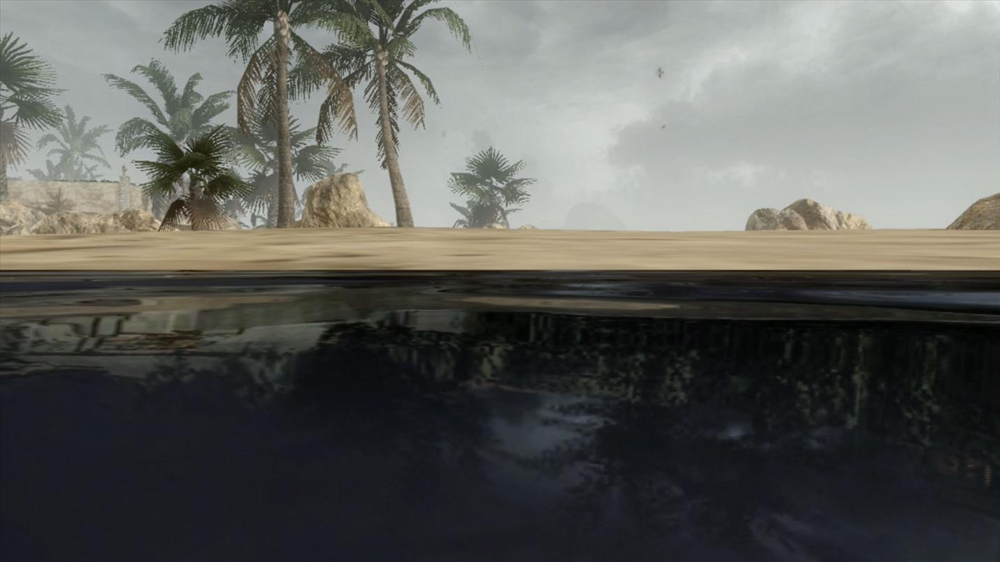

:::{class="EP"}

“Where Does This World End?” Space, Time and Image in Harun Farocki’s _Parallel I-IV_

« Où s’arrête ce monde? » Espace, temps et image dans _Parallel I-IV_ d’Harun Farocki

:::

## Introduction

Harun Farocki’s _Parallel-IV_ (2012-2014) is a four-part video series that was originally intended for a multi-screen viewing experience at the Galerie Thaddaeus Ropac in Paris, France (see fig. 1). The installation, which runs 45 minutes from start to finish, is Farocki’s last completed work. The focus throughout the work is on “computer images” (Farocki, _Parallel I_). Farocki raises questions surrounding the materiality of these images, connecting to ongoing debates over constructivism in design, the limits of indexicality, the reprise of cinematic genres in video games, and the narratologies adopted by computer image platforms. One of the notable features of this work is Farocki’s careful treatment of images and contexts that fundamentally challenge his own authority as a documentary filmmaker. Through novel storytelling techniques, including the use of a voiceover, and through the arrangement of images and words into dialogues with the audience, Farocki’s _Parallel I-IV_ skillfully works to disassemble received ideas about computer images and to question the value of representations, including the representation of the filmmaker in the film. This article is dedicated to exploring these techniques.

Overall, the installation reanimates debates that Farocki participated in from the 1960s up to his death in 2014. The most important of these involves identifying the complicity of vision-based technologies in broader sociotechnical relations or _dispositifs_ that Erika Balsom has described in terms of “a totally administered world” (369). For Balsom, Farocki’s reflections on the history of moving images and technologies help to address how visual culture translates social practices and power relations; and indeed, these themes are present in many of Farocki’s previous video installations, including _Workers Leaving the Factory_ (1995) and _Serious Games I-IV_ (2009-2010). A narrower discussion, however, is needed to explore the specific quality of data-driven narratives in _Parallel I-IV_, to investigate how Farocki’s approach to storytelling and argumentation aligns with both practical and philosophical issues surrounding image production, dissemination, and reception.

With this aim in mind, my article builds on existing conversations that refer to the _Parallel_ series, whether directly or indirectly, to introduce specific theoretical perspectives focused on three interlocking themes. The first of these will look at Farocki’s investigation into operative images, contextualizing his approach with reference to literature on the subject, and gesturing toward the lessons that Farocki’s work can provide us in relation to present day challenges. Second, I will situate _Parallel_ within contemporary debates on the essay film, addressing the enduring legacy of the voiceover as a foundational narrative technique and highlighting the epistemic rupture of passive voice effects in so-called “non-vococentric” documentaries. Finally, I will examine Farocki’s methodological contribution of “soft montage” in relation to competing modes of production, weighing the value of multi-screen exhibitions over traditional theatre screenings.

## Operative Images, Narratives, Discourses

_Parallel I_ opens with an inventory of computer graphics as seen in video games from the 1980s through the 2010s. This section displays images that are organized chronologically by the date of their release, as well as thematically through representations of the elements, including earth, fire, water, and air (see fig. 2). Balsom has suggested that these elemental motifs reveal a sense of contingency that is “historically \[…\] allied to the mimetic power of cinema” (369). However, there is another inflection adjacent to this fact: it is that Farocki’s attempt at building a narrative around these historic changes reveals hidden connections between the explicit inventory on display in the video, and the implicit drive to achieve a rate of image perfectibility. In other words, throughout _Parallel I_, Farocki participates in cinematic motifs of documentary narration to identify how the proliferation of computer images has helped to identify the limit point between photorealism on the one hand and constructivism on the other. His conclusion is that real and simulated worlds possess the same ontological status.

Farocki raises a further set of questions regarding the developmental order that appears to guide his inventory of the elements. Using a distinctive mode of questioning propelled by a neutral voice, Farocki begins to challenge the latent progressivism that determines how “the history of one form of image can be used as a model for another kind of image” (_Parallel I_). The resulting statements and observations evoke André Bazin’s article from 1960, “The Ontology of the Photographic Image,” in which the development of photographic technologies is measured by the symptomatic “crisis of realism” that arises in painting around the same time. Bazin writes, “photography \[…\] freed the plastic arts from their obsession with likeness” (7). Whereas painting in the 19^th^ and 20^th^ centuries moved on to explore abstractions, whether by way of Cubism or the other avant-gardes, photographers adopted the painter’s claim of constructing realistic representations, yet through different means: by drawing support from a medium that literally “embalms time” (Bazin 8). For Farocki, whose approach builds on Bazin’s, there is a sense in which computer images are constructed far more self-consciously than they may at first appear to video game audiences. Constructed images, even photorealistic ones, produce effects that go beyond the realism that photography was able to achieve. Perhaps we should think of these images less in terms of their photorealistic appearances, then, and more in the terms that Bazin uses to describe the work of surrealists, for whom “the logical distinction between what is imaginary and what is real tends to disappear” (10). Quoting a noteworthy passage from _Parallel I_ that aligns to the surrealist ethos, “The computer images try to achieve the effect of film images. They want to surpass them and leave them far behind” (_Parallel I_).

While Farocki manages to convey a position of neutrality throughout the installation, he also imparts a subtle mischievousness that puts common assumptions regarding the history and development of image recording technologies into doubt. The problematic assumption is that constructed images ought to be evaluated based on their ability to emulate photorealistic images, thereby adhering to a bias of progression or image perfectibility. Farocki highlights the fragility of these claims. With an argument more akin to Bazin’s, Farocki maintains that photographic media signals multiple divergences from the representational forms that were in existence at the time when photography appeared on the scene in the 19^th^ century. For Farocki as for Bazin, photographic media has some degree of autonomy from the kind of realism that was practiced by artists in the era before photography. Correspondingly, _after_ photography, the realism practiced by those same artists did not occupy the same cultural and associative meanings it once did. Farocki thus disqualifies any striving for perfectibility or progress regarding the making of photorealistic images in the computer age. His subtle art of disassembling traditional frameworks through a narrative medium plays an important role in highlighting the broader rhetorical aims of the installation. For example, at one point in the film the voiceover says, “The Egyptians could build pyramids, the Middle Ages could build cathedrals. But neither was capable of representation in perspective. _This is what we learned in school \[sic\]_” (_Parallel I_, emphasis added) (see fig. 3-5).

## Image Operations

[I]{.dropcap}n “Media Archaeology as Symptom,” Thomas Elsaesser proposes a diagnostic method that can help to reframe Farocki’s interrogations as a branch of media archaeology. From Elsaesser’s perspective, Farocki’s work participates in the taking apart of “false teleologies” that have long informed film studies by redirecting critical analysis toward film’s “technical-prosthetic afterlives” (“Media Archaeology as Symptom”). As Henrik Gustafsson adds, “a media-archaeological principle of utilizing the technology \[…\] comments on its own operations in order to articulate a critical reflection from within the machine” (29). By drawing inspiration from the operational tools of media machines, the filmmaker can strategically avoid pontificating about their broader implications. Farocki’s _Parallel I-IV_ adopts this approach by focusing on the tools themselves to build upon a media-archaeological commitment to decentring the linear progression of narratives that structure everyday artifactual histories. In effect, _Parallel I-IV_ reads computer images “against the grain” in the same manner as some of the earliest writers on the history of technology, as Jussi Parrika and Erkki Huhtamo have pointed out (10). This connection brings to light Farocki’s effort to expand the boundaries of “new media” to consider how “mediations” in general encompass a planar field that is dominated by archaeological and elemental characteristics (see, for example, Parrika, or Peters). The critical practice that is now known as media archaeology aligns with Farocki’s engagement in a method of symptomatic reading that is mindful of the idiosyncratic properties of material artifacts.

With an eye focused on the implications of media archaeology for film studies, Elsaesser points to the necessity of obliterating the “narrative of inevitability” that tends to accompany technical advancements in the image arts (“Media Archaeology as Symptom”). By adopting a media-archaeological approach, he argues, film scholars are better able to redirect pronouncements regarding supposed technical advancements, whether “from chronophotography to cinematography, from silent to sound, from black and white to colour” (Elsaesser 2018). The digital is a key turning point in redirecting these founding teleologies. Media archaeologists extend Bazin’s ontology of the photographic image by adopting a critical stance toward “the digital” by situating it in a larger tapestry of horizontal assemblages. Elsaesser argues that this approach tends to be manifested, or “verbalised, if at all \[…\]\[through\] the cut, the gap, and what becomes visible ‘in-between’” (“Media Archaeology as Symptom”). In line with this approach, Farocki’s task is both to carefully identify the often-hidden contradictions that allow linear histories to be sustained and revered as foundations, and, importantly, to accomplish this forensic task through a kind of equivocal storytelling.

Media archaeologists such as Wolfgang Ernst have an uneasy relationship with narrative media. In several works (i.e. _Digital Memory and the Archive_, and “The Archive as Metaphor”), Ernst builds on Michel Foucault’s insights regarding the archive as a site for revealing the discontinuities of historical time, detailing moments of rupture that signal changes in the episteme. Through these efforts, Ernst identifies the archive as an important rhetorical aid in supporting the argument that linear history and teleology are chimeras that have no basis in fact. As Foucault argued throughout _The Archaeology of Knowledge_, the archive is not only material but also partial, incomplete, and fragile. The very act of building archival collections speaks to a shift in the methods and practices of knowledge production and dissemination. For Ernst, Foucault’s concept of the archive is a blueprint for determining the epistemic shifts of ubiquitous digital media. He argues that these shifts introduce new operational tools with which to accommodate the preservation of documents that are now distributed across different scales, topologies, and algorithmic processes. Above all, Ernst’s claim is that the so-called digital archive adheres to temporal categories instead of spatial ones, as “the dynamization of the archive involves time-based procedures,” with information now processed through “the time-based archive as a topological place of permanent data transfer” (“The Archive as Metaphor,” 48-50). Importantly, Ernst positions these changes as the impetus to challenge making strong distinctions between the archive and its associated narratives. He writes, “there is no necessary coherent connection between archival data and documents, but rather gaps in between: holes and silence” (“The Archive as Memory” 48). Ernst ultimately refers to a sharp dichotomy between “signal processing and semiotics,” associating the latter with human affect, imagination, and unconscious dream content (47). To rely on the semiotics of the archive is therefore to be willfully imprisoned by “an archival retro effect” (48).

Ernst’s media-archaeological critique of semiotics helps him to develop parallels between the study of communications and the history of technology. But it provides minimal support when it comes to evaluating the ways that filmmakers like Farocki have attempted to document historical ruptures across diverse mediascapes. Do data-driven narratives like those in _Parallel I-IV_ simply provide another instance of an “archival retro effect”? Should Farocki’s method of storytelling be minimized as a derivative and “soft” (feminine) expression of “hard” (masculine) material forms? To answer this question, Shannon Mattern has observed that “media archaeologists often bracket out not only the people with which, but also the environments within which, those media interact” (xvii). Mattern further points to examples in the literature of media archaeology that builds on a less confrontational approach to sense-making practices. Erkki Huhtamo’s category of _topoi_, for example, draws from the archive “to identify discursive patterns, conceptual “molds” that recur in slightly different forms in different contexts across time, to help us imagine media and their place in the world” (Mattern xix). The challenge posed by Huhtamo is to find points of contact in which signal processes can be appreciated for their ability to _transform_ discursivity. Shane Denson adds to this debate by emphasizing the need to “shift the conversation away from the well-worn discussions of indexicality and its supposed demise in the digital era” to something both more accurate and generative (15). This need will be met by a critical re-evaluation of the supposed rupture between media-archaeological frameworks and film studies, and, more specifically, between technology-driven approaches and aesthetic or narrative forms (Denson 15). For Denson, as for Mattern, this task requires engaging in experimental approaches to narrative analysis, and to finding new ways of working through the semiotic detritus of changes in the technology.

Farocki’s approach to documentary filmmaking routinely connects the inherited meanings communicated by images together with the tools and machines that are used to produce them (see fig. 6). As Elsaesser points out, many of Farocki’s late works concentrate on discursively framing operational images with a focus on “scientific experiment and medicine, heavy industry and factory work, surveillance and military operations” (_Harun Farocki_ 37). The need to “detect, document \[and\] reconstruct” these images motivates Farocki to include shots of technicians doing the work of image fabrication in their studios (“Media Archaeology as Symptom”). This repeated motif highlights concerns that are broadly “media-archaeological” insofar as it addresses the need to challenge the mythologies that accompany image construction, while, perhaps implicitly, creating an alignment between technicians and filmmakers.

Farocki repeatedly disarms his audience with an expression of critical distance from the subject matter and provides subtle cues in terms of how to evaluate his attempts at narrating changes in how images are constructed over time. The stories that tend to accompany these images never embellish their significance, but rather let the images take the lead. Balsom, for one, builds on a description of Farocki’s investment in such images by comparing his work with Étienne-Jules Marey’s study of chronophotography from the pre-cinematic era (see fig. 7). Though both Farocki and Marey were invested in the technical properties of images, Balsom notes that they sit on opposite ends both historically and ideologically. Historically, she writes, Marey was concerned with the scientificity of translating “pictures into measurements” (358). However, images constructed by computers involve reversing this order by translating measurements into pictures (Balsom 358). Correspondingly, in ideological terms, Balsom speaks to Marey’s belief that describing the moving image using criteria derived from aesthetics was a distraction that ought to be rejected. Yet as _Parallel I_ shows, the inclusion of digital formats increasingly serves to trouble the line between ‘“art” and “science,” making the very notion of scientificity that was so important to Marey far less convincing for us in the present. Balsom nevertheless maintains that both Farocki and Marey were fundamentally drawn to image operations for similar reasons, and that they each held a specific mutual interest in the technical capacity to represent bodies in movement, which was the subject of Farocki’s ongoing project at the time of his death (Balsom 360). Indeed, this alignment is no doubt significant. However, my emphasis is on the impulse to narrate these changes as a core dimension of understanding the medium’s material qualifications. I therefore suggest that Farocki’s explicit choice to engage in expressive documentary practices—in effect, to create _data-driven_ narratives—is ontologically sutured with his broader interrogation of how images are made in general.

## The Stories of Subjects

[F]{.dropcap}arocki’s ontologically tangled and self-reflexive documentary style is used throughout _Parallel II-IV_ to mobilize a narrower set of questions regarding the impact of video games on digital storytelling. He explores how operational images can address issues of control and mitigation, having been galvanized in specific ways to work through concepts of self and subjectivity. By looking at the remediation of genres in video games, whether it be through the western, horror, science fiction, or film noir, Farocki identifies the arrival of a new protagonist which inhabits a rule-based universe that appears to fundamentally challenge the ontological status of images, including their method of construction in traditional narrative films. As Soraya Murray writes, “Farocki presents the \[…\] simulated computational image in terms of the natural world and the hero within it, exploring their limits, their architectures, and their status as fundamentally hollow objects” (23). This much is in evidence by the appearance of figures engaging the world of others by horse, foot, car, and flight, in a proliferating cast of characters who are pulled in every direction whether by the algorithm or by the user’s whim. The user’s choices are often redirected or channeled in ways that must be learned through experience, by traversing the layers of codes and designs that serve to determine the course of a single action. In turn, these actions allow the story to progress in a way that is dependent on hitting the correct prompts in accordance with the game’s programmable fences (see fig. 8). Character development, the cues to action, and the unfolding of narrative worlds is rearticulated through what Nanna Verhoeff calls “a visual regime of navigation,” in which the user participates in a coherent world that is spatialized, and effectively _policed_ by what Farocki describes as “invisible borders” (_Parallel II_). As the voiceover says, “The hero has no parents and no teachers. He \[sic\] has to learn by himself what rules are valid” (_Parallel II_).

The video game user engages with a screen interface that fosters the illusion of mastery and power over the very machines that make video game experiences possible. In _Programmable Visions: Software and Memory_, Wendy Chun dispels a still-prominent notion of the interface as a site of individual empowerment and transparency vis-à-vis the machine. She diagnoses the broader logic at play as being a symptom of ideological reproduction beset by technologies of “direct manipulation” (63). Evoking Althusserian state apparatuses, Chun writes, “interfaces offer us an imaginary relationship to our hardware” (66). The primary function of the interface is to create users, and to sustain power over them by engaging in a microphysics of affirmation based on promoting “interactive pleasure” (Chun 67). For Chun, these ideological operations have superficial outcomes, such as creating “personal computers” that serve to reinforce the primacy of the individual’s experience over the realities of networked processes (68). They also have significant outcomes, such as how these ideological operations build commonsense notions of temporality which serve as foundations of experience, as demonstrated by the concept of “real time” (Chun 68). Farocki’s approach is like Chun’s as he, too, does not aim to overturn the system of ideological reproduction, or build a new regime of thinking about how the world of images is constructed by digital machines. Rather, Farocki’s aim is to create a sense of defamiliarization and distance for the viewer, engaging the very same tools as those at play in various ideological operations—to filter the experience with a dose of skepticism.

Exploring the ideological dimensions of the user-as-subject brings a new level of scrutiny to Lev Manovich’s hypothesis of a conflictual relationship between databases and narratives. For Manovich, users in a video game environment must engage with preselected narrative paths to achieve desired outcomes. This action validates Manovich’s argument that “a database can support narrative, but there is nothing in the logic of the medium itself that would foster its generation” (201). Narratives are developed by subjects who exercise various facets of agency to organize data as it comes available. Manovich goes on to argue that narratives must be assessed through their own rigorous criteria, which historically grounds them in practices whereby “the database is the unmarked term” (201). Whereas the tools of storytelling were once implicit, the onset of digital media makes the database structure both elevated and visible to all, whether to makers or to their audiences. Subsequently, the algorithmic handling of these basic elements in a story form the basis of an active consumption, as user-subjects aim to become fully knowledgeable about a given narrative, establishing a personal relationship to the story as we might through acts of navigation and decision-making in a video game format.

On the surface of this account, Manovich’s founding dichotomy is generative for thinking through some of the questions Farocki has raised in _Parallel II-IV_, including for working through Farocki’s own narrative style of documentary filmmaking. On the other hand, as Alexander Galloway writes in _The Interface Effect_, there are limitations here in the sense that Manovich’s argument is premised on a formalism: “At one layer is cinema, at another are bits and bytes, at a third algorithm” (8). Galloway departs from this position to argue that the computer’s capacity for simulation signals a rupture from the historical path that visual culture had been taking up to that moment.

> “Cinema so captured the twentieth-century imagination that it is common to assume that other media are also at root cinematic. And since the cinema is, in general, an ontology \[…\] it seems logical to assume that other media are ontological in the same way. The computer however, is not _of_ an ontological condition, it is _on_ that condition. It does not facilitate or make reference to an arrangement of being, it remediates the very conditions of being itself.” (Galloway 21)

Galloway’s perspective is useful for situating Farocki’s narration of historical rifts in the construction of images. One of the main points that _Parallel II_ underlines is the degree to which video games relinquish the authority invested in the camera, and specifically how the movement of the camera itself is rendered subaltern to an entirely different set of navigational tools. Video game interfaces appear to eclipse traditional cinematic production techniques, such as editing, sound production, and mise-en-scène, which are now engineered in a software-enabled production cycle. Gustafsson writes, “whereas classical continuity editing sutured together the illusion of a coherent diegetic space from disparate shots, the computer immerses the gamer into an unedited space, which unfolds in fluid traveling shots from a first-person point of view” (32). Perhaps not surprisingly, film technologies became a subject of fierce debate in critiques of ideology from the 1970s. In Jean-Louis Baudry’s apparatus theory, the reproduction of social life occurs on two registers in film, that of inscription and projection. Inscription relates to the function of the camera as an extension of the subject’s eye, which ideologically reproduces conditions for a subject to emerge, but also to hide its status by presenting as an optical technology that enables scientific truths beyond reproach. Projection works the other end of the spectrum, occurring “in a closed space \[in which\] those who remain there, whether they know it or not, find themselves chained, captured, captivated” (Baudry 44).

For Farocki, the apparatus is not a tool of subjection, as it is for Baudry, but rather a tool of simulation. In other words, the computer image is not “_for_ a world,” it is “_on_ a world” (Galloway 11). The “chained” and “captured” subject in Baudry’s account is hereby abolished pure and simple. As Farocki once said in an interview with Elsaesser, the computer conceals “a process of human self-abolition” (185). The very activities involved in using images and stories to make sense of the world—to link database and narrative, as it were—have been disqualified. While it is true that images as they appear on a screen speak less and less to indexical reality, the more significant concern, especially as expressed throughout _Parallel II, III_ and _IV_, is that computer images tend to incite a crisis of interpretation for the user.

Bazin held that the era of photography and cinema reflected the “instrumentality of a nonliving agent,” in which the authority of the subject was narrowed to a single decisive moment when the aperture widens to create the image, such that “all the arts are based on the presence of man, \[but\] only photography derives an advantage from his \[sic\] absence” (8). Farocki maintains that with computer images, not even the hand is necessary to produce them, as “nothing has done more to marginalize the image than computing” (Farocki quoted in Cowan, 71). Farocki’s portrait of technicians at work in their studios therefore doesn’t simply aim to be self-reflexive in the manner of Bazin and others; it also conveys existential danger. In other words, beyond the explicit effort to link technicians and filmmakers, Farocki’s work struggles to visualize a countervailing effort to de-link filmmakers and images. By identifying operations that work under the radar to achieve autonomy for the image, Farocki must address not only the product—the image itself—but also the systems that generate it. In this sense, the _Parallel_ series can perhaps be generative for contemporary discussions of AI image generation.

## Narrative Turns

Rick Warner has suggested that the disparity between aesthetics and technics mirrors a fundamental tension between images and vision, in which the latter refers to a cache of technologically enhanced operations that _produce_ images (“Essaying” 13). This tension is picked up by Jussi Parrika and Abelardo Gil-Fournier in a documentary video installation titled _Seed, Image, Ground_, which was accompanied that year by an article on “fake” geographies, and subsequently a book-length contribution by Parrika (2023) on “operational images” (see fig. 9). The video work illustrates how environments, including landscapes, are instrumentalized and shaped by technologies. The narrative opens by making a comparison between the production of images in cinema, including the fabricating of wind, and the broader history of the aerial view, which is grounded in military operations and the logistics of perception. By further extending the latter to agricultural practices of seed bombing, environmental monitoring, and remote sensing, Parrika and Gil-Fournier wish to demonstrate a link between “the air, the ground, the seeds, the images.” As the voiceover (Parrika) says, the operational trajectory follows “the air from the ground; the ground from the air; the plant as images; and images as they define the ground. A circulation of how we know, and how we picture; how images grow, and how growth is imaged.” In effect, the video develops an elliptical view on the relationship between images and the terraforming of the Earth surface, figuring the seed both as a kind of imaging technology and as a site of transformation mediated by “motorized descent.” Parrika and Gil-Fournier further connect this process to more recent, profit-driven digital operations through an emerging “platform ruralism” (_Seed, Image, Ground_).

The video offers a stunning amount of detail to highlight the stakes involved in putting forward a thorough examination of vision technologies and their wide implications. Making the necessary steps to prove the argument, however, would take another kind of effort, such as a frame-by-frame analysis of the video’s images, which highlight the different vantage points of monitoring cameras and how terraforming processes become distributed across multiple scales. Both the form and content of this work bear obvious links to the preoccupations that motivated Farocki throughout his career. This influence can be identified in the overall visual strategy, as Parrika and Gil-Fournier adopt the use of the dual screen, the cinematographic emphasis on cataloging and comparative analysis, and the use of a voiceover. However, despite the clear alignment between the two, there are also significant differences. Above all, _Seed, Image, Ground_ is written in an expository format, revealing a sense of directedness aimed at convincing audiences with a preestablished narrative that is unequivocal (Nichols 110). In other words, the aim is to convince with the support of irrefutable claims and propositional statements. Farocki’s approach is descriptive in that he repeatedly defers to the image and allows the narrative to emerge on the basis of its unfolding. Farocki’s analysis is therefore not expository so much as it is Socratic, deductive, and revelatory. This approach is perhaps more akin to collecting words and images in the same mould as Walter Benjamin, resolving in what Catherine Russell refers to as “archiveology.” Indeed, the archival impulse in _Parallel I-IV_ pairs well with Elsaesser’s claim that Farocki’s general method covers a wide breadth of “archival research, archaeological reconstruction, and allegorical reading” (_Harun Farocki_ 27). Based on these observations, I argue that by narratively reconstructing a database of encoded images, Farocki’s curatorial approach allows him (the filmmaker) to achieve outcomes that Warner describes as “contrapuntal,” which are different from those that tend to result from a more expository format as described above (“The Cinematic Essay” 2).

Essay film criticism provides another set of criteria that can not only help to contextualize Farocki’s idiosyncratic approaches, but also to bring his work into a productive dialogue with the likes of Jean-Luc Godard (a key influence of his), Alexander Kluge, Chris Marker, and Agnès Varda. More specifically, I argue that the _Parallel_ series brings together a succession of operative images that rupture long-held assumptions concerning the _medium_ of film, and a structure of narrating or sense-making that draws from a contested _genre_ otherwise known as “essay film.”

As inspired by Michel de Montaigne from the early modern period, the essay format does not refer to a collection of works or even to a style of writing, but rather to an action or a way of doing things _with_ words. That is, the essay format is structured through an act of writing that is conceived in the manner of a trial, tangent, exercise, meditation, or inquiry. Then, in 1940, Hans Richter wrote “The Film Essay: A New Type of Documentary Film,” which offered a very different concept for the essay as a cinematic mode that disrupts the boundaries between narrative fiction, documentary, and the avant-garde. For Nora M. Alter, the interstitial status of essay films has been magnified over the years. The term may now be applied to any number of binary opposites, whether it be “documentary versus feature,” “narrative fiction versus historical record,” “truth versus fantasy,” or “socio-historical account versus personal testimony” (216). Warner, on the other hand, takes a different approach in that he situates the essay film in relation to three basic modes of engagement: “the capacity for self-portrayal, a critical poetics of citation, and an inclination towards dialogue” (“The Cinematic Essay” 4). There are clearly several different options to choose from when it comes to evaluating this hybrid genre.

One of the more controversial subjects in essay film criticism is the status of voiceover. In _The Personal Camera: Subjective Cinema and the Essay Film,_ Laura Rascaroli argues that the presence of a voice should not be associated with essay films at all. Others, like David Oscar Harvey (2012), develop a spectrum of possibilities that aim to put conventional “vococentric” documentary films into greater context with “non-vococentric” ones. While both documentary types include the use of voiceover, a vococentric film is unique in that it that adheres to an expository narrative style, whereas a non-vococentric film tends to be exploratory. In particular, the latter’s narrative style is guided by what Naz Önen refers to as “the spatial arrangement of images” (100). In other words, by focusing on spatial concerns as opposed to exclusively temporal ones, the maker of a non-vococentric film can communicate a message with the help of a larger tapestry of narrative strategies that play on the distinctions between seeing, hearing, and perceiving. Harvey extrapolates from Önen’s definition to argue that non-vococentric essay films counter the overplayed influence of the literary tradition of film in general, where voice occupies a specific (expository) role. Others, such as Warner, argue that such films promote greater potential for a crossover with popular fiction narratives (“The Cinematic Essay 13”).

The category of non-vococentric essay film can be useful in evaluating Farocki’s work because it directly emphasizes specific vocal qualities as opposed to voice itself, and addresses how narrative verbalization can go beyond the “voice of god” typical of expository films to achieve a presence that forces us to rethink notions of documentary objectivity altogether. In Farocki’s _Parallel_, for instance, the emphasis appears to be on making it possible to achieve collective sense-making between filmmaker and audience to establish an equality of perspectives. For Tim Corrigan, the use of a dialogical voice in essay films “disavow\[s\] epistemological mastery” (169) on the part of a speaking subject, and thereby challenges the subject’s assumed powers of interpretation. Indeed, non-vococentric approaches use voice strategically to build upon absence, lack, and the space in-between, and they also help to create a dialogue with the audience as opposed to a one-dimensional soliloquy that appears in more conventional documentary films. Notably, the voice in Farocki’s installations is led by the distribution of the images, not the other way around. For instance, as the voiceover says in a characteristically descriptive moment concerning the ontological status of a riverbed (see fig. 10), “the surface of the water is nothing but surface. There is no water below it. It floats in emptiness. This world floats like an island in the primeval ocean” (_Parallel II_).

## Hard and Soft Montage

[S]{.dropcap}everal commentators have compared Farocki’s investment in narratively engaging questions of absence, lack, and space with Dziga Vertov’s cinepoetics. In _Vertov, Snow, Farocki: Machine Vision and the Posthuman_, David Tomas identifies Farocki and Vertov’s mutual interest in exploiting the relationship between operative images and technologies of vision. He argues that both makers appear to express a similar interest in the technical aspects of how individual shots are arranged in the editor’s suite to achieve a level of perceptual manipulation among their audiences. Others, notably Warner and Elsaesser, push back on these associations. They argue that unlike the revolutionary spirit of the 1920s, our contemporary societies are now control societies in that image-based worlds must now interact with a logistics of control in a way that diminishes their powers of construction. If Farocki were to be said to engage in montage, it would be, as Warner writes to “generate new associations,” and to engage in a process of making strange through the defamiliarization of fragments (“The Cinematic Essay” 2). For others, the historical references anchoring Farocki’s work point elsewhere, as Volker Patenburg demonstrates by making a connection to Andy Warhol’s practice of juxtaposing and repeating the narrative motifs of operational images.

In all these cases the fact remains that “computer images” introduce both opportunities and challenges for the filmmaker. For Gustafsson, _Parallel I-IV_ emphasizes the challenges involved in grappling with images “that no human eyes will witness,” in other words, images that bear down on the world as conditioning agents to govern as opposed to display (18). For Farocki, “the visual knows no reverse shot \[_contrechamp_\], it lacks nothing, it is complete within itself, a closed circuit” (Corrigan 50). If we can speak of “montage” in the Farockian sense, it is therefore primarily in the guise of a theoretical practice by which to critique this process of closure, a task that requires the filmmaker “to extract images from processes that are no longer destined to be watched” (Patenberg, 55). The monument penetrating scene in _Parallel III_ and its shifting point-of-view revelations is a testament to this critical practice (see fig. 11-15).

I argue that Farocki’s approach to montage displaces the traditional modes adopted in film history with references to the likes of Vertov, and seeks to create a viewer experience that is mediated by the simultaneity of different images across multiple screens—a “soft” montage. David Montero Sanchez identifies this approach in Farocki’s 1995 documentary, _Workers Leaving the Factory_, which “promotes an interpretive schema that stimulates essay even more, and statement even less” (197). By letting images and their specific arrangements lead the words, there is less pressure here to create fields of reference, and greater freedom to create dialogues that are mediated through a collage of images. As Farocki wrote with Kaja Silverman in _Speaking About Godard_, soft montage reveals “an interplay between multiple screens \[that\] involves both serial and concurrent lineages that execute a variety of doublings, refrains, reeanactments, side-by-side weighings and relays of motifs” (quoted in “Essaying” 49). As Gustaffson confirms, the practice of a soft montage involves “juxtapositions without explicating clear connections \[…\] images \[that remain\] undecided and open-ended rather than aiming for a synthesis, \[an interval that is identified in the\] gap between screens…” an engagement that calls for “more trial and less assertion” (37) (see fig. 16).

Exhibiting the work satisfies the practitioner’s need for a method that adheres to these specifications. Toward the end of his career, Farocki increasingly turned to constructing multi-screen environments in a gallery setting, not unlike many other artists working in the early-to-mid-2010s, such as Yael Bartana and her trilogy of videos, _And Europe Will Be Stunned_ and Richard Mosse’s _The Enclave_ (see Synenko). The appeal of multi-screen environments is that they create a decentered experience in which one’s own embodiment and position in the gallery becomes significant for interpreting the piece overall. Elsaesser referred to an experience of opting-in or “random access” that speaks to this decentring and disorienting process that is no less dialogical. Above all, Farocki invites his audience to detotalize the consuming of images that appear on multiple screens. As Farocki observed in a panel discussion at Loop 2014, his early adoption of multi-screen exhibitions resulted from successful attempts at facilitating a shift away from experimental film collectives in the 1960s and 1970s—aligned with the anarchism and student protests of that era—toward producing work intended for radio and television audiences, followed by video work exhibited in art galleries (2014 Loop Panels). Alter adds that Farocki’s multi-screen installation films were born from his experience with broadcast media, specifically television, and then continued through the end of his career. A broader discussion is needed as to Farocki’s participation in debates over the status of curatorial practices under the banner of “research-creation,” including the contribution such works make to the nebulous production of “knowledge” (see Vilar).

To conclude, the _Parallel_ series focuses on specific relations between video installation and the cinema, exploiting the former’s potential to critique the metanarratives that are commonly associated with the history of film. As Elsaesser writes, “the installation itself becomes a \[…\] metaphor machine, which may have to be constrained, synchronised by voice, \[by\] sound and a new kind of syntax \[…\] to produce contiguous metonymic relations \[…\] and a sense of progression” _(Harun Farocki_ 3). Many of the writers and critics I have quoted in this article wish to identify Farocki’s video installations as an evolution of the cinema, and to explore artistic video productions through a media-archaeological lens. By adopting this approach but also going further, I argue that Farocki’s strategic use of multi-screen video productions develops an approach to _data-driven_ narratives. Ultimately, this task involves representing vision-based technologies both in their operative modes and effects, critically identifying their autonomy, and giving space for the modes themselves to speak through the tapestry of images so constructed. This is what _Parallel_ does.

:::{class="REF"}

## Works Cited

“2014 LOOP Panels \| Harun Farocki in conversation with Mark Nash,” _YouTube_, 2014.

Alter, Nora. “The Political Im/perceptible: Farocki’s _Images of the World and the Inscription of_ War.” _Harun Farocki. Working on the SightLines_, edited by Thomas Elsaesser, Amsterdam University Press, 2004, pp. 211-236.

_And Europe Will Be Stunned_. Directed by Yael Bartana, 2011.

Balsom, Erika. “Moving Bodies: Captured Life in the Late Works of Harun Farocki.” _Journal of Visual Culture_, vol. 18, no. 3, 2019, pp. 358-377.

Bazin, André, and Hugh Gray. “The Ontology of the Photographic Image.” _Film Quarterly,_ vol. 13, no. 4, Summer 1960, pp. 4-9.

Baudry, Jean-Louis, and Alan Williams. “Ideological Effects of the Basic Cinematographic Apparatus.” _Film Quarterly_, vol. 28, no. 2, Winter 1974-1975, pp. 39-47.

Chun, Wendy. _Programmable Visions: Software and Memory_. The MIT Press, 2011.

Corrigan, Timothy. “Essayism and Contemporary Film Narrative.” _The Essay Film: Dialogue, Politics, Utopia_, edited by Elizabeth A. Papazian and Caroline Eades, Wallflower Press, 2016, pp. 15-28.

Cowan, Michael. “Rethinking the City Symphony after the Age of Industry: Harun Farocki and the ‘City Film.’” _Intermédialités_, 2008, pp. 69-86.

Denson, Shane. _Discorrelated Images_. Duke University Press, 2020.

Elsaesser, Thomas. “Media Archaeology as Symptom.” _Universitat Oberta de Catalunya_, YouTube, 2018.

Elsaesser, Thomas. _Film History as Media Archaeology: Tracking Digital Cinema_. Amsterdam University Press, 2016.

Elsaesser, Thomas. “Harun Farocki: Filmmaker, Artist, Media Theorist.” _Harun Farocki. Working on the SightLines_, edited by Thomas Elsaesser, Amsterdam University Press, 2004, pp. 11-42.

Ernst, Wolfgang. _Digital Memory and the Archive_, edited by Jussi Parrika, University of Minnesota Press, 2012.

Ernst, Wolfgang. “The Archive as Metaphor: From Archival Space to Archival Time.” _Open_, no. 7, 2004, pp. 46-52.

Farocki, Harun, and Thomas Elsaesser. “Making the World Superfluous: An Interview with Harun Farocki.” _Harun Farocki. Working on the SightLines_, edited by Thomas Elsaesser, Amsterdam University Press, 2004.

Farocki, Harun. _Parallel-IV_. Harun Farocki Institut. 2012-2014.

Farocki, Harun. _Serious Games I-IV_. Harun Farocki Institut. 2009-2010.

Farocki, Harun. _Workers Leaving the Factory_. Harun Farocki Institut. 1995.

Farocki, Harun, and Kaja Silverman. _Speaking About Godard_. NYU Press, 1998.

Foucault, Michel. _The Archaeology of Knowledge_. Translated by A. M. Sheridan Smith, Routledge, 2002.

Galloway, Alexander R. _The Interface Effect_. Polity, 2012.

_Seed, Image, Ground_. Directed by Abelardo Gil-Fournier and Jussi Parrika. 2020

Gil-Fournier, Abelardo, and Jussi Parrika. “Ground Truth to Fake Geographies: Machine Vision and Learning in Visual Practices.” _AI & Society_, 2020b.

Gustafsson, Henrik. “Archaeologists of the Off-Screen: Harun Farocki and Trevor Paglen.” _Invisibility in Visual and Material Culture_, edited by Asbjørn Grønstaf and Øyvind Vågnes, Palgrave Macmillan, 2019, pp. 17-47.

Harvey, David Oscar. “The Limits of Vococentrism: Chris Marker, Hans Richter and the Essay.”

_SubStance_, vol. 41, no. 2, 2012, pp. 6-23.

Huhtamo, Erkki, and Jussi Parrika. _Media Archaeology: Approaches, Applications, and Implications_. University of California Press, 2011.

Manovich, Lev. _The Language of New Media_. The MIT Press, 2001.

Mattern, Shannon. _Code and Clay, Data and Dirt: Five Thousand Years of Urban Media_. University of Minnesota Press, 2017.

Montaigne, Michel de. _The Essays of Montaigne_. Translated by Charles Cotton, edited by William Carew Hazlitt, Project Gutenberg, 2006.

Mosse, Richard. _The Enclave_. Jack Shainman Gallery, 2012.

Murray, Soraya. “Horizons Already Here: Video Games and Landscape.” _Art Journal_, vol. 79, no. 2, 2020, pp. 42-49.

Nichols, Bill. _Introduction to Documentary, 3rd Edition._ Indiana University Press, 2017.

Önen, Naz. “Essay Film as a Dialogical Form.” _JOMEC Journal_ no. 13. SI: “Dialogue and Communication in Film,” 2019, pp. 93-103.

Parrika, Jussi. _Operational Images: From the Visual to the Invisual_. University of Minnesota Press, 2023.

Parrika, Jussi. _A Geology of Media_. University of Minnesota Press, 2015.

Patenburg, Volker. “Working Images: Harun Farocki and the Operational Image.” _Image Operations: Visual Media and Political Conflict_, edited by Jans Elder and Charlotte Klonk, Manchester University Press, 2017, pp. 49-63.

Peters, John Durham. _The Marvelous Clouds: Toward a Philosophy of Elemental Media_. The University of Chicago Press, 2015.

Rascaroli, Laura. _The Personal Camera: Subjective Cinema and the Essay Film_. Wallflower Press, 2009.

Richter, Hans. “The Film Essay: A New Type of Documentary Film (1940).” _Essays on the Essay Film_, edited by Nora M. Alter and Timothy Corrigan, Columbia University Press, 2017, pp. 89-93.

Russell, Catherine. _Archiveology: Walter Benjamin and Archival Film Practices_. Duke University Press, 2018.

Sanchez, David Montero. “Commenting on Images With Images: Dialogic-Visual Critique in the Films of Harun Farocki.” _L’Atalante 21_, January-June 2016, pp. 191-202.

Synenko, Joshua. “Settler Sublime: Reparation and Return in Yael Bartana’s Polish Trilogy.” _PhiN_, no. 13*.* 2017, pp. 220-244.

Tomas, David. _Vertov, Snow, Farocki: Machine Vision and the Posthuman_. Bloomsbury, 2013.

Verhoeff, Nanna. _Mobile Screens: The Visual Regime of Navigation_. Amsterdam University Press, 2012.

Vilar, Gerard. “Does Artistic Research Produce Knowledge? A Five-Fold Distinction.” _Estudis Escènics_, no. 43, 2018, pp. 1-9.

Warner, Rick. “Essaying the Forms of Popular Cinema: Godard, Farocki and the Principle of Shot/Countershot.” _The Essay Film: Dialogue, Politics, Utopia_, edited by Caroline Eades and Elizabeth Papazian, Wallflower, 2016, pp. 28-67.

Warner, Rick. “The Cinematic Essay as Adaptive Process.” _Adaptation_, vol. 6, no. 1, 2012, pp. 1-24.

## Image Notes

Figure 1: Dual screen image in Parallel I. Harun Farocki 2012.

Figure 2: Computer graphics in _Parallel I_. Harun Farocki 2012.

Figure 3: Comparison of perspectival representations in Parallel I. Harun Farocki 2012.

Figure 4: Comparison of perspectival representations in _Parallel I_. Harun Farocki 2012.

Figure 5: Comparison of perspectival representations in _Parallel I_. Harun Farocki 2012.

Figure 6: Technicians build clouds in Parallel I. Harun Farocki 2012.

Figure 7: “Falling Cat,” an example of Marey’s chronophotography. Public domain, 1894.

Figure 8: Programmable fences as shown in Parallel II. Harun Farocki 2014.

Figure 9: Image (left) and vision (right) in _Seed, Image, Ground_. Parrika and Gil-Fournier, 2020.

Figure 10: Probing the ontological status of a riverbed in _Parallel II_. Harun Farocki 2014.

Figure 11: First person view of the impenetrable surface in _Parallel III_. Harun Farocki 2014.

Figure 12: Jump to camera’s point of view in _Parallel III_. Harun Farocki 2014.

Figure 13: Jump to combined first person/camera point of view in _Parallel III_. Harun Farocki 2014.

Figure 14: Combined perspective shot reveals the penetrable surface in _Parallel III_. Harun Farocki 2014.

Figure 15: Combined perspective shot ends on the open sky in _Parallel III_. Harun Farocki 2014.

Figure 15: Combined perspective shot ends on the open sky in _Parallel III_. Harun Farocki 2014.

Figure 16: Soft montage display in _Galerie Thaddaeus Ropac_ Paris. Philippe Servent 2014.

:::
