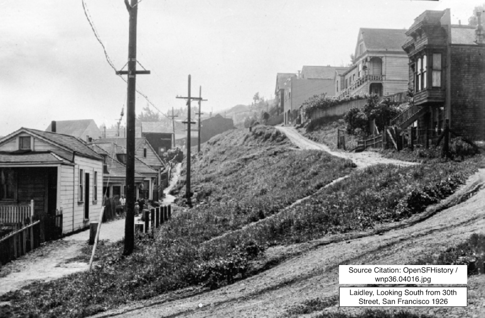
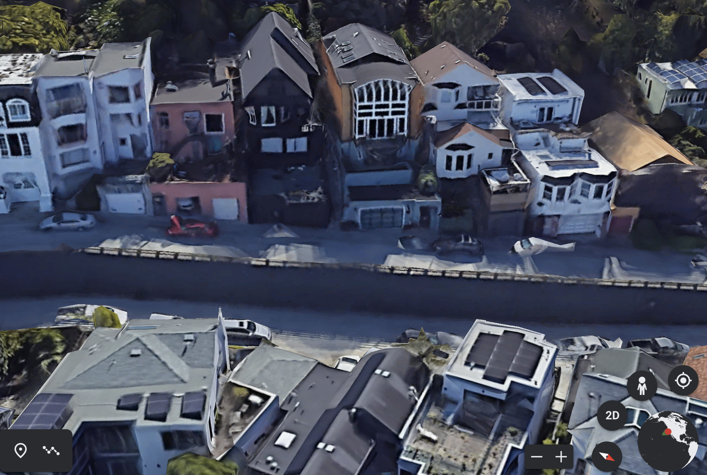

::: {class='EP'}
“I wish that … we could take some magic carpet and ride around and see hundreds of Gangsters.”

— Stella Burton, "The Hollow Tree,” Western Story Magazine, January 27, 1923

:::

## Introduction

[D]{.dropcap}ismissed for decades as low-brow or “trash” reading for the working class, pulp fiction has only recently come to the fore as a valuable cache for literary studies scholars. As New Historical literary theory was developing in the 1980s, and scholars sought to understand how texts shaped readers and society at large, an unearthing of historical popular fiction began (Johanningsmeier 592). Pulps were part of a vast body of late-19^th^ and early-20^th^ century periodicals that had been wildly popular in their time and yet ignored by the academy. However, in the past few decades, readership studies scholars have noted the enormous impact of American pulp fiction magazines on 20^th^-century popular culture (Everett 200). Hundreds of pulp titles with wide distribution across North America have influenced a range of literary voices, from Tennessee Williams to H.P. Lovecraft to Isaac Asimov (200). More significantly, as one of the products of the mass culture explosion beginning at the turn of the century, pulps were integral to the creation of modern American ideologies, and to culture as a whole (Johanningsmeier 594). At this time in history, reading as a cultural practice was deeply woven into daily life, and its ubiquity meant that it informed things like voting behaviour, purchases, cooking, and agricultural methods, while also influencing the wider racial, capitalist, and gender ideologies of the time (Kaestle and Radway 471-472; Johanningsmeier 594). But despite this late-century recognition of reading’s pervasiveness and its formative power, there is little detailed information about who these readers were and how these fictions affected them. Indeed, an enduring lament of historians and scholars of popular fiction is the "dearth of evidence” available to ”“reconstruct past audiences of popular culture” (Kunzel 204).

Such prolific and influential material deserves further and more layered investigations of its effect on audiences, but how can scholars exhume historical audiences? Existing theories about reading and readers, such as Wolfgang Iser’s “implied reader,” can be useful. So too can close textual readings of advertisements. However, these models do not have the ability to help envision real audiences and their experience of the text. Moreover, in the case of pulps, most magazine publishers of this time had unreliable demographic understandings of their readership (Lamont 131). What they did have, however, was extraordinarily active reader departments, where readers wrote in, interacted with one another, and shared their thoughts, dreams, and often their addresses. These sections offer a trove of clues to reader experience, and through the use of locative media tools, enable a spatial and temporal recreation of reader circumstances. In the pursuit of a better understanding of reader experience and to explore locative media’s capacities for informing readership studies, I created _[[Reader Worlds]](https://earth.google.com/earth/rpc/cc/drive?state=%25257B%252522ids%252522:%25255B%2525221qamw1evuSSutds3HteCdllH-wnu3iTiN%252522%25255D,%252522action%252522:%252522open%252522,%252522userId%252522:%252522107751485406508792432%252522,%252522resourceKeys%252522:%25257B%25257D%25257D&usp=sharing),_ an interactive tour project which focuses specifically on the readers of the popular pulp, _Western Story Magazine_.

Mapping these readers’ locations in Google Earth’s creative tour tool (formerly known as Tour Builder) _Reader Worlds_ immerses users in the spaces and images of past readers, offering sketches of the historical reading context that scholars seek. The project’s shifting temporality provides a range of vantage points from which to consider the readers’ letters, and permits a more comprehensive view of readership. Developed as a research-creation project, the tour creation component was crucial to the discussions in this paper. To build and then to experience the tour was to reframe these artefacts of readership, a practice that granted insights which would not have materialized with research alone. More, the insights that other users of _Readers Worlds_ will inevitably have while they explore the tour supports the project’s emphasis on expanding the modes of interpretation employed in readership studies, and examining how visual technologies might enrich text-based research. A mediating tool of this nature could supplement existing scholarly methods by constructing the site-specific contexts of users, stories, media, and historical readers.

## Finding the Reader: a Proposition

[S]{.dropcap}cott McCracken’s "World, Reader, Text” offers a foundation for location-based examinations of readership. Exploring the role of travel and transience in the reader experience, he explains that “the context in which popular fiction is read is crucial to our understanding of it” (5). Often sold at train stations and corner newsstands, pulps, writes Justin Everett, should “be understood as occupying transient spaces—those places people pass by or through rather than occupy \[…\] this background provides a basis for understanding the place that pulps occupied in everyday lives” (202). Pulps were also accessed in libraries and read at home in rural and suburban settings. To consider these contexts is to approach reading as Kaestle and Radway do, “as a _social_ practice that takes place in situ—at a particular place or site, in a given context, and at a given historical moment” (473). These situational details are where reader research is deficient. James Machor writes that what is elusive is “a clear sense of what the actual reading experiences were for the numerous nineteenth-century readers whose encounters with literature took place, not in public forums, but alone in the bedrooms of middle-class homes in suburban Boston, or in barn lofts in rural Virginia, or between stolen moments of leisure at factory workbenches in Pittsburgh and Chicago” (xxi). Though focused on 19^th^-century readers, Machor's brief but evocative descriptions of possible reader experiences kickstart imaginings of early twentieth century reading habits, and how popular fiction might have offered other worlds to its readers at a time without television, and when radio was only emerging. It is in this interaction between reader, text, and context that beliefs, ideologies, and the self are formed.

If we are to discover and learn from the elusive experiences of these readers, several scholars encourage using more innovative methods. Barbara Ryan and Amy Thomas call for readership studies to employ cross-disciplinary and experimental “stretches” (xiv). Charles Johanningsmeier argues that scholars need to add to their toolbox, and try to reconstruct and then apply the historicized filter through which a reader would have read a text. Scholars, he writes, “should then employ _these_ filters, rather than the critical theory filters with which they have been trained to interpret literary texts, to formulate hypotheses of historical readers’ responses” (596). Considering pulps as transient reading material, and heeding these calls for interdisciplinary, innovative approaches, a novel way to approach and understand pulps and the correspondences in reader departments is to create locative media artifacts. _Western Story Magazine_, a popular long-running weekly pulp with broad urban, suburban, and rural audiences, implies a readership with these shifting contexts. Spread across the continent in varying environments and circumstances, _Western Story_’s audiences for the magazine’s tales of cowboys and adventure would have experienced the magazine in vastly different ways. The potential of locative media storytelling to situate the user spatially, historically, and contemporarily lends itself to a contextual analysis of _Western Story_’s readers’ letters. The inclusion of readers’ complete addresses alongside their letters in the magazine means that these specific locations can be pinned onto Google Earth’s creative tour application, revealing the homes, neighbourhoods, or the crossroads of these readers, while connecting them with archival photos and other relevant materials which identify where readers had been while they read, and sometimes, where they wished they could be. With pins spread across the United States, Eastern and Western Canada, Panama, the United Kingdom, Australia, and South Africa, _Reader Worlds_ is a small but telling sampling of the worlds of readers through seven years of this 30-year-old magazine.

The tour explores how the visualization and embodiment capacities of locative media tools might enhance understandings of readership, through their capacity to reconstruct and reframe reader letter content. Lending an immediacy to what are often experienced as disembodied voices from long ago, _Reader Worlds_ aims to add dimension to the understanding of readership by situating users historically and spatially. The tour also explores how novel, screen-based representations of text can influence its meaning and offer new modes of historical reading.

## Mapping Narratives: The Case for Locative Media

[L]{.dropcap}aunched in 2005, Google Earth has been a powerful asset for researchers and educators. Its ease of access to satellite images revolutionized studies in a range of disciplines, predominantly archeology, geology, geography, and architectural studies (Liang et al.). Google added to Google Earth's utility when it launched Tour Builder in 2013, a user-friendly locative media storytelling tool originally developed so that veterans could map their military tours and share their stories. Since then, educators, organizations, individual users, and Google itself have developed thousands of tours, documenting the work of anti-poverty organizations, conservationists, and more recently, endangered Indigenous languages.

Intuitive and free of charge, Google Earth is a highly accessible tool, but the remarkable immersive visuals that position users within contemporary street and landscapes may be its most powerful quality. In _Readers Worlds_, Google’s Street View feature places users squarely amongst the spaces of these former readers, bringing their narratives into physical spaces and effecting a certain tangibility that is not possible in printed form. As locative media scholar Jason Farman explains, “mobile story projects orient our bodies in space. They engage us in a sensory experience of being situated among the stories of a space, among the communities that tell those stories” (“Stories” 110). _Reader Worlds_ utilizes this element of immersion by layering reader letters amongst the former homes, streets, or landscapes of their authors so that past lives collide with contemporary realities, a more visceral understanding of the letters is enabled, and their meaning is magnified.

As a pulp fiction sample for _Reader Worlds_, _Western Story Magazine_ is rich source material. Launched in 1919 just as America’s love affair with westerns was emerging, the magazine was an immediate hit. It made a name for itself by consistently delivering the wholesome adventure content promised by its original tagline, “Big Clean Stories of Outdoor Life” (Yancey). Indeed, as urban centres grew, the “cleanliness” and “purity” of the frontier became the stuff of fantasy, an idealized dream that developed after the frontier was declared “closed” in the late-19^th^ century, and the conception of a disappearing West materialized. American identity had been founded on the vision of a vast wilderness awaiting conquest, and stimulated by the notion of a “safety valve of ‘free’ land” (Lamont 5). With these ideas in peril, a sudden interest in stories and art about the West arose, giving way to the rise of the western genre (5). These stories were largely characterized by a white male hero, a scenario of capture and pursuit, confrontations with various villains—many of whom were racialized—and the concluding victory of white civilization (Bold 318). Westerns were purveyors of a powerful American mythology which shaped national identity, and as Christine Bold writes, “wielded long-term influence, especially in suturing nationhood to white, male individualism and reinforcing hierarchies of race and gender” (2). This identity was also sutured to land. In a period of growing industrialization, when America’s working class faced rapid urbanization and city populations had overtaken rural ones in a matter of a few years, _Western Story_ thrived (Bloom 78-79). By 1922, the magazine’s circulation had reached almost 2 million readers, and its weekly instalments reportedly earned the publishers \$400,000 per issue (Yancey). The magazine ran for thirty years, but by the start of the 1930s, the Depression, and competition from other western pulps, meant a significant decline in circulation (Yancey). But with _Western Story_'s extraordinary success into the late 1920s and the context of an America in transition, issues from this time period represent a readership at its largest and most loyal. With this in mind, the _Reader Worlds_ tour was constructed from letters printed in issues published between 1922 and 1928.

While _Western Story_'s large following can be attributed to multiple factors, the world created in the magazine, and the way readers placed themselves in it, likely played an integral role in that success. Cultivating a strong sense of community primarily through "The Hollow Tree” reader department, _Western Story_ developed a club-like quality, with a shared vernacular, values, and interests. As Snyder and Sorensen explain, these correspondents in reader departments built relationships and "co-produce(d) an emerging collective identity” (128). Stories where the skills, courage, and toughness of the hero triumph in an unforgiving wilderness aligned with the universal appeal of westerns, which Betty Rosenberg explains was rooted in "a dream of freedom in a world of unspoiled nature, a world independent of the trammels of restraining society” (Herald 27). As she says, “the hero dominates the western: competent, self-reliant, and self-sufficient” (Herald 27). For a working class readership fenced in by factory or office walls, at a time when industrialized labour had deskilled work and created a hierarchal supervisory system, pulps celebrated independent, plain-speaking, manly men, untethered to bosses or routines (Smith 58-59).

The stories in _Western Story Magazine_, while mainly set rurally at ranches or prospecting sites, often reflected the tension between the urban and the rural. Stories regularly depicted the triumphs of characters from a mix of classes, levels of education, and urban and rural origins, or, as in Raymond Ward Hoffi's "The Element of Chance,” published in the November 25, 1922 issue, dispute class-based stereotypes and tropes of the sharp urbanite versus the dim-witted yokel. Narratives like these would have satisfied fantasies of a more empowered working class (McCracken 3), and a life away from the city. But while fantasy was integral to the reader community, and to _Western Story_’s popularity, it is clear that it was not just performative. _Reader Worlds’_ locational pins and the letters themselves confirm that many readers were living, or had previously lived, rurally on farms or ranches, and were genuinely interested in exploration, travel, prospecting, and other endeavours represented in _Western Story_’s content. Bona fide western experiences are prized by urban readers, and the value of this authenticity runs through the stories as well. “True” cowboys who are brave and loyal tend to reap the rewards. In contrast, those who play-act are put in peril, or are in some way amoral. In "Great White Wizard,” a story by Edison Marshall that appears in the April 11, 1925 issue, an adored Hollywood star named Carlo Modesto filming a western in the Yukon is ultimately revealed as the villain. Filled with classic western motifs, disguise and true identities figure prominently; Modesto the villain is not only an actor pretending to be a cowboy, but his handsome, placid exterior conceals a controlling and violent nature. More, as an Hispanic character, he is an Other, a reminder that in westerns, the authenticity of a "real” American hero also means "authentically white.”

How readers interpreted these constructions of Americanness amid notions of a closed frontier could be assessed in the reader departments. It is in these pages that these fantasy and potential selves are acted out, and on an external level, where readers “fashion\[ed\] a sense of themselves as public, political actors and \[…\] influence\[d\] the social, political, and cultural debates of their era” (Snyder and Sorensen 124). To imagine this complicated process and its outcomes, reader contexts need closer examination. The site-specificity of locative media tools lend themselves to such considerations.

## Google Earth: Locative Media and Narrative Cartography

[M]{.dropcap}uch of the academic analysis of locative media projects examines the physicality of place-based storytelling, where project participants move through a physical location that has been redefined by using technology—often GPS-based—and storytelling or art. The element of bodily engagement is often a key focus, as is the untethered aspect of mobile media. Digital and literary scholar Rita Raley asserts that locative media is "an instance of 'unframed' media practice \[…\] unbound from the desktop, detached from the singular screen and thus a fixed spectatorial perspective” (2). It is a definition that excludes the screen-based, armchair Google Earth Tour, which was never designed to facilitate a physical experience of a place-based story. Indeed, users move between locations by “flying”––a fantastical voyage by its very nature––as the original intention of the tool was to instantly bring people where they could not physically go (at least, not instantly). Interestingly, this virtual experience replicates the work of _Western Story_’s reader departments and their efforts to connect readers who would then share their photos and stories with one another. However, while the user experience is somewhat removed from reality, its explore-ability and 360-degree views offer an experience that is similarly detached from a single view or perspective. While there is a uniquely embodied experience inherent in many place-based projects, I argue that locative media projects need not simply be about physical presence in a given location. In fact, excluding screen-based experiences like virtual or augmented reality from a locative media definition dismisses how such projects can create deeply affective immersive experiences. Such technologies also connect users to narratives in a spatial capacity, and it is that tethering to place that enables a more profound connection to stories. In many instances, and particularly with Google Earth’s tour tool, the critical ingredient in achieving this link is the use of maps.

As an expression of space, movement, time, and human activity, a map is intrinsically a storytelling device, and “narrative cartographies”—where maps are "used to represent the spatio-temporal structures of stories and their relationships with places”—recognize and utilize this capacity (Caquard and Cartwright 1). In their discussion of narrative cartographies, Caquard and Cartwright argue that these applications "raise some common cartographic challenges, such as improving the spatial expression of time, emotions, ambiguity, connotation, as well as the mixing of personal and global scales, real and fictional places, dream and reality, joy and pain” (1). These possibilities recognize the range of complicated ideas maps can express, and Google Earth Tours, and _Reader Worlds_ specifically, explore these potentials by unifying space and narrative to create accessible, non-linear stories, the coherence of which is due in part to the tour's basis in a map.

## Maps: Storytelling, Power and Erasure

[J]{.dropcap}ason Farman explains that "to understand the power of maps in locative media projects, we have to understand that we orient ourselves in space \[…\] by simultaneously experiencing the space in a _sensory_ way—as something that is learned as you move through it, engaging it with all of your senses—and understand that such ‘implacement’ \[or how we understand our "situational location”\], is culturally _inscribed_ and contextually specific” (“Map Interfaces” 88). While the street view feature may not engage all senses, it recalls our innate sense of implacement, while we move virtually through a space. Street View is powerful because it mimics this embodied experience of being _in_ a place, and all of the discovery and contextual comprehension of place that experience can evoke. It does so instantly, revealing a feet-on-the-ground intimacy with a location in a matter of seconds.

Maps are, of course, imperfect, and as Farman points out, where they fail has to do with which perspectives and which bodies they exclude, rather than what or whom they include. Indeed, part of the ongoing work in narrative cartography is to address the new challenge for mapmakers to tell the stories behind how maps are conceived (Caquard and Cartwright 1). As representations of space, they are subject to a multitude of biases, while also "reinforc\[ing\] existing power dynamics of the space” (“Map Interfaces” 90). When it comes to Google's Street View feature, the glaring omission of a host of African and Middle Eastern streets, cities, and sometimes whole countries is a powerful case in point (Weiner). Google plans to include these locations eventually, but relies heavily on unpaid volunteers to collect these images. With a billion users accessing the app, Google Maps is increasingly becoming the principal map by which people view the world (Perez; Weiner). The focus on Western countries in the street view feature, as well as the absence of many poorer, rural locations, highlights Farman's concerns about spatial power dynamics. Even within North America, there are several _Reader Worlds_ pins where specific addresses are not represented, nor are any nearby roads. In places like Coalwood, West Virginia (January 7, 1928 issue), an old coal mining town, or Cloud Chief, Oklahoma (April 11, 1925 issue), now largely uninhabited, there is no street view option to include in the pinned location’s snapshot. Instead, I resort to capturing satellite views that have been supplemented with blocky computer-generated renderings of the landscape (see fig. 1). In some ways, such limited visuals offer a more authentic historical representation, as these places appear as they would have to historical readers: mere spots on a map and with scant information about what they look like at ground level. More, such locations are less likely to be significantly different from their 1920s versions, and may provide a more genuine construction of past reader contexts. However, their exclusion can also be viewed as representative of the tradition of rewriting, or erasure of the narratives of these communities, and in the case of _Readers Worlds_ and its examination of pulp fiction readers, the disregard for their significance as an important element of the periodical reading community.

## Subjectivity: Problem and Gift

[B]{.dropcap}eyond the problematic Google Map, another consideration in this research is that it is mediated by the researcher’s lens; in this case, mine. The source material and archival media is selected solely by me, and I offer interpretations of reader context based on my own readings of those objects. Even as I attempt to construct the filter of an historical reader, my own filter is present. However, James Machor suggests that in readership studies, this may be an unavoidable situation. Machor argues that even if a complete, unadulterated archival record existed, “the supposition that such an archive would bring us closer to history ignores the way that even the most complete historical record never discloses a pure presence but depends on our own mediating activities as interpreters and readers of the past” (Machor xxii). Moreover, the transformation of archival materials into digital form adds another interpretative layer. In _The Nineteenth-Century Press in the Digital Age,_ James Mussell argues that understanding early periodicals not only demands a grasp of their genres, but a capacity to examine the tools used to digitize and present them. Screen-based consumption represents both a transformation, and an interpretation of printed works, in a shift that makes us not only readers but users as well. “What we must do,” Mussell writes, “is recognize how use affects meaning, whether this is in our encounter with historical material or the digital resources that provide access to it” (17). Certainly, throughout this paper, my own discourse, lens, and context influence interpretations of _Western Story_’s reader letters, but the ways in which the readings are mediated by the materiality and the rhetoric of the Google Tour tool must also be acknowledged. In the absence of an uncontaminated picture of these readers—one that Machor asserts is an impossibility—these subjective readings (mine and others’), aided and influenced by locative media tools, remain valuable contributions to readership studies, perhaps _because_ of the myriad interpretations they afford.

Ultimately, these locative media narratives rely on users to engage with them in order to make meaning. Just as Ryan, Thomas, and Johanningsmeier call for readership studies that move beyond traditional, often isolated academic analyses, the reader letters and archival media set against contemporary land and streetscapes are not meant to be presented for solitary interpretation. While my archival selections may add subjectivity (and the tour’s space for only eight slides or videos for each pinned entry is limiting), the tour encourages exploration of all available angles, a roaming eye, bird’s-eye view, and non-linear leaps from one pin to another. Furthering the transition from reader to user that Mussell identifies, Rita Raley argues that locative media shifts users into “participants,” as not only does the context—the physical environment one explores—contribute to recreating the historical reader, but the participant does as well. Their view of the landscape and how the participant operates the Google tour is subjective, making the interpretation active and ongoing. With locative media, a town or city itself becomes more vital, changing constantly as the participant makes their own meaning. As Raley argues, locative media's "invitation to experience the city as verb rather than noun also clearly summons the participant to activity as well,” and permits a diversity of experiences and narrative understandings (6).

## Reading the Readers

[T]{.dropcap}he multiple perspectives of the tour’s participants enrich what _Reader Worlds_ offers to readership studies, and what it offers in understanding the multiplicity of reading experiences. In the tour, locative media’s immersive element and the storytelling affordances of narrative cartography come together to build worlds around locations, enabling what Veronica Tozzi calls “impositional narrativism,” where accounts of events can be shared from multiple perspectives during multiple times in history, offering a more expansive narrative (Oppegaard and Grigar 21). That the tour enables a view of present-day spaces framed by sketches of individual readers from a century ago, means users can read the reader on multiple levels in a single platform.

In the context of the rapidly changing landscape of the 1920s, with the readership straddling urban and rural identities, _Reader Worlds_’ impositional narrativism provides more insight into reader circumstances*.* The implacement afforded by the tour’s map interface, and its visual and spatial markers, roots users in the familiar present day, and also helps situate them historically, so they can compare contemporary realities with historical narratives.

These comparisons warrant some reflection. Overwhelmingly, letter writers in urban centres are hungry for stories of the West. They are unhappy in the city and looking to hear from _Western Story_ “hombres,” real cowboys or anyone living in the West. Often, they are looking for someone to travel with who wants, as they do, to get away “from the noise and confusion of the city” (1928, Rivers 136). Some are injured war veterans who will “never be able to ride again,” and are regretfully city-bound (1927, Rivers 138). Such letters align with the narrative of a disappearing West, and the anxiety of a readership who feel their lives are encroached on by modernity, but they take on more meaning when considered alongside a modern streetscape, now even more urban than in the 1920s. Stella Burton in Alexandria, Louisiana is eighteen when she writes, “I live in the city but don’t like it very much” (1923, Rice 137). Her Alexandria address is now a parking lot. Mrs. C.S. Powell writes from San Francisco, “I used to live in the country, and now I live in the city, and I cannot seem to get used to it. There doesn’t seem much chance of us going back where my heart is always turning, so I am looking to The Tree for comfort” (1923, Rice 138). Powell’s home is on a steep, tightly turning street in what is now the heart of an enormous city (see fig. 2). Included with her pinned letter on the Google tour are archival photos of her street from the year her submission was published (see fig. 3). The photo reveals typical San Francisco houses, snugly placed on an unpaved road. In later photos, the road is paved, cars are pictured, and we see the ongoing progress toward the large, modern San Francisco of today. In this context, the tour's temporality, its simultaneous revelation of past and present bestows additional poignancy.

## Reinvigorating Relevance: Narrative Archaeology

[T]{.dropcap}o excavate the past and place it in the present also affords consideration of the valuable nuances in historical accounts. Artist Jeremy Hight termed this kind of historical locative storytelling "narrative archeology” (Hight). In his groundbreaking locative media project _34 North 118 West_, Hight installed GPS-triggered hotspots at the former location of the Santa Fe Railroad depot. As participants moved around the site they heard overlapping audio narratives from fictional railroad workers. These stories had been written based on Hight's research on the surprising history of the railroad, one that Hight says had been "forgotten, shifted away from or erased” (Raley 10). The project, he wrote, revealed that "context and subtext can be formulated as much in what is present and in juxtaposition as in what one learns was there and remains in faint traces” (Oppegaard 27). As a narrative archeology of its own, _Reader Worlds_ benefits from these subtleties.

In the tour, subtext and obscured meanings become more defined when pulled into the context of place, and one of the things gleaned from several correspondences is the unromantic realities of rural life. Writing from Libby, Montana, a man working as a Forest Lookout in Kootenai National Forest asks for letters to “relieve the monotony of this lookout life” (1927, Rivers 137); a homesteader in Cane Beds, Arizona looks for pen pals to “while away the leisure hours” (1927, Rivers 136); a woman in the village of Cloud Chief, Oklahoma looks for a friendly woman to move in and help her with housework; a lonely coal miner in the mountains of Coalwood, West Virginia, and the wife of an oil field worker in Salt Creek, Wyoming, both ask for pen pal companionship. Meanwhile, archival film and photos of workers in these remote areas show hard, dirty, and dangerous labour, where people struggled to make a living amid the landscape so romanticized by the western.

A letter from Lillian Pennywell in April 1925 dispels some of the myths of a Californian promised land. From Long Beach, California she describes her state as “beautiful in places, but it is also true that there are spots as undesirable as you see anywhere else and conditions that one does not approve of \[…\] I am just one of the mass of working women, and for years have known nothing else but hard work” (Rivers 135). Archival media reveals gorgeous beaches near her home that she likely rarely visited, and a sea of oil derricks in and around urban Long Beach. Similarly, in Newburg Oregon, Mertie B. Cook warns his fellow readers that though his part of the country is beautiful, “you can’t live on scenery.” From his suburban street in small town Oregon, Mertie writes, “I know the problems of the working class from the coast clear through to the eastern State line. And I’m right here to say that those who have a home and a good position had better stay with both” (1927, Rivers 136).

In these letters, isolation, loneliness, and disappointment is not solely reserved for urbanites. Google’s Street Views also reveal that, in many cases, the urban encroachment of a closed frontier never materialized. Libby’s remoteness and small size (still a small town almost 100 years later), and the connected forest lookout location where the reader had worked, are palpably isolated, and both Cane Beds and Cloud Chief remain decidedly rural. Indeed, a contemporary look at Cloud Chief, once alive with farms and a school, finds it now a ghost town. Other rural industrial areas have similarly disappeared. One hundred years later, Salt Creek is no longer, and Coalwood’s coal mine has been sealed and much of the area reclaimed by forest.

From this vantage, the nostalgia for a disappearing frontier and a simpler time that _Western Story_ mobilizes is complicated. Writing from Philadelphia, Samual C. Beerman’s brief letter to “The Hollow Tree” in the 1927 Christmas Eve issue asks if there is “any one living in McLennan County, Texas, who will write to a lonesome buddy? I’m hoping to hear from my ol’ stamping ground” (137). It is a straightforward request from an uprooted Texan living in an Eastern city, however 1920s McLennan County had a prominent Ku Klux Klan presence, and only a decade before Beerman’s letter to “The Hollow Tree,” Waco, the county seat, had been the site of the horrific torture and public lynching of 17-year-old Black farmhand, Jesse Washington. A crowd of 15,000 came from miles around to watch. These events are included in the tour to re-contextualize the connections, knowledge, and experiences of the places that readers hold dear, and to clarify and interrogate the haze of nostalgia in the western genre.

Locative media can bring these “faint traces” of past realities into view. Writing about Hight’s project, Rita Raley makes the important point that narrative archaeology is not purely about the recovery of narrative artifacts, but something more substantial: it imagines a past that “now intrudes upon the present” (10). This layering of the historical onto the contemporary blurs the distinction between past and present.

## Visualizing Reader Locations

[T]{.dropcap}he temporal affordances of locative media and narrative cartographies are powerful, but the simple ability to see readers’ geographical locations can be telling as well. Snapshots of these sites can make details of reader experiences like Manchor’s “stolen moments of leisure at factory workbenches” more vivid, and close readings of the letters, embedded in the sites of the tour, stimulate fruitful imaginings of readers’ lives (xxi).

The tour affords these rapid visualizations, quick comparisons, and conclusions, and while there is also an impracticality in examining readership on this individual basis, the map does permit both micro and macro views of the reader letters. This sort of broad scale analysis is commonly applied when there are large quantities of data to examine, permitting an aerial view (literally) of the content. Incorporating this digital humanities approach to the letters encourages the co-existence of both levels of analysis, and assures that less will be missed in these readings (Jockers 7). In the case of _Reader Worlds_, there are valuable deductions and conclusions to be drawn from physical locations, and other commonalities. Certainly, the pins of overseas readers in the United Kingdom, Australia, and South Africa are suggestive of the reach of the American western in the popular imagination, but it is also valuable to note clusters across North America. Though the pins in _Reader Worlds_ represent only a selection of the readers, a larger scale version of this project could reveal locational trends. For example, in the map of the 1922 issue (with locations indicated by yellow pins), a cluster of readers appears in the East, providing a useful observation and an evocative image in the context of the magazine's basis in the dream of the West. It is a visual that, alongside the letters and media in each pin, illustrates a readership in a state of longing, dreaming of being elsewhere. Even the postings in the reader's trading department, "Swapper's Exchange,” suggest a pursuit of adventure. On the outskirts of Pittsburgh, Henry E. Pfeiffer aims to shed his jewelry and old army gear in favour of more useful items like a shotgun, a Mexican vest, or cash. In these communications, powerful visualizations of reader experiences take shape. Reading this ad in the tour, with the view of his urban, residential street, we might gather Pfeiffer is preparing to hit the road. His ad sits amongst the larger map of pinned locations of other readers, many of whom are similarly planning, helping to imagine a community of restless urbanites who get their weekly fix of action and adventure from their favourite magazine. This visual of readerships in geographic relation to one another and to their urban, suburban, or rural locations has the potential to present fresh insights into reading communities and their choices or motivations. While only inferences, the tour facilitates these more tangible ideas of reader experience, and a stronger connection to their humanity.

In _Reader Worlds_ we might also interpret not only how the text informs the values or dreams of the readers (as we saw in their wistful letters about travel), but how their current context might inform the reading of the material, and how this same reading of the material might then, reciprocally, inform their views of their current contexts. More, engaging with the _Western Story_ reader department, readers could effectively influence one another and the content of the magazine itself. In this way, the effects of reader contexts are multi-layered, and understanding them and other reader perspectives shines a light on popular culture’s influence on broader American ideals.

## Conclusion

[L]{.dropcap}ocative media and narrative cartography tools present a powerful new lens to view reader narratives, and can supplement current readership studies practices and inspire novel methods of historical reading. Indeed, alternate uses of Google Earth’s creative tools could be employed to examine larger numbers of readers. The _Reader Worlds_ tour focuses on constructing a sense of reader environments by mining available archival media, and mapping fifty letters and personal ads from only a quarter of the magazine’s thirty-year run. However, another approach could be to concentrate on pinning only, allowing a researcher to map many more locations and rely on the street view feature and Google Earth’s built-in information boxes to fill in details about various neighbourhoods. While not as detailed and evocative, this is a more efficient way to examine larger quantities of locations, or to find patterns in readership. A method like this could also be useful when specific reader addresses are not available, and researchers may be working only with general circulation data.

It is necessary, however, to recognize that relying on Google in this manner comes with other concerns about representation and the digital colonization of the planet. Readers located in towns—or even in entire countries––that are excluded from Google’s Street View feature cannot be equally represented in a mapping project of this kind. Moreover, the larger question of privacy lingers when it comes to sharing reader locations, historical or not. But for better or for worse, these applications are becoming increasingly immersive and accessible. New applications from Google include Geo VR, which offers a virtual reality experience for tours, and augmented reality is on its way. Google is also going off-road. Street view cameras carried by hikers are documenting footpaths, beaches, and other non-auto accessible spaces, and similarly, the Google Expeditions project now brings you to remote places with the scientists who are studying them. Such features may provide opportunities for more detailed constructions of reader context, and a more visceral, embodied experience. Ironically, however, these efforts at digital documentation also represent a world with closed frontiers, making Google Tours a fitting tool for envisioning early-20^th^ century fans of westerns.

These are tools that replicate the filter through which the historical reader experienced these texts, and so widen the frame on the reader. To consider the readers’ geographic and special contexts is to gather a more fulsome picture of their interaction with texts. To mine those “faint traces” of subtext and juxtapositions, and the ghosts roaming these locations is to, as Rita Raley writes, challenge “the hegemony of words” (4). Employed in readership studies, locative media can push against text-only examinations; it is a practice that augments lone academic interpretations which have so far relied on close readings, limited demographic information, and hypothetical constructions of readers. Researchers who are versed in the rhetoric of locative media can use these tools to become active participants in creating more meaning from reader correspondences. Locative media recognizes and embraces the complicated and fascinating interactions between time, space, place, and human experience, which have always been elemental to how readers experience stories and construct their unique worlds.

:::{class="REF"}

## Works Cited

Bloom, Clive. _Cult Fiction: Popular Reading and Pulp Theory_. St. Martin's Press, 1996.

Bold, Christine. "The Western.” _Oxford History of Popular Print Culture_: _Volume Six: US Popular Print Culture 1860-1920_. Oxford University Press, 2011.

Cantú, Francisco. "When the Frontier Becomes the Wall.” _The New Yorker_, March 4, 2019. [[https://www.newyorker.com/magazine/2019/03/11/when-the-frontier-becomes-the-wall]](https://www.newyorker.com/magazine/2019/03/11/when-the-frontier-becomes-the-wall)

Caquard, Sébastien and William Cartwright. "Narrative Cartography: From Mapping Stories to the Narrative of Maps and Mapping.” _The Cartographic Journal,_ vol. 51, no. 2, 2014, pp.101-106., doi: 10.1179/0008704114Z.000000000130.

Everett, Justin. "Teaching the Pulps.” _Transformations: The Journal of Inclusive Scholarship and Pedagogy_, vol. 24, no. 1-2 (Spring 2013/Summer 2013 & Fall 2013/Winter 2014), pp. 200-205.

Farman, Jason. "Map Interfaces and the Production of Locative Media Space.” _Locative Media_, edited by Rowan Wilken and Gerard Goggin, Routledge, 2017.

Farman, Jason. "Stories, Spaces, and Bodies: The Production of Embodied Space through Mobile Media Storytelling.” _Communication Research and Practice_, vol. 1, no. 2, Mar. 2015, pp. 101-116. doi:10.1080/22041451.2015.1047941.

Herald, Diana Tixier. _Genreflecting: A Guide to Reading Interests in Genre Fiction._ 5^th^ ed., Libraries Unlimited, 2000.

Hight, Jeremy. “Narrative Archaeology.” _NeMe_, 25 Mar. 2013, www.neme.org/texts/narrative-archaeology.

Iser, Wolfgang. _The Implied Reader: Patterns of Communication in Prose from Bunyan to Beckett_. Johns Hopkins University Press, 1974.

Jockers, Matthew Lee. _Macroanalysis: Digital Methods and Literary History_. University of Illinois Press, 2013.

Johanningsmeier, Charles. "Understanding Readers of Fiction in American Periodicals,1880-1914.” _Oxford History of Popular Print Culture_: _Volume Six: US Popular Print Culture 1860-1920_, Oxford University Press, 2011.

Kaestle, Karl F., and Janice A. Radway. "Part B: Reading in Situ: Introduction.” _A History of the Book in America: Volume 4: Print in Motion: The Expansion of Publishing and Reading in the United States, 1880-1940._ University of North Carolina Press, 2009.

Kunzel, Regina G. "Pulp Fictions and Problem Girls: Reading and Writing Single Pregnancy in the Post-War United States.” _Reading Acts: U.S. Readers' Interactions with Literature, 1800-1950,_ edited by Barbara Ryan and Amy M. Thomas, University of Tennessee Press, 2002.

Lamont, Victoria. _Westerns: A Women's History_. University of Nebraska Press, 2016.

Liang, Jianming, , Jianhua Gong, & Wenhang Li. "Applications and Impacts of Google Earth: A Decadal Review (2006–2016).” _ISPRS Journal of Photogrammetry and Remote Sensing_, 146. 2018. 91-107. 10.1016/j.isprsjprs.2018.08.019.

Machor, James. "Introduction: Readers/Text/Contexts.” _Readers in History: Nineteenth-Century American Literature and the Contexts of Response_, edited by James L. Machor, Johns Hopkins University Press, 1993. pp. vii-xxix.

McCracken, Scott. "World, Reader, Text.” _Pulp: Reading Popular Fiction_. Manchester University Press, 1998.

Mussell, James. _The Nineteenth-Century Press in the Digital Age_. Palgrave Macmillan, 2012.

Oppegaard, Brent, and Dene Grigar. "The Interrelationships of Mobile Storytelling: Merging the Physical and the Digital at a National Historic Site.” _The Mobile Story: Narrative Practices with Locative Technologies_, Routledge, 2013.

Perez, Sarah. "Google Maps is turning its over a billion users into editors.” _Tech Crunch_, July 21, 2016, https://techcrunch.com/2016/07/21/google-maps-is-turning-its-over-a-billion-users-into-editors/

Raley, Rita. "Walk This Way: Mobile Narrative as Composed Experience.” _Beyond the Screen: Transformations of Literary Structures, Interfaces and Genres_, edited by Jörgen Schäfer and Peter Gendolla. Transcript, 2010. doi: https://doi.org/10.14361/9783839412589

Rice, Louise, editor. "The Hollow Tree.” _Western Story Magazine_, November 25, 1922. 140-141.

Rice, Louise, editor -. "The Hollow Tree.” _Western Story Magazine_, January 27, 1923. pp 136-138.

Rivers, Helen, editor. "The Hollow Tree.” _Western Story Magazine_, April 11, 1925. pp. 134-136.

Rivers, Helen, editor. "The Hollow Tree.” _Western Story Magazine_, December 24, 1927. pp. 136-138

Rivers, Helen, editor. "The Hollow Tree.” _Western Story Magazine_, January 7, 1928. pp.136-138

Ryan, Barbara, and Amy M. Thomas. “Introduction.” _Reading Acts_. University of Tennessee Press, 2002.

Smith, Erin. _Hard-Boiled:Working-Class Readers and Pulp Magazines_. Temple University Press, 2000.

Snyder, Carey, and Leif Sorensen. “Letters to the Editor as a Serial Form.” _The Journal of Modern Periodical Studies,_ vol. 9, no. 1, 2018, doi:10.5325/jmodeperistud. 9.1.0123.

Weiner, Chlor. “He’s Trying to Fill in The Gaps On Google Street View — Starting With Zimbabwe.” _npr.org_, September 22, 2019.https://www.npr.org/2019/09/22/760572640/hes-trying-to-fill-in-the-gaps-on-google-street-view-starting-with-zimbabwe

Yancey, Alexandra. “Western Story Magazine.” _Pulp Magazines Project_, www.pulpmags.org/content/info/western-story-magazine.html. Accessed April 7, 2020.

## Image Notes

Figure 1: Google Earth, Google, https://earth.google.com/web/search/ coalwood+west+virginia@37.38791925,-81.65195326,444.28402503a,492.87990161d,35y,0h,0t,0r/data=CigiJgokCc4v6r_SvDVAEcsv6r_SvDXAGTL2y_p760JAIbfqDcQJhVDAOgMKATA. Accessed 1 Oct. 2023.

Figure 2: _Google Earth_, Google, [[https://earth.google.com/web/data=MkEKPwo9CiExcWFtdzFldnVTU3V0ZHMzSHRlQ2RsbEgtd251M2lUaU4SFgoUMDk5QTM3OEQyODE2NDNGRDcxMjEgAQ]](https://earth.google.com/web/data=MkEKPwo9CiExcWFtdzFldnVTU3V0ZHMzSHRlQ2RsbEgtd251M2lUaU4SFgoUMDk5QTM3OEQyODE2NDNGRDcxMjEgAQ)

Figure 3: “Laidley from 30th” Apr. 14, 1926. OpenSFHistory / wnp36.04016

:::
